# RedForge — Architecture Review & Engineering Philosophy

**Status:** Reverse-engineered from the implementation as of `VERSION 2.0.0`. This document describes what RedForge **is today** — no redesign, no recommendations beyond what is explicitly labeled as such in Parts IV–V. It is the foundation reference for all future architecture work.

**Scope:** `C:\Users\LOQ\redforge\backend` (FastAPI, SQLAlchemy 2.0 async, SQLite) + `C:\Users\LOQ\redforge\frontend` (React 18, TypeScript, Vite).

---

## Table of Contents

- **Part I — Architecture Review** (26 sections)
- **Part II — Domain Entity Catalog**
- **Part III — Lifecycle & State Machines**
- **Part IV — Responsibility Audit**
- **Part V — Architecture Smell Review**
- **Part VI — Competitive Landscape**
- **Part VII — Core Identity & Engineering Philosophy**

---

# PART I — ARCHITECTURE REVIEW

## 1. Overall System Architecture

RedForge is a **single-process, local-first monolith**: one FastAPI process serves the REST API, and — in production — also serves the compiled React SPA from the same origin, so there is no separate frontend server, no reverse proxy requirement, and no distributed state. In development, Vite serves the SPA and proxies `/api` to the backend.

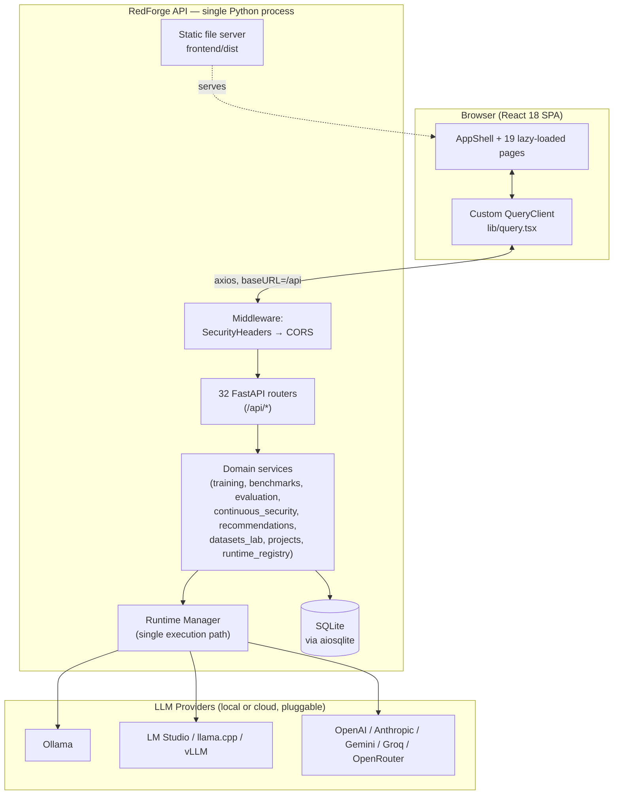

**Defining architectural facts:**
- **Single process, enforced.** `_enforce_single_process()` in `main.py` refuses to start if `WEB_CONCURRENCY`/`UVICORN_WORKERS`/`GUNICORN_WORKERS` > 1, because live state (runtime metrics, training progress, log ring buffer, in-process async queues) lives in process memory. This is a deliberate, load-bearing constraint, not an oversight.
- **One database.** SQLite via `aiosqlite`, resolved to an OS app-data directory (or a legacy `./redforge.db` for backward compatibility, or an explicit override). 26 tables, additive schema via `create_all` (not fully tracked by Alembic — see §14).
- **One execution path per capability domain.** Every feature that needs to call an LLM goes through `get_runtime()` (the Runtime Manager singleton) — never a second HTTP client, never a bespoke provider call. Every feature that needs to run something long-running goes through one of two async single-worker queue implementations that are structurally identical (Benchmark Center, Continuous Security, Evaluation Workbench).
- **No auth, no accounts, no cloud dependency.** By design (see Part VII). CORS is restricted to configured origins; there is no session/user model anywhere in the schema.

---

## 2. Folder Responsibilities

### Backend (`backend/app/`)

| Folder | Responsibility | Era |
|---|---|---|
| `api/` | HTTP surface only — 32 routers, thin request/response mapping over services | all |
| `db/` | `Base`, `AsyncSessionLocal`, `get_db`, and the single `models.py` (26 tables) | all |
| `runtime/` | The unified LLM execution layer: `Provider` ABC, 9 concrete providers, queue, cache, cancel, metrics, transport error mapping, model catalog/estimation | v1.2 |
| `runtime_registry/` | Checkpoint → runnable-model resolution with graceful base-model fallback | V2 Phase 2.5 |
| `training/` | Provider-swappable LoRA/QLoRA orchestration: providers, manager, runner, service, in-memory progress store | V2 Phase 2.2 |
| `continuous_security/` | Per-checkpoint security evaluation via an async queue, reusing the v1 engine | V2 Phase 2.3 |
| `recommendations/` | Heuristic engine turning security/training/dataset context into a training plan + predicted gain | V2 Phase 2.4 |
| `benchmarks/` | Phase-3 Benchmark Center: pluggable suites, async queue, `BenchmarkResult` | V2 Phase 3 |
| `evaluation/` | Phase-4 Evaluation Workbench: similarity/regression/comparator/versioning + async queue | V2 Phase 4 |
| `projects/` | Workspace CRUD — the aggregation root every V2 feature optionally scopes to | V2 |
| `datasets_lab/` | Dataset import/parse/analyze/clean/split/version | V2 Phase 2 |
| `resources/` | Cross-platform hardware detection (RAM/CPU/GPU/disk), cached | v1.2 |
| `health/` | Structured, severity-graded readiness checks | v1.2 |
| `onboarding/` | Hardware-aware first-run recommendations + model pull tracking | v1.2.1 |
| `sessions/` | The v1 durable event-sourced evaluation engine: `SessionManager`, event/session repositories, terminal rendering | v1 |
| `analysis/` | v1 security scoring: `security_analyzer`, `finding_generator`, `report_builder`, static recommendation-text lookup | v1 |
| `attacks/` | The 28-entry seeded attack library | v1 |
| `evaluators/` | Standalone heuristic/LLM-judge/hallucination scorers, reused across multiple engines | v1 |
| `pipeline/`, `planner/`, `scheduler/`, `profiler/`, `execution/` | The v1 "intelligent" plan-driven evaluation stack (profile → plan → adaptive execute → analyze) | v1 |
| `agents/` | Two autonomous red-team agent implementations (`red_team_agent`, `adaptive_agent`) | v1 |
| `mutations/` | 7 prompt-mutation strategies, used by the adaptive executor's retry/escalation loop | v1 |
| `scoring/` | `ScoringEngine` interface + `WeightedScoringEngine`, used only by the legacy benchmark subsystem | v1 |
| `benchmarking/`, `dataset/` | The **legacy** static-dataset benchmark subsystem (`BenchmarkRun`/`ModelScore`) — distinct from `benchmarks/` | v1 |
| `reports/` | The legacy per-`model_name`, persisted `Report` generator | v1 |
| `evaluation_profiles/` | Declarative evaluation-profile loading/registry for the v1 planner | v1 |
| `errors.py`, `logging_config.py`, `config.py`, `version.py`, `static_serving.py` | Cross-cutting infrastructure | all |

### Frontend (`frontend/src/`)

| Folder | Responsibility |
|---|---|
| `pages/` | 19 route-level components, one per nav destination |
| `components/` | `AppShell` (nav/topbar/statusbar), `Assistant`, `CommandPalette`, `ui/` design-system primitives, `ErrorBoundary`, `Markdown`, `Terminal`, `VirtualTable`, `shared` |
| `api/` | `client.ts` (one axios instance), `endpoints.ts` (~100 typed wrapper functions), `types.ts` (~90 interfaces) — components never call axios directly |
| `hooks/` | `queries.ts` (~65 hooks wrapping the custom query lib), `useSessionStream`/`useTerminalStream` (polling-based pseudo-SSE) |
| `lib/` | `query.tsx` (hand-rolled react-query replacement), `toast.tsx` (hand-rolled sonner replacement), `format.ts`, `export.ts`, `cn.ts` |

---

## 3. Backend Architecture

FastAPI + SQLAlchemy 2.0 async + aiosqlite, single process, no ORM lazy-loading across process boundaries (every session is request-scoped or explicitly opened per background task).

**Layering, as actually practiced (not uniformly — see Part IV):**
```
API layer (app/api/*.py)          — Pydantic request/response models, route wiring, thin orchestration
  ↓
Service / engine layer            — domain logic (training/service.py, evaluation/service.py, etc.)
  ↓
Data layer (app/db/models.py)     — SQLAlchemy ORM, one Base, one models module for the entire app
```

Every domain service that needs to run something long-lived does **not** call other services directly through the API layer — it imports the other subsystem's service/singleton module directly (e.g., `app/api/training.py` imports `app.runtime_registry.runtime_registry` and `app.continuous_security.continuous_security` and wires them together in a closure at request time). This is the app's primary integration mechanism: **direct Python imports of singleton service objects**, not an internal event bus or message queue (see §17 on why this matters).

Two families of "engine" coexist for evaluation:
1. **v1 durable event-sourced engine** (`app/sessions`, `app/analysis`, `app/pipeline`, `app/planner`, `app/scheduler`, `app/execution`) — security-attack evaluation against `Attack`/`TestRun`/`EvaluationSession`/`EvaluationEvent`.
2. **v2 async-queue engines** (`app/benchmarks`, `app/evaluation`, `app/continuous_security`) — a different, newer, simpler concurrency model built three times independently with an identical shape (see §16).

## 4. Frontend Architecture

A React 18 SPA built with Vite, TypeScript, Tailwind, and Radix UI primitives. **No react-query, no Redux/Zustand/MobX** — both were unavailable to install in the original environment, so `lib/query.tsx` (a ~230-line hand-rolled cache with request dedup, stale-time, background refetch, and interval polling that pauses on `document.hidden`) and `lib/toast.tsx` stand in, deliberately API-compatible with their real counterparts for a future mechanical swap.

State management model:
- **Server state** → the single `queryClient` singleton (`Map<string, CacheEntry>`), subscribed to per-key by every mounted `useQuery` call; mutations invalidate by string-prefix match on the JSON-serialized query key.
- **UI state** → local `useState` per component; no global client-state store exists.
- **Cross-cutting UI signals** (command palette open, toasts) → bare `window.dispatchEvent(CustomEvent)` + module-level singleton, not React context.

19 routes, all `React.lazy`-loaded, wrapped in one `AppShell` (sidebar/topbar/statusbar) except the full-screen onboarding flow. A design-system layer (`components/ui/index.tsx`) supplies every visual primitive (`Card`, `Button`, `Badge`, `StatusBadge`, `Progress`, `Stat`, `Skeleton`, `Spinner`, `EmptyState`, `ErrorState`, `PageHeader`) so every page composes the same primitives rather than reinventing chrome.

## 5. Runtime Architecture

The **single execution path** for every LLM call in the entire application, from the Playground to Benchmark Center's Performance suite to the v1 security-attack loop. See §13 (Provider Architecture) for the provider layer itself; this section is the client that wraps it.

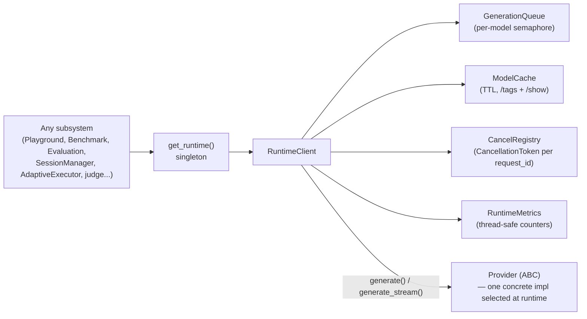

`RuntimeClient.generate()` is the one method that matters: acquire a per-model queue slot → race the provider call against a `CancellationToken` with a timeout (`_await_with_cancel`, `asyncio.wait(FIRST_COMPLETED)`) → retry transient `ConnectionFailure`/`ProviderUnavailable` up to `RUNTIME_RETRY_COUNT` times with backoff → record metrics → release the slot. No provider implementation duplicates queueing, retry, caching, or cancellation — the `Provider` ABC's docstring makes this an explicit contract, and `transport.map_transport_error()` is the single chokepoint translating raw `httpx` exceptions into the stable `RuntimeLLMError` hierarchy so no provider leaks a library-specific exception.

## 6. Training Architecture

Provider-swappable, mirroring the Runtime Manager's registration pattern one level up the stack.

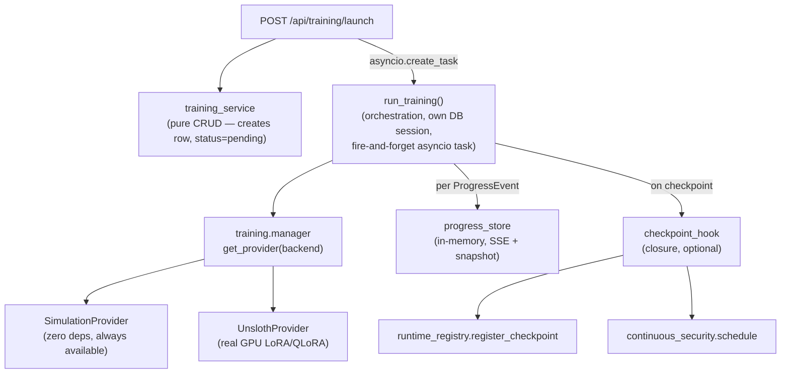

`UnslothProvider.diagnose()` (per-layer: PyTorch → CUDA → GPU → Transformers → PEFT → Unsloth → bitsandbytes → TRL, each independently probed and cached process-lifetime) determines `is_available()`, which determines `default_backend()`'s auto-selection (`unsloth` preferred, `simulation` guaranteed fallback). The real training recipe (`_unsloth_impl.py`) runs HF's `Trainer.train()` on a background **thread** (not the event loop) bridged to `ProgressEvent`s via a `queue.Queue`, with the thread's real exception captured and surfaced rather than masked by a downstream save error.

Training is the **hub** that fires two other subsystems non-blockingly per checkpoint: Runtime Registry registration (idempotent per `run_id`+`step`) and Continuous Security scheduling — both wrapped so their failure can never abort training.

## 7. Benchmark Architecture

"How well does the model perform?" — objective, suite-based, async-queued.

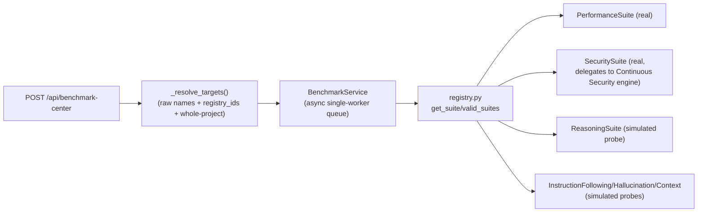

Every suite implements `BenchmarkSuite` (`key`, `label`, `real: bool`, `async run(ctx) -> SuiteResult`) and is registered in a flat dict — adding a dimension is a one-file change. The **honesty convention**: only suites that measure something locally (`Performance`, timed real generations; `Security`, delegates to the real engine) report `simulated=False`; dataset-dependent suites (`Reasoning`, `InstructionFollowing`, `Hallucination`, `Context`) run a deterministic hash-based probe (`_stable_probe_score`) and always report `simulated=True` until a real dataset adapter is attached — architecture is present, the data is not.

## 8. Evaluation Architecture

"How does the model actually behave?" — qualitative, prompt-based, golden-response-compared, regression-detecting. Structurally a sibling of Benchmark Center, one layer deeper (Collection → PromptSet → Prompt → Session → Result instead of just Target → Result).

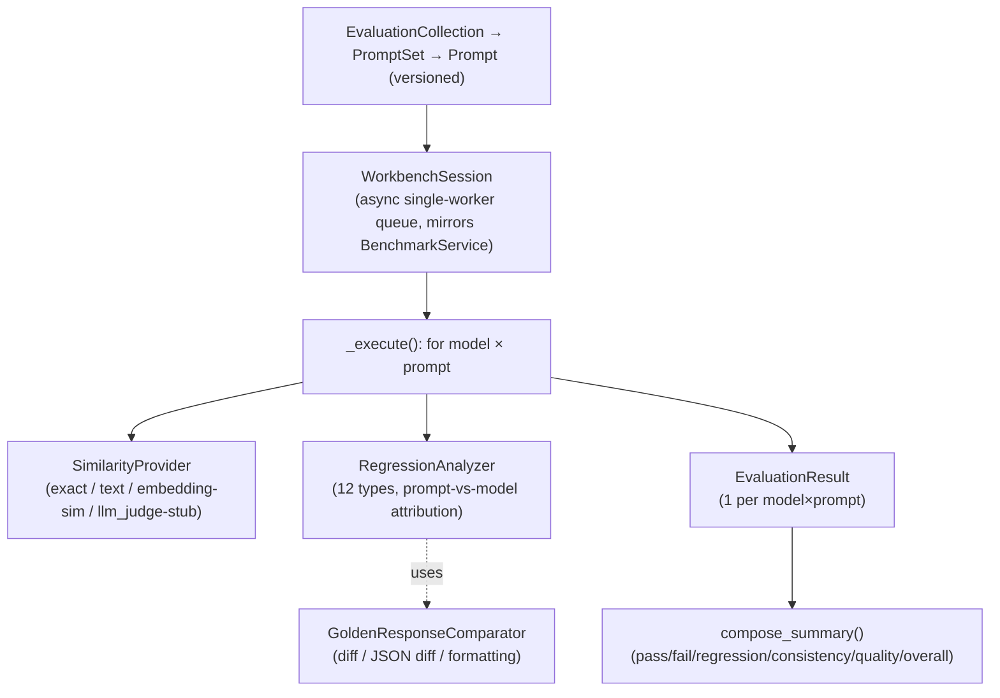

Prompt versioning (`PromptVersionService`) bumps `current_version` only when a *content* field changes (not title/tags/priority), and every version is an immutable snapshot — which is what lets `RegressionAnalyzer` attribute a detected drift to "the prompt changed" vs. "the model changed" (`prompt_changed = prev.prompt_version != p.current_version`). Same Runtime Manager, same async-queue shape as Benchmark Center — deliberately, per both modules' docstrings.

## 9. Continuous Security Architecture

Per-checkpoint security evaluation, scheduled automatically during training, using the same async-queue shape as Benchmark Center and Evaluation Workbench — but its "engine" is not new code at all:

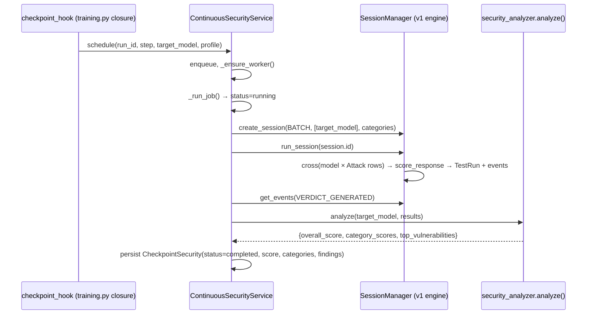

`_default_evaluate()` is explicit in its own docstring: it "reuses `SessionManager` (batch run) + `analysis.security_analyzer` — no new engine." Continuous Security is architecturally a **scheduling and checkpoint-history layer** over the v1 evaluation engine, not a fourth evaluation implementation.

## 10. Project Overview Architecture

`Project` is the aggregation root; `ProjectOverviewPage` and the training report endpoint are both **read-time composition** over independently-owned data — no subsystem writes into `Project`, and `Project` has no knowledge of any of them beyond the `id` foreign keys other tables optionally carry.

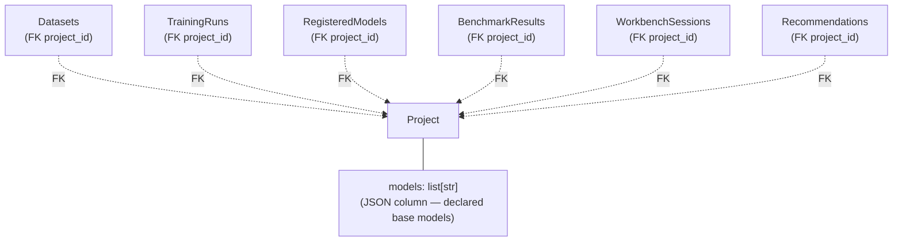

`Project.opened_at` bumped on open is the entire "Recent Projects" mechanism — no separate access-log table. `Project.datasets`/`Project.settings`/`Project.last_scan` JSON columns are largely vestigial placeholders from earlier phases (Dataset Lab uses its own FK'd `Dataset` table, not `Project.datasets`).

## 11. Assistant Architecture

**Fully local, fully deterministic, zero model calls.** Confirmed by direct code inspection: no `httpx`/provider/runtime import anywhere in the answer-generation path. It is a rules-and-templates system over already-computed local data, with a generic keyword-overlap knowledge-base fallback.

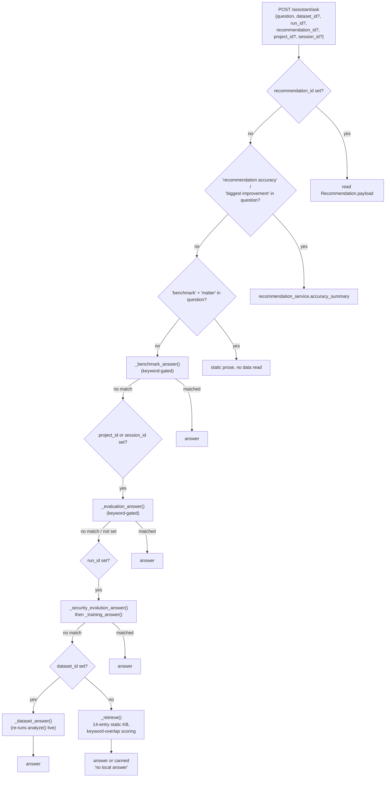

Every scoped branch reads only its own subsystem's already-persisted or cheaply-recomputable local data (`benchmark_center.history()`, `evaluation_sessions.get/results/regressions()`, `continuous_security.timeline()`, `training_service.get/checkpoints()`, `dataset_service.analyze()`). The floating `Assistant.tsx` widget, however, currently calls `ask.mutate({ question })` with **no context fields populated** — the scoping plumbing exists end-to-end at the API layer but the mounted UI component doesn't forward the current route's `session_id`/`run_id`/`project_id`/`dataset_id` (see Part V, UI Architecture Issues).

## 12. Runtime Registry

The identity bridge between a training checkpoint and something the Runtime Manager can actually run.

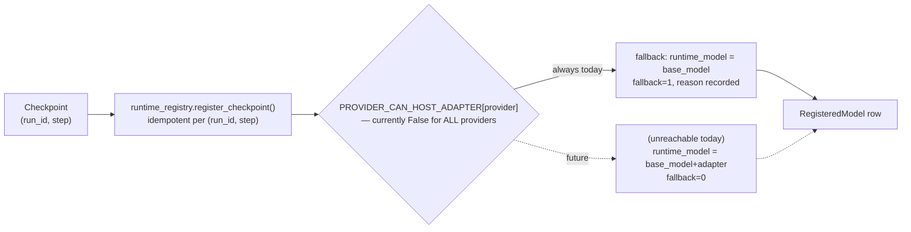

`PROVIDER_CAN_HOST_ADAPTER = {ollama: False, lmstudio: False, llamacpp: False, vllm: False}` is an honest, explicit placeholder — every checkpoint registered today resolves to the base model with `fallback=1` and full metadata preserved for reproducibility, never a fabricated "it worked" result. Consumers (`benchmark_center.py`, `evaluation_workbench.py`) don't call `resolve()`; they fetch the full dict and read `runtime_model` themselves because they also need `provider`/`label`. Registration failure is caught at every call site and degrades to `registry_id=None, target=base_model` — it can never abort training, benchmarking, or evaluation.

## 13. Provider Architecture

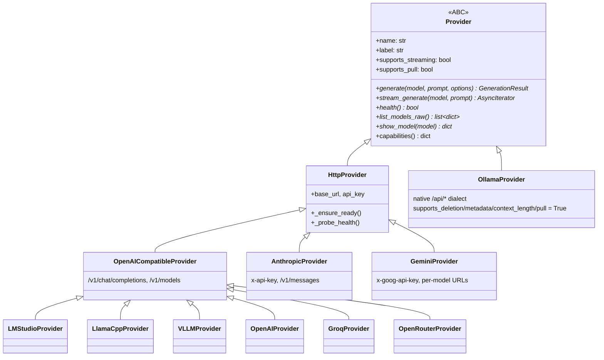

9 built-in providers across 3 wire dialects (Ollama-native, OpenAI-compatible, Anthropic, Gemini), registered in one flat dict (`BUILTIN_PROVIDERS`). No provider implements queueing, retrying, caching, or cancellation — that's `RuntimeClient`'s job exclusively (§5). Every provider funnels transport errors through one shared mapper. Two providers (`Anthropic`, `Gemini`) accept `options` in their method signatures but silently ignore sampling parameters (`temperature`/`top_p`/`seed`) — a real inconsistency, not a design choice (flagged in Part V).

## 14. Database Schema

**26 tables**, SQLite, `Base.metadata.create_all()` at startup (additive only — no column migrations without Alembic, and Alembic's `env.py` only imports the 11 legacy models, so it's stale relative to the 15 V2/Phase3/Phase4 tables).

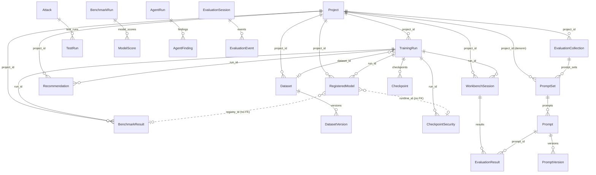

**Table inventory by era:**

| Era | Tables |
|---|---|
| **Legacy v1** (11) | `models` (ModelRecord), `attacks`, `test_runs`, `reports`, `benchmark_runs`, `model_scores`, `agent_runs`, `agent_findings`, `evaluation_sessions`, `evaluation_events`, `dataset_entries` |
| **V2 AI Studio** (8) | `projects`, `datasets`, `dataset_versions`, `training_runs`, `checkpoints`, `checkpoint_security`, `registered_models`, `recommendations` |
| **Phase 3** (1) | `benchmark_results` |
| **Phase 4** (6) | `eval_collections`, `eval_prompt_sets`, `eval_prompts`, `eval_prompt_versions`, `workbench_sessions`, `eval_results` |

**Cross-cutting schema pattern**: cross-subsystem references (`registry_id` on `BenchmarkResult`/`CheckpointSecurity`, `session_id` on `CheckpointSecurity`, `prompt_set_id` on `EvaluationResult`) are frequently **plain string columns, not `ForeignKey` constraints** — deliberate loose coupling that also means SQLite never enforces referential integrity across these links; orphaned references are possible and silently tolerated (every reader treats a missing lookup as `None`, never an error).

## 15. API Map

32 routers mounted on `app`, in registration order (`main.py`):

**Legacy (23):** `models, attacks, runs, evaluate, dashboard, reports, benchmarks, analytics, mutations, agent, leaderboard, history, dataset, benchmark_dataset, sessions, evaluation_engine, pipeline, system, runtime_status, providers, model_manager, health, onboarding`

**V2 (9):** `projects, playground, assistant, datasets, training, recommendations, registry, benchmark_center, evaluation_workbench`

| Prefix | Router | Domain |
|---|---|---|
| `/api/models`, `/api/model/*` | `models`, `model_manager` | model listing, catalog, deletion |
| `/api/attacks` | `attacks` | seeded attack library (read-only) |
| `/api/runs` | `runs` | ad-hoc attack execution |
| `/api/evaluate` | `evaluate` | standalone hallucination/judge scorers |
| `/api/dashboard`, `/api/leaderboard`, `/api/history`, `/api/analytics` | — | cross-run aggregate views |
| `/api/reports` | `reports` | legacy persisted per-model reports |
| `/api/benchmarks`, `/api/benchmark-dataset` | — | **legacy** static-dataset benchmark subsystem |
| `/api/mutations` | `mutations` | standalone mutation-strategy testing |
| `/api/agent` | `agent` | red-team agent runs |
| `/api/dataset` | `dataset` | legacy `DatasetEntry` export/sync |
| `/api/sessions` | `sessions` | v1 `EvaluationSession` CRUD/lifecycle |
| `/api/evaluation-plan`, related | `evaluation_engine` | v1 profile catalogue + plan preview |
| `/api/evaluate` (pipeline) | `pipeline` | `EvaluationPipeline` entry point |
| `/api/system`, `/api/health` | `system`, `health` | readiness / first-run checks |
| `/api/runtime`, `/api/providers` | `runtime_status`, `providers` | Runtime Manager status/control |
| `/api/onboarding` | `onboarding` | hardware recs + model pull |
| `/api/projects` | `projects` | workspace CRUD |
| `/api/playground` | `playground` | interactive chat |
| `/api/assistant` | `assistant` | local Q&A |
| `/api/datasets` | `datasets` | Dataset Lab |
| `/api/training` | `training` | Training Lab (+ security timeline + composed report) |
| `/api/recommendations` | `recommendations` | Recommendation Engine |
| `/api/registry` | `registry` | Runtime Registry |
| `/api/benchmark-center` | `benchmark_center` | Phase-3 Benchmark Center |
| `/api/evaluation-workbench` | `evaluation_workbench` | Phase-4 Evaluation Workbench |

Route-ordering convention, followed consistently in every V2 router: literal paths (`/suites`, `/leaderboard`, `/queue`, `/{resource}/accuracy`) are declared **before** their sibling parameterized `/{id}` route, so FastAPI's first-match routing never shadows them.

## 16. Background Workers

Three structurally identical async single-worker queues, built independently (not shared code) in `app/benchmarks/service.py`, `app/evaluation/service.py`, and `app/continuous_security/service.py`:

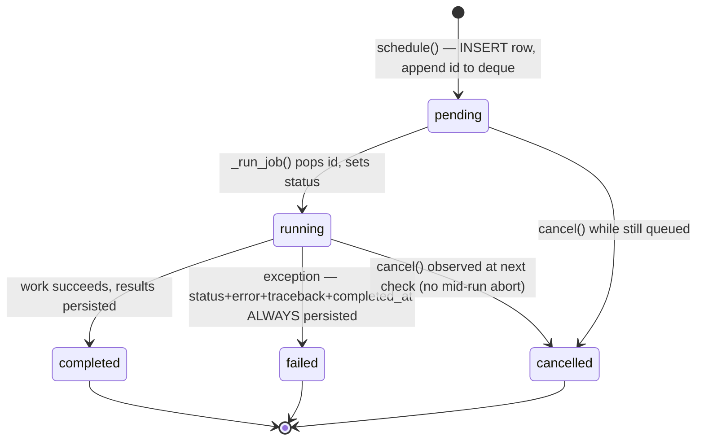

Shared mechanics: `deque[str]` FIFO + `set[str]` cancelled-ids + `asyncio.Lock` (serializes the background worker against an explicit test `drain()`) + `auto_worker` flag (tests disable it and call `drain()` directly). `_ensure_worker()` spawns at most one `asyncio.create_task` per service instance; the lock, not task-uniqueness, is what actually guarantees single-worker semantics. A fourth, older background-task pattern exists in parallel: the legacy `app/benchmarking/benchmark_scheduler.py` tracks jobs in a plain in-memory dict with **no persistence and no resume** — a different, simpler, and non-durable mechanism from the three queue-based services (see Part V).

A separate, unrelated background mechanism: `run_training()` (§6) is a bare `asyncio.create_task` fire-and-forget, not queued at all — an unlimited number of training runs could be launched concurrently (no per-process training concurrency limit exists, unlike `GenerationQueue`'s per-model semaphore for inference).

Orphan recovery (`main.py:_recover_orphaned_jobs`, run once at startup) is the safety net for **all** of these: any row left `pending`/`running`/`paused` from a prior crash is walked **per-row** (not a bulk `UPDATE`) and given a terminal status **plus** a populated `error`/`completed_at`/`metrics.error` wherever those columns exist — the explicit fix for a documented bug where a bulk `UPDATE` previously produced `status=failed, error=null, completed_at=null`.

## 17. Event System

There is **no application-wide event bus**. "Event" means two entirely different things depending on subsystem:

1. **Durable domain events** (`EvaluationEvent`, v1 engine only): an append-only table, one row per significant action (`session_created`, `model_started`, `attack_started`, `response_received`, `verdict_generated`, `session_completed`, `session_failed`, plus `model_profiled`/`plan_generated`/`mutation_applied`/`attack_retried`/`analysis_completed`/`report_generated`/`heartbeat`). This is genuine event sourcing: session state is either a column or reconstructible purely from its event stream (`EvaluationPipeline._results_from_events` rebuilds `AttackResult`s from nothing but persisted `verdict_generated` events), and `app/sessions/terminal.py` explicitly renders **only** what's in this stream, never inventing lines.
2. **In-process progress events** (`ProgressEvent` from Training providers): an `AsyncIterator` yielded from a provider's `run()` coroutine, consumed once by `run_training()`, written into the in-memory `progress_store`, and never persisted as individual rows (only the final terminal state and periodic checkpoints are durable).

Cross-subsystem "eventing" (Training → Continuous Security, Training → Runtime Registry) is not events at all — it's a direct async callback closure (`checkpoint_hook`) passed as a function argument, invoked in-process. There is no publish/subscribe mechanism connecting subsystems; every cross-subsystem call is a direct import and a direct async call.

## 18. State Management

| Layer | Where it lives | Durability |
|---|---|---|
| Domain records | SQLite, via SQLAlchemy | Durable, survives restart |
| Live training progress | `progress_store` (module singleton, `dict[str, RunState]`) | **Lost on restart** — orphan recovery marks the DB row `interrupted`, but fine-grained history/logs are gone |
| Async queue state (Benchmark/Evaluation/Continuous Security) | In-process `deque`/`set`/`asyncio.Lock` per service singleton | **Lost on restart** — the DB rows are the source of truth for what was scheduled; the in-memory queue itself is not persisted, only reconstructed implicitly (nothing re-enqueues orphaned `pending` rows automatically; orphan recovery marks them `failed` rather than re-queuing) |
| GPU/hardware detection | Module-level cache (`_gpu_cache`, `UnslothProvider._diag_cache`) | Process-lifetime, explicit `refresh` to bust |
| Model list / show metadata | `ModelCache` (TTL, default 30s) | Process-lifetime, TTL-bounded |
| Runtime metrics | `RuntimeMetrics` singleton (thread-safe counters + rolling deque) | Process-lifetime only, never persisted |
| Frontend server-state | `queryClient` singleton (`Map`) | Browser-tab lifetime only |
| Frontend UI state | Component `useState` | Component lifetime |
| Frontend cross-cutting flags | `localStorage` (`redforge_onboarded`, `redforge_nav_collapsed`) | Persistent, browser-scoped |

The single-process constraint (§1) is precisely what makes all the in-memory singletons above safe *within* their process — there is exactly one of each, and nothing else could observe a stale copy.

## 19. Dependency Graph

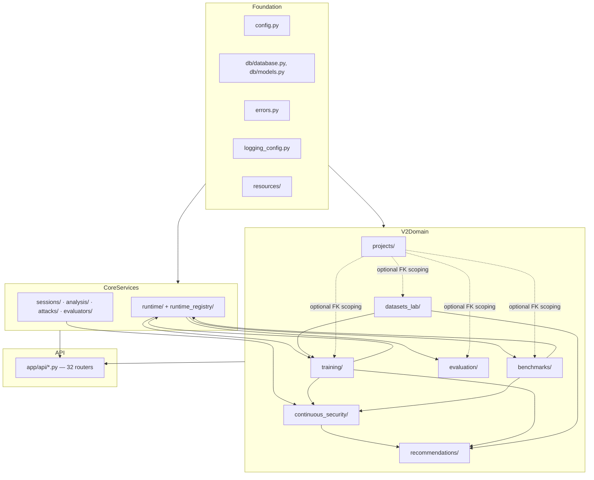

Dependencies flow strictly downward (Foundation → Core → V2 Domain → API) with **one deliberate exception**: `app/sessions/session_manager.py::_generate` imports `app.runtime.manager.get_runtime` lazily inside the method body specifically to avoid a `sessions ↔ api.runs` import cycle noted in its own comment — the one place a historical circular-import problem left a visible scar (a local, not top-level, import).

## 20. Artifact Flow

RedForge has **no first-class Artifact entity or artifact store** (no table, no service, no API surface named "artifact"). What exists instead:

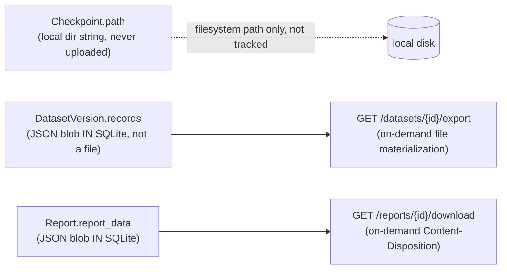

Every "artifact-like" thing is either (a) a filesystem path string stored in a column with no size/hash/existence tracking (`Checkpoint.path`, `RegisteredModel.adapter_path`), or (b) a JSON blob stored directly in SQLite rows rather than as a file (dataset records, report data). There is no content-addressable storage, no artifact versioning independent of its owning entity, and no artifact registry a future feature could query generically ("show me every artifact produced by run X"). Local-only is honored (nothing described here ever uploads), but "artifact" as a reusable, trackable concept does not exist yet (see Part II, Missing Entities).

## 21. Data Flow

Canonical shape, illustrated with the Training → Continuous Security → Registry → Report chain (the richest cross-subsystem flow in the app):

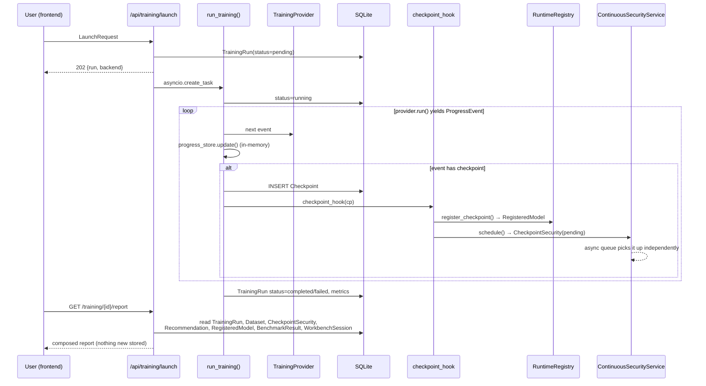

Data flows **forward through direct calls at write time**, and **backward through independent reads at report time** — no subsystem pushes updates to a report cache; the report endpoint pulls fresh from six tables on every request.

## 22. Execution Flow

Three distinct execution shapes coexist:

1. **Fire-and-forget task, no queue** — `run_training()`. One `asyncio.create_task` per launch; no cap on concurrent trainings.
2. **Async single-worker queue** — Benchmark/Evaluation/Continuous Security. Enqueue is non-blocking (just an INSERT + deque append); actual work is strictly serialized per service instance via `asyncio.Lock`.
3. **Synchronous-per-request, then background poll** — the v1 `SessionManager.run_session` loop runs to completion inside whatever task invoked it (itself usually a fire-and-forget task from `app/api/pipeline.py`/`sessions.py`), with the frontend polling `/sessions/{id}/events` (or the streaming shim `useSessionStream`) rather than the backend pushing anything.

None of the three use a real task queue (Celery/RQ/arq) or process pool — everything is `asyncio` cooperative concurrency inside the one enforced single process.

## 23. Request Lifecycle

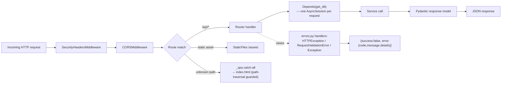

Every unhandled exception is caught by the catch-all `Exception` handler, logged with full traceback server-side, and returns a generic `500`/`internal_error` — **no exception detail ever reaches the client** except through the deliberate `HTTPException(detail=...)` path. `mount_frontend()` is registered last specifically so the SPA catch-all can never shadow `/api/*`, `/healthz`, `/openapi.json`, `/docs`, `/redoc`.

## 24. Startup Lifecycle

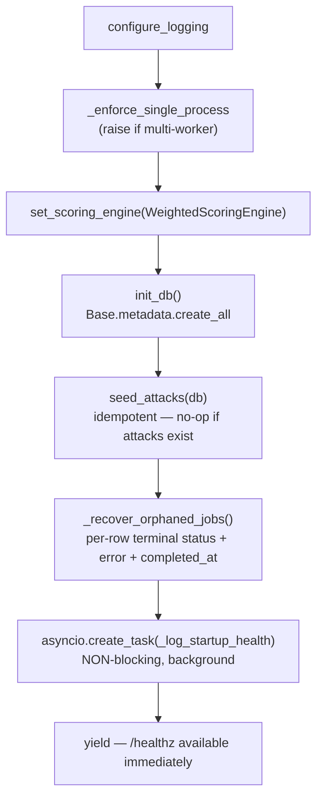

`/healthz` is deliberately decoupled from the health-check task — it returns `{"status":"online"}` unconditionally the instant the process is listening, while the real structured health report (`app/health/`) runs in the background and only logs its findings; nothing gates readiness on it at the HTTP layer (only the `system.py` first-run-wizard endpoint computes and returns readiness synchronously, on demand, not at startup).

## 25. Configuration System

Plain-Python `Settings` class (`app/config.py`), no Pydantic `BaseSettings`, no `.env` loading — every override is a real `REDFORGE_*` process environment variable, read once at import time into a single module-level `settings` singleton. Grouped by concern: Ollama-specific timeouts, unified runtime-provider timeouts/concurrency/retries, adaptive-execution/estimation constants, GPU-probe timeout, CORS origins, database URL resolution (explicit override → legacy `./redforge.db` if present → OS app-data dir, created on demand, falling back to CWD on `OSError`), log level, upload size cap. No feature-flag boolean fields exist; `RUNTIME_PROVIDER` (a string selector) is the closest thing, and `REDFORGE_ALLOW_MULTIWORKER` is read directly from `os.environ` in `main.py`, bypassing `Settings` entirely — a second, undocumented configuration surface.

## 26. Existing Design Principles

Extracted from consistent patterns and explicit docstrings across the codebase (not the author's aspirations — what the code actually does, repeatedly, on purpose):

1. **One execution path per capability.** Every LLM call goes through `get_runtime()`. Every provider-swappable domain (Runtime, Training) has exactly one manager/registry module that owns selection.
2. **Additive, never destructive.** New tables via `create_all`; new routers appended; new suites/providers/similarity-methods registered into flat dicts. Nothing in the codebase deletes or restructures an existing table in-place at runtime.
3. **Never crash the caller.** Pervasive `try/except Exception` at every integration seam (checkpoint hook, registry registration, health checks, per-suite/per-prompt execution) with the explicit stated intent "must never abort X."
4. **Honesty over simulation-as-fact.** `simulated: bool` flags on `SuiteResult`/`SimilarityResult`; `fallback: bool` on `RegisteredModel`; explicit "architecture, not real data" notes — the system is willing to say "I don't actually know" rather than fabricate a plausible number.
5. **Compose at read time; store nothing new.** Both the training report and the Project Overview page are pure joins over existing tables computed fresh on every request — no cached "report" row to go stale.
6. **Local-first, no cloud coupling.** No accounts, no telemetry, hosted providers are opt-in and never auto-recommended (`onboarding/recommender.py` explicitly prefers local runtimes).
7. **Graceful degradation over hard failure.** Runtime Registry's base-model fallback, Training's Simulation fallback, the Assistant's KB fallback, Health's non-blocking network check — every subsystem has a "cannot do the real thing, but here's an honest, working substitute" path.
8. **Injectable seams for testability.** `session_factory`, `run_fn`, `generate_fn`, `evaluate_fn` constructor parameters throughout the V2 services exist purely so tests can drive real logic without a live provider or live DB pool.

---

---

# PART II — DOMAIN ENTITY CATALOG

For each entity: **Responsibility · Owner · Lifecycle · Relationships · Current Implementation · Mixed responsibilities? · Ownership correct?** Modeling only — no redesign proposed here (that's Part IV).

## Project

- **Responsibility**: A named local workspace grouping models, datasets, training runs, benchmarks, evaluations, and recommendations.
- **Owner**: `app/projects/service.py` (CRUD) + `Project` table.
- **Lifecycle**: create → (opened repeatedly, bumping `opened_at`) → updated → optionally duplicated → deleted (hard delete).
- **Relationships**: Loosely-FK'd aggregation root — 7 other tables carry an optional `project_id`. `Project` itself has zero awareness of any of them (no relationship() back-references declared on `Project`).
- **Current implementation**: Thin, correct, and stable — a genuine workspace concept with no scope creep.
- **Mixed responsibilities?** No — but it carries two **vestigial** fields (`models: JSON list[str]`, `datasets: JSON list`) that predate the real `Dataset` table and are largely unused by newer subsystems, which use `Dataset.project_id` instead.
- **Ownership correct?** Yes. This is the one entity in the system that is unambiguously well-scoped.

## Workspace

- **Does not exist as a distinct entity.** "Workspace" in the UI/docs vocabulary *is* `Project` — there is no separate Workspace concept, no multi-project grouping, no user/team scoping. Noted here because the prompt asked for it explicitly; the finding is its absence, not an implementation to describe.

## Runtime

- **Responsibility**: The unified execution surface for calling any LLM (generate, stream, list, show, health).
- **Owner**: `RuntimeClient` (`app/runtime/client.py`), instantiated once behind `get_runtime()`.
- **Lifecycle**: Not a persisted entity — a process-lifetime singleton, rebuilt only when `set_default_provider()` is called (`reset_runtime()` drops the cached instance).
- **Relationships**: Wraps exactly one active `Provider` at a time; composes `GenerationQueue`, `ModelCache`, `CancelRegistry`, `RuntimeMetrics`.
- **Current implementation**: Clean single-responsibility composition — orchestration only, zero business logic about training/benchmarking/evaluation leaks in.
- **Mixed responsibilities?** No.
- **Ownership correct?** Yes — this is the architecture's strongest boundary.

## Runtime Provider

- **Responsibility**: Speak one LLM wire dialect (Ollama-native / OpenAI-compatible / Anthropic / Gemini).
- **Owner**: `Provider` ABC + 9 concrete classes (`app/runtime/providers/`).
- **Lifecycle**: Constructed fresh per `build_provider(name)` call; not pooled/reused beyond whatever the caller holds.
- **Relationships**: Selected by `app/runtime/manager.py` from `_PROVIDERS`; consumed exclusively through `RuntimeClient`.
- **Current implementation**: Consistent ABC contract, inconsistent **fidelity** to it — `AnthropicProvider`/`GeminiProvider` accept `options` but ignore sampling params (temperature/top_p/seed silently dropped), which is a contract violation, not a variant.
- **Mixed responsibilities?** No — providers correctly do transport-only work.
- **Ownership correct?** Mostly yes; the two silently-partial implementations are a correctness gap, not an ownership gap (flagged in Part V).

## Training Provider

- **Responsibility**: Execute (or simulate) a LoRA/QLoRA run and yield progress.
- **Owner**: `TrainingProvider` ABC + `SimulationProvider`/`UnslothProvider` (`app/training/providers/`).
- **Lifecycle**: Fresh instance per `get_provider(backend)` call (mirrors Runtime Provider's statelessness), except `UnslothProvider._diag_cache` which is a **class-level** attribute persisting across instances for the process lifetime — an intentional exception to "fresh instance."
- **Relationships**: Selected by `app/training/manager.py`; consumed exclusively by `run_training()`.
- **Current implementation**: Same registration pattern as Runtime Provider, one level up — a second, independently-implemented copy of the "pluggable-backend registry" idea (see Part V, duplicated architecture pattern).
- **Mixed responsibilities?** `UnslothProvider` mixes **diagnostics** (per-layer dependency probing) with **execution** (delegating to `_unsloth_impl.run_unsloth`) in one class — arguably two responsibilities, though the split into `diagnose()`/`run()` methods keeps them cleanly separated internally.
- **Ownership correct?** Yes.

## Training Run

- **Responsibility**: The durable record of one fine-tuning job — config, status, final metrics.
- **Owner**: `TrainingRun` table + `training_service` (CRUD only) + `run_training()` (orchestration, writes directly to the ORM, bypassing `training_service`).
- **Lifecycle**: `pending` (created by `training_service.create`) → `running` (set by `run_training`, not `training_service`) → `completed`/`failed`/`cancelled` (set by `run_training`, or forced by `/cancel` via `training_service.set_status`) → optionally deleted.
- **Relationships**: Has `Checkpoint`s (cascade delete), optionally an FK'd `Dataset`, referenced by `CheckpointSecurity`, `RegisteredModel`, `Recommendation`, `BenchmarkResult`, `WorkbenchSession`.
- **Current implementation**: **Two writers to the same table** — `training_service` owns CRUD but `run_training()` mutates `status`/`started_at`/`completed_at`/`metrics` directly via its own ORM session, never calling back into `training_service`. The module docstring for `service.py` even states this split explicitly ("Live progress is the store's job; this owns the durable record... runner.py does *not* call training_service").
- **Mixed responsibilities?** The *entity* is fine; the **write path is split across two modules** by design, which is unusual but documented, not accidental.
- **Ownership correct?** Debatable — a single `TrainingRun` has no single writer. Functionally safe today (no observed race), but it's a real deviation from "one owner per table" that a future refactor should be aware of.

## Training Job

- **Does not exist as a separate entity from Training Run.** No distinct "job" concept — `TrainingRun` *is* the job. Noted because the prompt asked for it; there is no duplication here, just a naming non-issue (unlike "Evaluation Session," below, where a duplication genuinely exists).

## Dataset

- **Responsibility**: A named, versioned collection of records (or text) usable for training.
- **Owner**: `Dataset`/`DatasetVersion` tables + `DatasetService` (`app/datasets_lab/`).
- **Lifecycle**: import/create → analyze (cached onto `dataset_metadata`) → clean/split (produce new versions or ephemeral previews) → optionally restored to an earlier version → deleted.
- **Relationships**: Optionally FK'd to `Project`; referenced by `TrainingRun.dataset_id`.
- **Current implementation**: Immutable-version-on-every-save is applied with real discipline (`save_version` is the single choke point; nothing ever mutates a `DatasetVersion` row).
- **Mixed responsibilities?** No — `DatasetService` cleanly separates parsing/analysis/cleaning/splitting/versioning into distinct modules under one service facade.
- **Ownership correct?** Yes.

## Benchmark

- **Responsibility**: In the prompt's vocabulary, "Benchmark" maps to two **genuinely different, coexisting** things in the codebase.
- **Owner (legacy)**: `app/benchmarking/` + `BenchmarkRun`/`ModelScore` tables — static RedForge-Bench-V1 dataset, in-memory (non-durable) job tracking.
- **Owner (Phase 3)**: `app/benchmarks/` + `BenchmarkResult` table — pluggable suites, durable async queue.
- **Lifecycle (Phase 3)**: `pending` → `running` → `completed`/`failed`/`cancelled` (see §16/22 in Part I).
- **Relationships**: `BenchmarkResult` optionally references `Project`/`TrainingRun`/`RegisteredModel` (the last via a non-FK string column).
- **Current implementation**: Both systems are live simultaneously, registered as separate routers, over separate tables, with separate job-orchestration mechanisms (in-memory dict vs. durable async queue). This is the single clearest **duplicate concept** in the entire codebase (see below and Part V).
- **Mixed responsibilities?** N/A — the issue is duplication, not internal mixing.
- **Ownership correct?** No single "Benchmark" owner exists — two subsystems both legitimately own something called a benchmark.

## Benchmark Session

- **Does not exist as its own entity.** A `BenchmarkResult` row *is* a single-target run, not a session grouping several targets — the closest thing to a "session" is the ephemeral list returned by `POST /benchmark-center` (`{scheduled: [...], count}`), which is never itself persisted as an entity. Contrast with Evaluation, which *does* have an explicit session entity (`WorkbenchSession`) one level up from its per-target results (`EvaluationResult`). This asymmetry is a real structural inconsistency between the two Phase-3/Phase-4 siblings (flagged in Part IV).

## Evaluation

- **Overloaded term** — refers to at least three unrelated things depending on context:
  1. The **v1 security-attack evaluation** (`EvaluationSession`/`EvaluationEvent`/`TestRun`, driven by `SessionManager`).
  2. The **v1 "intelligent" pipeline** (`EvaluationPipeline`, profile→plan→adaptive-execute→analyze).
  3. **Evaluation Workbench** (Phase 4, `WorkbenchSession`/`EvaluationResult`, qualitative prompt-response validation).
- No single "Evaluation" entity or module owns the term; each of the three is independently correct in its own scope, but the shared English word invites confusion in conversation, documentation, and (per Part V) in the Assistant's keyword-gating logic.

## Evaluation Session

- **This is the clearest duplicate-concept finding in the schema.** Two tables, both literally named "session," both representing "a batch of work executed against one or more models":
  - `EvaluationSession` (legacy, table `evaluation_sessions`) — v1 security-attack batch, event-sourced, `session_type ∈ {batch, benchmark, agent, single}`.
  - `WorkbenchSession` (Phase 4, table `workbench_sessions`) — Evaluation Workbench prompt-set run.
  - Both model docstrings explicitly disclaim the other ("distinct from the legacy `evaluation_sessions`...", "Unlike the legacy in-memory batch job store...") — the duplication is **known and intentional**, not accidental, but it remains two owners for the same conceptual role.
- **Current implementation**: Neither is wrong in isolation; the naming collision (both are literally "an EvaluationSession") is the issue, not the modeling.
- **Ownership correct?** No single "Session" abstraction exists that either could implement — a missing shared abstraction (see below).

## Continuous Security

- **Responsibility**: Schedule and track a security evaluation per training checkpoint over time.
- **Owner**: `CheckpointSecurity` table + `ContinuousSecurityService`.
- **Lifecycle**: `pending` → `running` → `completed`/`failed`/`cancelled` (async-queue pattern, §16).
- **Relationships**: FK'd to `TrainingRun`, optionally to `Checkpoint`; carries non-FK `runtime_id`/`session_id` string links to `RegisteredModel`/`EvaluationSession`.
- **Current implementation**: A thin, honest scheduling/history layer — it deliberately does **not** own evaluation logic, delegating entirely to `SessionManager` + `security_analyzer.analyze()`.
- **Mixed responsibilities?** No — this is a model example of "orchestration only, zero engine duplication."
- **Ownership correct?** Yes.

## Checkpoint

- **Responsibility**: A saved point within a training run (step, loss, local path).
- **Owner**: `Checkpoint` table, written only by `run_training()._persist_checkpoint` (not `training_service`).
- **Lifecycle**: Created when a provider's `ProgressEvent.checkpoint` is set; never updated after creation; cascade-deleted with its `TrainingRun`.
- **Relationships**: Hub of the checkpoint fan-out — `CheckpointSecurity.checkpoint_id`, `RegisteredModel.checkpoint_id` both reference it (loosely — `CheckpointSecurity` is even passed `checkpoint_id=None` at the one call site that could populate it, see Part V).
- **Current implementation**: Simple, append-only, correctly scoped.
- **Mixed responsibilities?** No.
- **Ownership correct?** Yes, though the `checkpoint_id=None` gap above is a real data-quality bug in an otherwise-correct model.

## Model

- **Overloaded term**, referring to at least four distinct things across the app, none of which is a shared abstraction:
  1. `ModelRecord` (legacy `models` table) — a discovered/known model name+provider+version.
  2. A **raw string** model name/tag passed around everywhere else (`target_model`, `base_model`) — no entity at all, just a string the Runtime Manager resolves at call time.
  3. `RegisteredModel` — a checkpoint made runnable (see Runtime Model / Registry, below).
  4. Catalog entries returned live from `ModelCatalog`/`Provider.list_models_raw()` — never persisted, always fetched fresh from the provider.
- **Current implementation**: There is no canonical "Model" entity the rest of the app refers to by id — everything keys on the raw name string except registered checkpoints, which key on `RegisteredModel.id`. This works because the Runtime Manager treats any string as resolvable, but it means "model identity" is fundamentally string-based, not id-based, throughout the schema.

## Base Model

- **Not a distinct entity** — a *role*, not a type: any raw model-name string used as the starting point for training (`TrainingRun.base_model`) or as the fallback target when a `RegisteredModel` can't host a real adapter (`RegisteredModel.base_model`, `RegisteredModel.runtime_model` when `fallback=1`). Correctly modeled as a plain string field wherever it appears — introducing a real "BaseModel" table would be over-engineering given today's usage.

## Runtime Model

- **Not a distinct entity** — the *resolved, actually-runnable* string (`RegisteredModel.runtime_model`) that the Runtime Manager is handed. It is a computed/derived field, not independently persisted or versioned; its provenance (`fallback: bool`, `model_metadata.fallback_reason`) is the only audit trail.

## Adapter

- **Barely modeled**: `RegisteredModel.adapter_path` is a nullable string column with no accompanying size, hash, format, or validity tracking, and — per `PROVIDER_CAN_HOST_ADAPTER` being `False` for every provider — is **never actually populated with a real, provider-hostable adapter today**. It exists as a forward-looking placeholder field, not a working feature.

## Merged Model

- **Does not exist.** No concept of merging a LoRA adapter into base weights to produce a standalone model appears anywhere in the schema, training providers, or Runtime Registry. A genuinely missing entity if/when real adapter hosting is built (see Part IV/V).

## GGUF

- **Does not exist.** No quantization/export/format-conversion concept anywhere in the codebase — training produces (in the real Unsloth path) whatever `trainer.save_model()` writes via HF's native format; there is no GGUF conversion step, no format field on `Checkpoint`/`RegisteredModel`, and Ollama's own GGUF requirement for custom models is not bridged to anywhere in RedForge's data model.

## Artifacts

- **Does not exist as a first-class entity** — see Part I §20. Filesystem paths and JSON blobs stand in for what a real platform would model as versioned, content-addressed, sized, and typed artifacts. This is the single largest structural gap relative to the competitive landscape (Part VI).

## Reports

- **Two independent, non-communicating implementations**:
  1. **Legacy `Report`** — persisted, per-`model_name` (not per-run, not per-project), write-once snapshot computed from raw `TestRun`s.
  2. **V2 composed training report** (`GET /training/{run_id}/report`) — not a table at all; recomputed live on every request from six other tables.
- **Current implementation**: Genuinely different scopes (security-only vs. full-lifecycle engineering report) justify coexistence, but they share zero code (`generate_report()` is never called by the training report route) and a user could reasonably expect "Reports" in the nav to be one coherent concept — it isn't.
- **Ownership correct?** Each is internally correctly owned; there is no unifying "Report" abstraction across them.

## Recommendations

- **Responsibility**: A generated, accept/reject/apply-tracked suggestion for how to improve a model via retraining.
- **Owner**: `Recommendation` table + `app/recommendations/engine.py` (pure logic) + `service.py` (persistence/lifecycle).
- **Lifecycle**: `proposed` → `accepted`/`rejected` → (if accepted and later trained against) `applied`, with `outcome` fed back via `record_outcome` to compute predicted-vs-actual accuracy.
- **Relationships**: Optionally FK'd to `Project`/`TrainingRun`; reads (but does not write) `CheckpointSecurity`, prior `TrainingRun.config`, `Dataset.dataset_metadata`.
- **Current implementation**: Clean read-only-context-gathering + pure-function-recommendation + persisted-decision split (`ModelContext` → `recommend()` → `Recommendation.payload`).
- **Mixed responsibilities?** No.
- **Ownership correct?** Yes. (Note: a *second*, much smaller, unrelated "recommendation" concept exists in `app/analysis/recommendation_engine.py` — a static category→remediation-text lookup used only by the v1 security report/finding pipeline. Confirmed **not** a duplicate of the same responsibility — different scope, different consumer — but the shared name is a documentation/discoverability hazard.)

## Sessions

- **The most overloaded noun in the codebase.** Distinct, unrelated "session" concepts:
  1. `EvaluationSession` (v1 security batch, event-sourced)
  2. `WorkbenchSession` (Phase 4 evaluation)
  3. The Security Center's own internal notion of a "session" inside `_default_evaluate()` (an `EvaluationSession` created and immediately run, never surfaced as its own user-facing entity — a v1 session used purely as Continuous Security's internal implementation detail)
  4. No session concept at all for Benchmark Center (a scheduling batch is ephemeral, not persisted)
- There is no shared `Session` base entity or interface — each is an independent table/class with only superficial conceptual overlap ("a batch of scored work against one or more models over time").

## Events

- **Two unrelated meanings**, per Part I §17:
  1. `EvaluationEvent` — durable, persisted, append-only, v1-engine-only.
  2. `ProgressEvent` — transient, in-process, `AsyncIterator`-yielded, Training-only, never persisted as individual rows.
- No shared "Event" type, no event bus, no publish/subscribe. Every cross-subsystem "notification" is a direct function call (`checkpoint_hook`), not an event.

---

## Missing Domain Entities

1. **Artifact** — no unified, versioned, content-addressed representation of "a thing a run produced" (checkpoint file, exported dataset, report download, adapter). Every current stand-in is a bare path string or a JSON blob.
2. **Session (unifying abstraction)** — four unrelated "session" concepts with no shared interface; a real platform-wide `Session` (id, kind, status, started_at, completed_at, owner) could host all of them.
3. **Adapter / Merged Model** — genuinely absent; will be needed the moment `PROVIDER_CAN_HOST_ADAPTER` flips to `True` for any provider.
4. **User / Identity** — intentionally absent (local-first, single-user by design — see Part VII), but worth naming explicitly as a *deliberate* non-entity, not an oversight.
5. **Deployment** — explicitly out of scope per the product's stated non-goals, so its absence is by design, not a gap.
6. **Attack Set / Prompt Set unification** — the v1 `Attack` library and Phase-4 `Prompt`/`PromptSet` are conceptually near-identical ("a named, categorized, severity/priority-tagged text used to probe a model") but share no table, no interface, and no code.

## Duplicate Concepts

| Concept | Duplicate A | Duplicate B | Verdict |
|---|---|---|---|
| Benchmark | `app/benchmarking/` + `BenchmarkRun`/`ModelScore` (legacy, static dataset, in-memory jobs) | `app/benchmarks/` + `BenchmarkResult` (Phase 3, pluggable suites, durable queue) | Full duplication of *purpose*; different implementations, both live |
| Evaluation Session | `EvaluationSession` (v1) | `WorkbenchSession` (Phase 4) | Acknowledged in both docstrings; naming collision more than logic collision |
| Recommendation | `app/recommendations/engine.py` (training-plan recommendations) | `app/analysis/recommendation_engine.py` (static category→text lookup) | **Not** a true duplicate — different responsibility, confirmed by direct inspection — but the shared name is a real hazard |
| Report | Legacy `Report` (per-model_name, persisted) | Training report (`/training/{id}/report`, composed-at-read) | Different scope, zero shared code, same nav-level concept in user-facing terms |
| Async single-worker queue | `BenchmarkService`, `EvaluationSessionService`, `ContinuousSecurityService` | (three independent, structurally identical implementations) | Deliberate copy-paste pattern reuse, not a data-duplication issue, but a code-duplication one (Part V) |
| Target-resolution (`_resolve_targets`) | `app/api/benchmark_center.py` | `app/api/evaluation_workbench.py` | Identical dedup-key logic, independently defined, not shared |
| Attack/Prompt (adversarial-test-unit) | `Attack` (v1, security-only) | `Prompt` (Phase 4, general-purpose) | Conceptually the same "labeled test input," no shared model |

## God Objects

No single class in the codebase rises to a textbook "God Object" (one class doing everything). The closest candidates, and why they fall short of the label:

- **`app/api/training.py`** (478 lines) — the largest single file, and the one true integration hub: it owns the launch flow, the checkpoint→registry→security wiring closure, the SSE stream, and the 6-table report composition. It is *doing a lot*, but each responsibility is delegated to the right owning service (`training_service`, `runtime_registry`, `continuous_security`) rather than reimplemented inline — it's a **thick orchestration layer**, not a god object, though its size and the density of its `/launch` and `/report` handlers are worth flagging as complexity hot-spots (Part V).
- **`EvaluationSessionService`** (`app/evaluation/service.py`) — combines queue orchestration, execution (`_execute`), and scoring (`compose_summary`) in one class. Internally well-factored into distinct methods, but it is the single largest service class in the app and the one place where "run the queue" and "score the results" responsibilities sit in the same object rather than being split (contrast with Benchmark Center, which delegates scoring entirely to pluggable `BenchmarkSuite`s).

## Missing Abstractions

1. **A shared `AsyncQueueService` base class.** Three independent, byte-for-byte-structurally-identical implementations (`deque` + `set` + `asyncio.Lock` + `auto_worker` + `schedule`/`_run_job`/`drain`/`cancel`/`queue_status`) exist with zero shared code. A base class or mixin capturing this pattern once would eliminate the triplication and guarantee future subsystems inherit the "never leave status=failed with a null error" fix automatically rather than needing it re-applied per subsystem (as happened historically — see the earlier incident this document's own git history reflects).
2. **A shared target-resolution helper.** `_resolve_targets()` in `benchmark_center.py` and `evaluation_workbench.py` are independently maintained copies of the same dedup/whole-project-expansion logic.
3. **A shared "labeled test input" abstraction** unifying `Attack` and `Prompt` — both are "a categorized, severity/priority-tagged text used to probe a model," with independent version/tag/notes-shaped metadata, and neither can be reused in the other's engine today.
4. **A shared `Session` interface** (see Missing Entities, above).
5. **An Artifact abstraction** (see Missing Entities, above) — the biggest gap, and the one most likely to matter as soon as real adapter-hosting or GGUF export is built.

---

---

# PART III — LIFECYCLE & STATE MACHINES

For each subsystem: state machine, sequence diagram, lifecycle diagram, and the 8 lifecycle stages (Creation / Validation / Execution / Monitoring / Completion / Failure / Recovery / Archival). No redesign — only how each behaves today.

## Runtime

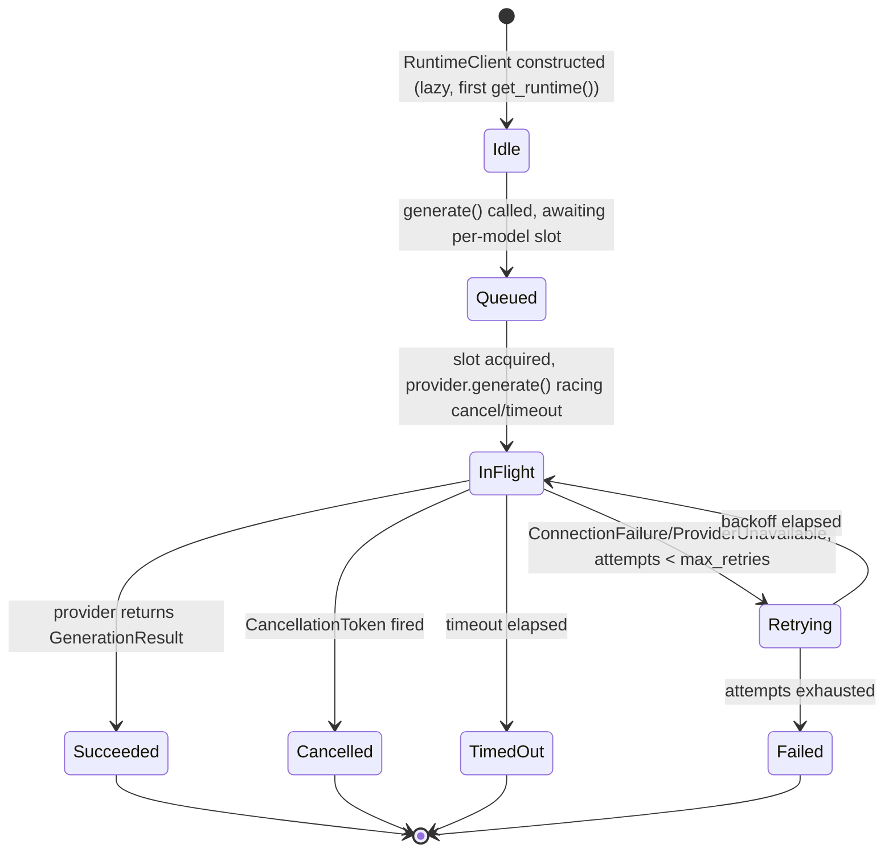

- **Creation**: implicit, on first `get_runtime()` call.
- **Validation**: none pre-flight — a bad model name surfaces only as a provider error (typically `ModelNotFound`, 404-mapped) at call time.
- **Execution**: `RuntimeClient.generate`/`generate_stream`, queued per model.
- **Monitoring**: `RuntimeMetrics` (active/total/completed/failed/cancelled/retry counters, rolling latency), exposed at `/api/runtime/status`.
- **Completion**: `GenerationResult` returned to caller; metrics recorded; cancel token discarded.
- **Failure**: mapped through `transport.map_transport_error` into the stable `RuntimeLLMError` hierarchy; retried if transient.
- **Recovery**: automatic retry with backoff (transient only); no recovery for timeout/cancel — caller must re-issue.
- **Archival**: none — no per-generation record persisted anywhere (only aggregate `TestRun`/`EvaluationResult` rows in the subsystems that choose to persist their own outcome).
- **Inconsistency flag**: no generation-level audit trail exists at the Runtime layer itself; every subsystem that wants history reimplements its own persistence (`TestRun`, `EvaluationResult`), so "what did the model actually say for request X" is only ever answerable through a subsystem-specific table, never centrally.

## Training

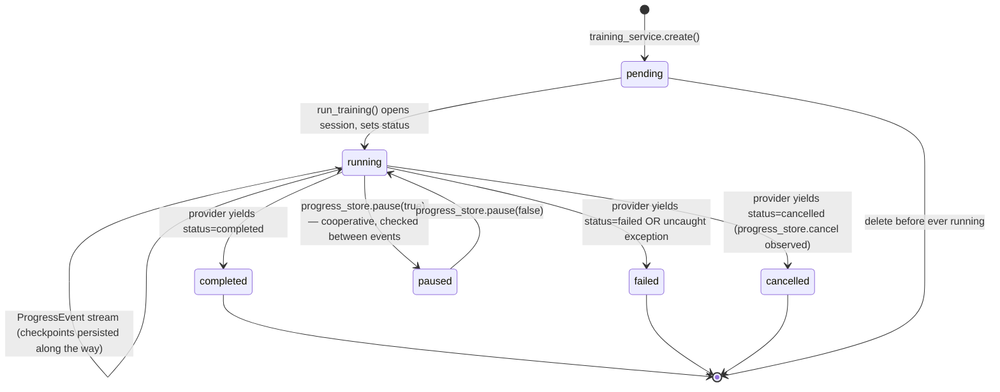

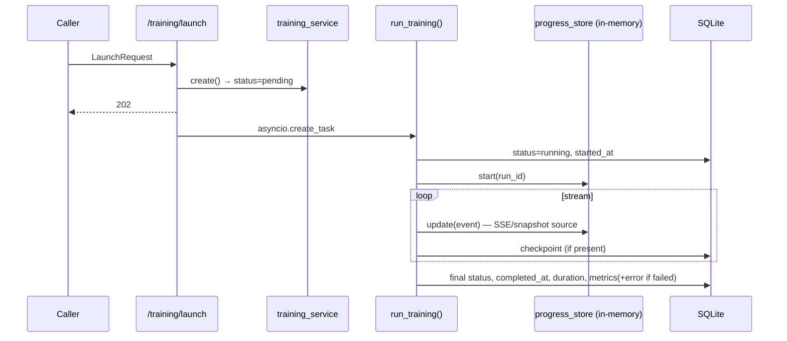

- **Creation**: `training_service.create` — always starts `pending`.
- **Validation**: none at creation time (no dataset-compatibility check, no hyperparameter bounds beyond Pydantic field constraints in the API schema).
- **Execution**: `run_training()`, provider-delegated.
- **Monitoring**: dual — in-memory `progress_store` (SSE + poll snapshot, fine-grained) and DB row (coarse, durable).
- **Completion**: DB row updated with final status/metrics; in-memory store retains the last snapshot until explicitly discarded (on run deletion) or lost on restart.
- **Failure**: real exception captured (post-fix) and stored in `metrics.error` — the *only* place a training failure reason durably lives, since `TrainingRun` has no dedicated error column.
- **Recovery**: none automatic — a failed run is terminal; the user must launch a new run. Orphan recovery at startup marks any `running`/`pending`/`paused` row `interrupted` (not resumed).
- **Archival**: `DELETE /training/{run_id}` hard-deletes the run and cascades to `Checkpoint`s; no soft-delete/archive state exists.
- **Inconsistency flag**: `TrainingRun` has no `error` column (unlike `BenchmarkResult`/`CheckpointSecurity`/`WorkbenchSession`, all of which do) — the failure reason is smuggled into the `metrics` JSON blob instead, an asymmetry with every other subsystem's failure-persistence shape.

## Benchmarking (Phase 3)

```mermaid
stateDiagram-v2
    [*] --> pending: schedule() — INSERT, enqueue
    pending --> running: worker pops id
    running --> completed: _default_run succeeds (per-suite scores/metrics)
    running --> failed: exception — error+traceback+completed_at always persisted
    pending --> cancelled: cancel() while queued
    running --> cancelled: cancel() observed post-run
    completed --> [*]
    failed --> [*]
    cancelled --> [*]
```

- **Creation**: `POST /benchmark-center` → `_resolve_targets` → `schedule_many` → one `BenchmarkResult` row per target, `pending`.
- **Validation**: `valid_suites()` filters unknown suite keys silently (falls back to defaults if the whole request list was invalid) — no hard validation error surfaced to the caller for a bad suite key.
- **Execution**: `_default_run` loops requested suites against one `SuiteContext`; per-suite failure is isolated (doesn't abort the row).
- **Monitoring**: `GET /queue` (pending/running counts only — no per-job progress percentage, unlike Training's step-level `progress_store`).
- **Completion**: `scores`/`metrics`/`overall_score`/`duration_seconds` persisted.
- **Failure**: row-level `error` + `metrics.traceback` (last 1500 chars) always populated — the explicit fix target of the historical bug.
- **Recovery**: none — failed rows are terminal; re-run means scheduling a new row.
- **Archival**: no delete endpoint exists at all for `BenchmarkResult` (only `DELETE /{id}` which is actually `cancel`, not a true delete) — history accumulates indefinitely with no pruning mechanism.
- **Inconsistency flag**: no true delete/archive path, unlike Training (`DELETE` hard-deletes) and Evaluation Workbench sessions (`DELETE` cancels, same asymmetry) — none of the three async-queue subsystems agree on what `DELETE` means (Training: destroy; Benchmark/Evaluation: cancel-only).

## Evaluation (Phase 4)

```mermaid
stateDiagram-v2
    [*] --> pending: schedule() — total_tasks precomputed
    pending --> running: worker pops id
    running --> completed: _execute() finishes — 1 EvaluationResult per model×prompt, summary composed
    running --> failed: exception — error+traceback+completed_at always persisted
    pending --> cancelled: cancel() while queued
    running --> cancelled: cancel() observed post-run
    completed --> [*]
    failed --> [*]
    cancelled --> [*]
```

- **Creation**: `POST /evaluation-workbench/sessions` → `_resolve_targets` (independent copy of Benchmark's) → one `WorkbenchSession`, `pending`, `total_tasks` precomputed as `len(models) × len(enabled prompts)`.
- **Validation**: 400 if `prompt_set_ids` empty or no models resolve — stricter than Benchmark Center's silent-fallback suite validation.
- **Execution**: `_execute()` — per (model × prompt): generate → similarity score (if baseline exists) → regression analysis (with drift context from the prior session's result for the same prompt+model) → verdict.
- **Monitoring**: `GET /queue`; no per-task progress fraction beyond `completed_tasks`/`total_tasks` on the row itself (which is only updated once, at completion, not incrementally during the run — so a long-running session shows `0/total` right up until it finishes).
- **Completion**: `EvaluationResult` rows persisted (one per model×prompt) plus a computed `summary` on the session row.
- **Failure**: identical pattern to Benchmark — error + traceback always persisted, this time into `summary.traceback`.
- **Recovery**: none — terminal.
- **Archival**: same `DELETE = cancel` semantics as Benchmark; no true delete.
- **Inconsistency flag**: `completed_tasks` is not updated incrementally during execution (only set once at the end), so it cannot actually be used for a live progress bar despite the field existing for exactly that purpose — a lifecycle gap between what the schema implies and what the execution loop does.

## Continuous Security

```mermaid
stateDiagram-v2
    [*] --> pending: schedule() (called from Training's checkpoint_hook)
    pending --> running: worker pops id
    running --> completed: _default_evaluate() succeeds (delegates to v1 engine)
    running --> failed: exception
    pending --> cancelled: cancel() while queued
    running --> cancelled: cancel() observed post-run
    completed --> [*]
    failed --> [*]
    cancelled --> [*]
```

- **Creation**: exclusively as a side effect of Training's checkpoint hook (no direct user-facing "create a security check" entry point outside training).
- **Validation**: none beyond the implicit requirement that the target model + a reachable provider + seeded attacks exist — a failure here (e.g., provider offline) is recorded as a normal job failure, not a distinct validation error.
- **Execution**: delegates entirely to `SessionManager.create_session`/`run_session` (v1 engine) + `security_analyzer.analyze()`.
- **Monitoring**: `GET /training/security/queue`.
- **Completion**: `score`/`categories`/`findings`/`session_id` persisted.
- **Failure**: same pattern as Benchmark/Evaluation (error always persisted).
- **Recovery**: none.
- **Archival**: no delete endpoint at all — `CheckpointSecurity` rows are permanent once created; only `cancel` exists (for pending/running).
- **Inconsistency flag**: this is the only one of the three "sibling" async-queue subsystems with **no direct creation API** — it can only be triggered indirectly through Training, which is a legitimate design choice (it's inherently checkpoint-scoped) but makes it structurally the odd one out compared to Benchmark/Evaluation's fully standalone scheduling APIs.

## Reports

- **Legacy `Report`**:
  - **Creation**: `POST /reports {model_name}` — computed once from all `TestRun`s matching that model name (no run/session scoping), persisted immediately.
  - **Validation**: 400 if zero matching `TestRun`s exist.
  - **Execution/Completion**: synchronous, in-request — no async/background step at all.
  - **Monitoring**: N/A (instantaneous).
  - **Failure**: an exception here surfaces as a normal 500; no partial/failed report state exists (write-once succeeds or the whole request fails).
  - **Recovery**: N/A.
  - **Archival**: none — reports accumulate forever, `GET /reports` lists all, `GET /{id}/download` serves the frozen blob. No re-generation/refresh path (a new `POST` just creates another row, doesn't update the old one).
- **V2 composed training report**:
  - **Creation**: none — computed and discarded on every `GET`, never a persisted lifecycle at all.
  - Every other stage is moot; this is the outlier lifecycle in the whole document — a report with **no state machine**, because it's pure derived data.
- **Inconsistency flag**: two "Report" concepts with completely different lifecycle shapes (one persisted/write-once/never-refreshed; one ephemeral/always-fresh) sitting under the same word in the product's vocabulary.

## Datasets

```mermaid
stateDiagram-v2
    [*] --> created: create/import (v1)
    created --> analyzed: analyze() — cached onto dataset_metadata (not a status change)
    analyzed --> versioned: clean()/split(save=true) → save_version() → v(n+1)
    versioned --> versioned: restore(v) → copies forward as v(n+1) — never rewinds
    versioned --> deleted: DELETE (hard, cascades DatasetVersion)
```

- **Creation**: inline record submission or file import (parsed via `parsers.py`).
- **Validation**: format detection + capped upload size (`MAX_UPLOAD_BYTES`, 413 if exceeded) + empty-file/unparseable-file rejection (422) at import time; no schema/content validation beyond that (a dataset can be nonsensical and still import successfully).
- **Execution**: `analyze`/`clean`/`split` — all pure, synchronous, in-request (no async queue involved anywhere in Dataset Lab).
- **Monitoring**: N/A (synchronous).
- **Completion**: each mutating operation either returns a preview (unsaved) or persists a new version.
- **Failure**: `ParseError` on import (422); no other failure mode modeled — there's no "dataset processing failed" status, because nothing here is async/backgrounded.
- **Recovery**: `restore(version)` is the recovery mechanism — but it's forward-only (always creates a new version), never a true rollback.
- **Archival**: hard delete only; no version-level delete (a `DatasetVersion` can never be individually removed, only the whole `Dataset`).
- **Inconsistency flag**: Dataset Lab is the only major V2 subsystem with **zero async/background execution** — every other domain (Training, Benchmark, Evaluation, Continuous Security) has a `pending/running/completed/failed` state machine; Datasets has none, because nothing it does takes long enough to warrant one today. Worth flagging only because it means Dataset Lab would need new lifecycle machinery (not just a bigger dataset) the day imports/analysis become slow enough to need backgrounding.

## Projects

```mermaid
stateDiagram-v2
    [*] --> created: create()
    created --> opened: touch() — opened_at bumped, repeatable
    opened --> updated: update() (partial, exclude_unset)
    updated --> opened
    opened --> duplicated: duplicate() → new Project, new uuid
    opened --> deleted: DELETE (hard — no cascade guard on child FKs)
```

- **Creation/Validation/Execution/Monitoring/Completion**: trivial CRUD, synchronous, no background step.
- **Failure**: standard 404/422 only.
- **Recovery**: N/A.
- **Archival**: **hard delete only, with no cascade behavior defined** on any of the 7 tables that carry `project_id` — deleting a `Project` does not delete or reassign its `Dataset`s/`TrainingRun`s/etc. (their `project_id` FK is nullable, so SQLite just leaves them pointing at a now-nonexistent id; no `ON DELETE` behavior is declared). This is a real lifecycle gap: deleting a project silently orphans everything that was scoped to it rather than cascading, archiving, or blocking the delete.

## Assistant

- Not a persisted entity — every "ask" is stateless request/response with no session/conversation memory server-side (the frontend widget holds `turns` locally only). No lifecycle beyond a single request's dispatch chain (Part I §11). Explicitly flagged here only because its *absence* of lifecycle is itself a notable, consistent design choice (matches "local, deterministic, no accounts" — nothing to archive because nothing is retained).

## Model Management

- **Creation**: models are discovered, not created — `ModelCatalog.catalog()` reflects whatever the active provider already has installed.
- **Validation**: none beyond provider-reported existence.
- **Execution**: pull (`onboarding/models/pull`, provider-native streaming) / delete (`DELETE /models/instance`, capability-gated via `supports_deletion`).
- **Monitoring**: `_PullTracker` — in-memory, percent-complete via byte counters, not persisted.
- **Completion**: pull tracker marked `done=True`.
- **Failure**: captured into the tracker's `error` field; no retry, no partial-pull cleanup logic visible in the reviewed code.
- **Recovery**: none — a failed pull must be restarted by the user from scratch.
- **Archival**: `DELETE /models/instance` is the only "removal," and it's destructive/immediate (provider-native delete), not a soft archive.
- **Inconsistency flag**: pull progress is the *only* long-running operation in the entire app that is neither a DB-backed async queue (like Benchmark/Evaluation/Continuous Security) nor a fire-and-forget task with DB status (like Training) — it's purely in-memory, so a server restart mid-pull loses all progress visibility with no orphan-recovery equivalent (nothing marks it "interrupted"; the tracker entry simply vanishes).

## Checkpoint Lifecycle

Already covered under Training, but isolated here per the prompt's explicit ask:

- **Creation**: exclusively via `run_training()._persist_checkpoint`, triggered by a provider's `ProgressEvent.checkpoint`.
- **Validation**: none — whatever the provider reports (`step`, `loss`, `path`) is trusted verbatim.
- **Execution**: N/A — a checkpoint is a record of a past event, not itself executable.
- **Monitoring**: surfaced via `GET /training/{run_id}/checkpoints` and the live `progress_store` history (step-level chart data).
- **Completion**: immediate — a checkpoint row is complete the moment it's written; no checkpoint-level status field exists.
- **Failure**: none modeled — `_persist_checkpoint` has no failure path of its own (a DB write failure there would propagate up as an unhandled exception inside `run_training`'s own try/except, becoming a *run*-level failure, not a checkpoint-level one).
- **Recovery**: N/A.
- **Archival**: cascade-deleted with the parent `TrainingRun`; `DELETE /training/checkpoints/{id}` also exists for individual deletion.

## Artifact Lifecycle

- **Does not exist as a modeled lifecycle** (see Part II). The closest approximations — `Checkpoint.path` and `RegisteredModel.adapter_path` — have no creation-validation-monitoring-completion-failure-recovery-archival machinery at all; they are opaque strings written once and read forever, with no verification that the referenced path still exists on disk at read time. This is the most significant lifecycle gap in the document.

---

## Cross-Subsystem Lifecycle Inconsistencies (Summary)

| Dimension | Training | Benchmark | Evaluation | Continuous Security | Datasets | Projects |
|---|---|---|---|---|---|---|
| Async/backgrounded | Yes (fire-and-forget task) | Yes (queue) | Yes (queue) | Yes (queue) | No | No |
| Dedicated `error` column | **No** (smuggled into `metrics`) | Yes | Yes | Yes | N/A | N/A |
| `DELETE` semantics | Hard delete | Cancel only | Cancel only | No delete at all | Hard delete | Hard delete, no cascade |
| Incremental progress tracking | Yes (step-level, live) | No (binary pending/running) | Schema exists, **not populated incrementally** | No | N/A | N/A |
| Direct creation API | Yes | Yes | Yes | **No** (training-triggered only) | Yes | Yes |
| Orphan recovery on restart | Yes (interrupted) | Yes (failed) | Yes (failed) | N/A (not in recovery list — see note) | N/A | N/A |
| Cascade-delete children | Yes (Checkpoints) | N/A | Yes (EvaluationResults) | N/A | Yes (DatasetVersions) | **No** (orphans children) |

*Note on Continuous Security orphan recovery*: `main.py:_recover_orphaned_jobs()` (Part I §16/24) does not include `CheckpointSecurity` in its recovery loop — only `EvaluationSession`, `TrainingRun`, `BenchmarkRun`, `BenchmarkResult`, `WorkbenchSession`, `AgentRun` are covered. A `CheckpointSecurity` row left `running` by a crash stays `running` forever with no recovery path — a genuine gap, not a documented exception.

No single subsystem is "wrong" in isolation — each evolved to fit its own domain. The inconsistency is that **five different subsystems each independently answer "what does delete/error/progress mean" differently**, with no shared lifecycle contract enforcing consistency across new subsystems as they're added.

---

---

# PART IV — RESPONSIBILITY AUDIT

A Principal Engineer's read on *architectural ownership* — not code quality, not style. For each subsystem: current responsibilities, correct responsibilities, what should move, what should remain. Then the cross-cutting findings (coupling, circularity, leaky abstractions, duplication, technical debt).

## Training

**Current responsibilities**: owns run CRUD (partially — split with `training_service`), orchestration (`runner.py`), provider selection (`manager.py`), live progress (`store.py`), *and* is the trigger point for two other subsystems' work (Runtime Registry registration, Continuous Security scheduling) via an inline closure defined in the API layer (`app/api/training.py`'s `/launch` handler), not in `app/training/` itself.

**Does Training own too much?** Partially, but not where it looks. The actual ML orchestration (`runner.py`, `manager.py`, `providers/`) is tightly and correctly scoped — it does one thing. The overreach is that **the wiring of Continuous Security and Runtime Registry lives in the API layer, not in a service**. `app/api/training.py:132-151` defines `hook()` — a non-trivial piece of cross-subsystem business logic (idempotent registration, fallback handling, security scheduling) — as a closure inside a route handler. That's an API-layer file doing service-layer integration work.

**Correct responsibility**: `app/training/` should own "what happens when a checkpoint is produced" as a first-class, testable function (e.g., a `checkpoint_pipeline.py` or an injectable hook registered onto `training_service`), with the API layer only translating the HTTP request into a call. Today, testing the checkpoint→registry→security wiring means testing through the API route, not through the training service directly.

**What should move**: the `hook()` closure and its cross-subsystem wiring, out of `app/api/training.py` and into `app/training/`.
**What should remain**: everything else — provider abstraction, runner, store, service CRUD split (the split itself is fine; see Part V for the *documentation* gap around it).

## Runtime

**Current responsibilities**: transport, queueing, caching, cancellation, retry, metrics — and nothing else. This is the one subsystem in the audit with no findings against it.

**Correct responsibility**: unchanged.

**What should move**: nothing.
**What should remain**: everything, as the reference example for how a subsystem boundary should look.

**Should Runtime own model metadata?** No, and it correctly doesn't — `ModelCatalog` (a separate module) owns metadata *shaping* (basic/extended views), while `Provider.show_model()`/`list_models_raw()` remain the only metadata *source*. Runtime owns execution; catalog owns presentation. Correct split.

## Datasets

**Current responsibilities**: import, parse, analyze, clean, split, version — a complete, self-contained lifecycle with no leakage into or from Training.

**Should datasets belong somewhere else?** No. The one legitimate question is whether Dataset Lab's `_current_records` (used by Training to pull records for a launch) constitutes coupling — it doesn't meaningfully: Training calls one read method and receives plain data, exactly the shape a correct boundary should have (Training doesn't know how records are stored/versioned; Datasets doesn't know how they'll be trained on).

**What should move**: nothing.
**What should remain**: everything.

## Reports

**Should reports be generated elsewhere?** This is really two separate questions because there are two separate "Reports":
- The **legacy `Report`** generator (`app/reports/generator.py`) is correctly self-contained — pure function over `TestRun`s, no coupling.
- The **V2 training report** (`GET /training/{run_id}/report`) is defined *inside* `app/api/training.py` (163 lines of aggregation logic, lines 295-458) rather than in a dedicated `app/reports/` (or `app/training/report.py`) module. This is the same pattern as the Continuous Security hook finding above: **substantial domain logic living in the API layer because it was easiest to add there incrementally**, not because the API layer is the correct owner.

**Correct responsibility**: report composition (querying 6 tables and assembling the executive summary / deployment recommendation) is a legitimate standalone responsibility that deserves its own service module, independently testable without spinning up the FastAPI route.

**What should move**: the report-composition function, out of `app/api/training.py` into a new or existing service module.
**What should remain**: the route itself, as a thin caller.

## Providers

**Should providers own execution?** No — and per the Runtime audit above, they correctly don't; they own transport only. The one violation of this principle is the two providers (`Anthropic`, `Gemini`) that accept sampling options but silently drop them — not an *ownership* violation (they still don't own queueing/retry/caching) but a **silent partial-contract implementation**, which is arguably worse than an ownership violation because it's invisible until a user notices their `temperature` setting has no effect on Claude/Gemini calls.

**Correct responsibility**: unchanged (providers = transport only).
**What should move**: nothing structurally — this is a completeness gap inside the correct owner, not a misplaced responsibility.

## Benchmark Center vs. Legacy Benchmarking

**Current responsibilities**: both `app/benchmarking/` and `app/benchmarks/` claim the same conceptual territory ("run attacks/suites against models, score them, track history") with entirely separate implementations, tables, and job-orchestration mechanisms.

**Correct responsibility**: one subsystem should own "benchmark a model," full stop. The Phase-3 `app/benchmarks/` implementation is architecturally superior on every axis that matters for this platform (durable async queue vs. non-persistent in-memory dict; pluggable suites vs. hardcoded static dataset; honest `simulated` flagging vs. no such concept) — it is the *correct* long-term owner.

**What should move**: nothing code-wise needs to move (this is a consolidation question, not a relocation question) — but as a responsibility matter, the legacy subsystem's continued live registration in `main.py` alongside the new one means two competing answers exist to "where do I look for benchmark data," which is a genuine ownership ambiguity for anyone extending the platform.
**What should remain**: `app/benchmarks/` as the sole forward owner (a decision, not an implementation instruction — Part V covers the coexistence risk in more depth).

## Continuous Security

**Current responsibilities**: scheduling + checkpoint-history tracking only; evaluation logic is 100% delegated. This is the audit's second reference example (alongside Runtime) of correct, minimal ownership — it resists the temptation to reimplement anything the v1 engine already does.

**What should move**: nothing.
**What should remain**: everything, including its explicit choice *not* to own evaluation logic.

## Evaluation Workbench

**Current responsibilities**: CRUD (Collections/Sets/Prompts/Versions) + queue orchestration + execution + **scoring** (`compose_summary`), all inside `EvaluationSessionService`.

**Correct responsibility**: compare against Benchmark Center, its structural sibling — Benchmark Center delegates *all* scoring to pluggable `BenchmarkSuite` objects; nothing in `BenchmarkService` computes a score itself. `EvaluationSessionService`, by contrast, computes `pass_rate`/`regression_score`/`consistency_score`/`quality_score`/`overall_score` directly inside `compose_summary()` — a ~70-line function embedded in the same class that also owns the queue. Not wrong, but an inconsistency with the sibling subsystem's established pattern of "queue orchestration and scoring are separate concerns."

**What should move**: `compose_summary()` could be extracted to a standalone scoring module (mirroring how `RegressionAnalyzer`/`GoldenResponseComparator`/`SimilarityProvider` are already separate, pluggable modules) — it's the one piece of Evaluation Workbench's scoring that isn't already pulled out, and its neighbors show the pattern the codebase itself prefers.
**What should remain**: the queue orchestration, the per-prompt execution loop, and all of the already-separated scoring modules (similarity, regression, comparator, versioning) exactly as they are.

## Recommendation Engine

**Current responsibilities**: pure context-gathering (`_build_context`) + pure recommendation logic (`recommend`) + persistence/lifecycle (`service.py`) — cleanly separated internally.

**Correct responsibility**: unchanged. This is a well-audited boundary: the engine never writes to the DB itself (`engine.py` has zero DB imports), and the service never computes a recommendation itself.

**What should move**: nothing.
**What should remain**: everything.

## Projects

**Current responsibilities**: pure CRUD + timestamp-bump-based "recent" ordering. No overreach — `Project` never computes, aggregates, or reaches into any child subsystem.

**What should move**: nothing.
**What should remain**: everything, though see the cascade-delete gap flagged in Part III — that's a correctness gap, not an ownership one (the *responsibility* for cascading is correctly nobody's today because no subsystem has been assigned it, which is itself worth naming: **cascade/orphan-cleanup on project deletion is a responsibility that currently belongs to no one**).

## Assistant

**Current responsibilities**: read-only aggregation across every other subsystem's already-computed data, with zero write access anywhere. This is architecturally the correct shape for a "read the platform's own state and explain it" feature.

**What should move**: nothing structurally. The one gap (frontend not forwarding scoping context — Part I §11, Part V) is a wiring bug, not a responsibility-ownership problem — the Assistant *should* be told the current session/run/project id by whatever page it's floating on; today it correctly *could* answer scoped questions if it were given the ids, it just isn't given them.

---

## Tight Coupling

1. **API layer ↔ cross-subsystem orchestration** (Training's checkpoint hook, the training report composition) — the tightest coupling in the app is not between two *services*, it's between the **API layer and multiple services simultaneously**, inside route-handler-local closures that import 3-4 other subsystems' singletons directly. This makes `app/api/training.py` load-bearing in a way no other API file is.
2. **`_resolve_targets` duplication** (Benchmark Center, Evaluation Workbench) is coupling-by-copy — the two implementations must be kept in sync by hand; they are not currently coupled by import, but they are coupled by *convention that isn't enforced*.

## Circular Dependencies

None found at the module-import level except the one explicitly self-documented and already-resolved case: `app/sessions/session_manager.py`'s lazy, in-method `import app.runtime.manager` specifically to avoid a `sessions ↔ api.runs` cycle. No other circular import risk was observed across the dependency graph in Part I §19.

## Leaky Abstractions

1. **Runtime Registry's `resolve()` method is unused by its two real consumers.** Both `benchmark_center.py` and `evaluation_workbench.py` bypass `RuntimeRegistry.resolve()` and instead call `.get()` to fetch the full record and read `runtime_model` themselves — because `resolve()`'s narrow return type (just a string) doesn't carry `provider`/`label`, which callers need. The abstraction as designed doesn't fit its actual callers, so they route around it. This is a real leaky-abstraction signal: the intended API (`resolve`) isn't the one anybody uses.
2. **`TrainingConfig.public()`** strips `dataset_records` before echoing config back — a defensive leak-plug (the full dataset shouldn't round-trip into a JSON column meant for hyperparameters) rather than a structural problem, but it's a sign that `TrainingConfig` conflates "what a provider needs to run" with "what should be persisted as config," two things with different shapes.

## Mixed Responsibilities

Already covered per-subsystem above (Evaluation Workbench's scoring-inside-queue-service; Training's checkpoint-hook-inside-API-route; Report composition-inside-API-route). No new findings beyond those three.

## Feature Duplication

Fully covered in Part II ("Duplicate Concepts" table) — Benchmark (legacy vs. Phase 3), Evaluation Session (legacy vs. Workbench), the three independently-implemented async queues, and the two `_resolve_targets` copies.

## Technical Debt (Ownership-Relevant Only)

1. **Alembic drift** (Part I §14) — `alembic/env.py`'s `target_metadata` only imports the 11 legacy models; the 15 newer tables exist solely because `create_all` is additive and forgiving. This is *owned by nobody* today — no subsystem's team/module is responsible for keeping Alembic in sync, because the app doesn't currently need column-level migrations (SQLite + additive-only schema has masked the gap). The debt is real but dormant; it will surface the first time a column needs to be renamed or dropped.
2. **`CheckpointSecurity` missing from orphan recovery** (Part III) — an ownership gap in `main.py`'s recovery loop, not in Continuous Security itself.
3. **`checkpoint_id=None` always passed to `continuous_security.schedule()`** from Training's hook (Part I §6/Part II) — a data-quality debt where the FK-shaped column is never actually populated by its one populator.

---

---

# PART V — ARCHITECTURE SMELL REVIEW

Architecture only — no style, no formatting. Each finding: **Severity · Impact · Root Cause · Long-Term Consequences · Possible Architectural Solution** (named, not implemented).

### 1. Duplicated async-queue implementation (Benchmark / Evaluation / Continuous Security)

- **Severity**: High
- **Impact**: Any future bugfix to the queue pattern (as happened historically with the "failed jobs must always persist an error" fix) must be manually re-applied to three separate files, in three separate PRs, with no compiler/test enforcement that all three stay in sync.
- **Root cause**: Each subsystem was built by copying the shape of the previous one rather than extracting it, because the pattern only became "obviously reusable" after the second implementation existed.
- **Long-term consequences**: A fourth subsystem needing background work (increasingly likely as the platform grows) will either copy the pattern a third time or, worse, half-copy it and introduce a subtly different failure mode.
- **Possible architectural solution**: Extract a shared `AsyncQueueService[TRow]` base class or mixin in a new `app/core/queue.py`, parameterized by the row model and a `run_job(row) -> result` callable; each of the three services becomes a thin subclass supplying only its domain-specific `_run` logic.

### 2. Duplicated legacy vs. Phase-3 Benchmark subsystem

- **Severity**: High
- **Impact**: Two live routers (`/api/benchmarks` and `/api/benchmark-center`), two tables, two job-orchestration mechanisms answer overlapping questions. A new contributor has no way to know which one is "current" without reading both.
- **Root cause**: Incremental platform evolution (Phase 3 was built additively per the project's own stated principle — "additive, never destructive," Part I §26) without a corresponding deprecation/sunset step for the subsystem it superseded.
- **Long-term consequences**: Data fragmentation (a model's benchmark history could live in either table depending on when/how it was run); user confusion; doubled maintenance surface.
- **Possible architectural solution**: A formal deprecation marker on the legacy router/service (not a removal — that would violate "additive, never destructive" without a deliberate exception) plus a migration/backfill path from `BenchmarkRun`/`ModelScore` into `BenchmarkResult`, so history consolidates into one queryable place.

### 3. Business logic embedded in the API layer (Training's checkpoint hook, report composition)

- **Severity**: Medium
- **Impact**: Two of the platform's most complex integration flows (checkpoint→registry→security wiring; 6-table report composition) are untestable except through the FastAPI route, and invisible to anyone browsing `app/training/` looking for "what happens on a checkpoint."
- **Root cause**: Fastest path to shipping a feature was adding a closure/function directly where the request already had all the context it needed (`db`, `req.project_id`, etc.) — a natural but compounding shortcut.
- **Long-term consequences**: `app/api/training.py` continues to grow into the app's de facto orchestration hub by gravity, making it the single riskiest file to modify (highest blast radius per line changed).
- **Possible architectural solution**: Extract both into `app/training/` (a `checkpoint_pipeline.py` and a `report.py`), leaving the route as a 3-line translation layer, consistent with how every other subsystem's API file already behaves.

### 4. Provider inconsistency — silent partial sampling-parameter support

- **Severity**: Medium
- **Impact**: A user setting `temperature`/`top_p`/`seed` against Anthropic or Gemini gets no error and no effect — silent, not loud.
- **Root cause**: `AnthropicProvider`/`GeminiProvider` were built to satisfy the `Provider` ABC's method signatures without implementing every field the signature's `options` dict could carry, and the ABC has no mechanism to declare "which options this provider actually honors."
- **Long-term consequences**: Growing user distrust of sampling controls as more cloud providers are added, each with its own silently-partial support, unless the gap is made visible.
- **Possible architectural solution**: Extend `Provider.capabilities()` (already the pattern for `supports_streaming`/`supports_pull`/etc.) with a `supports_sampling_options: set[str]` field, and surface unsupported-but-requested options as a response warning rather than silent no-op.

### 5. Database — non-enforced cross-subsystem references

- **Severity**: Medium
- **Impact**: `registry_id`, `runtime_id`, `session_id`, `prompt_set_id` (on `EvaluationResult`) are plain strings, not `ForeignKey`s. SQLite never validates these; a bug anywhere upstream can silently write an orphaned reference, and no query will ever surface it as a data-integrity error — only as a confusing `None` at read time.
- **Root cause**: Deliberate loose coupling between subsystems (avoiding hard cross-package FK dependencies keeps each subsystem's table independently droppable/creatable), traded off against integrity.
- **Long-term consequences**: Silent data drift accumulates invisibly; debugging "why is this benchmark's registry link broken" requires manual cross-table inspection, since the schema itself offers no guarantee.
- **Possible architectural solution**: A scheduled or on-demand integrity-check job (fits the existing Health Engine's pattern — a new check id) that reports orphaned cross-references without requiring a schema change.

### 6. Database — no cascade/orphan policy on Project deletion

- **Severity**: Medium
- **Impact**: Deleting a `Project` silently orphans every `Dataset`/`TrainingRun`/`RegisteredModel`/`BenchmarkResult`/`Recommendation`/`EvaluationCollection`/`WorkbenchSession` that pointed at it (Part III, Projects lifecycle).
- **Root cause**: `project_id` FKs are universally `nullable=True` with no `ondelete` behavior declared, and no application-level cascade/guard was added when `Project` deletion was implemented.
- **Long-term consequences**: A user cleaning up an old project can produce a large amount of practically-inaccessible orphaned data (still occupying the DB, but no longer reachable from any UI list, since every list is `project_id`-filtered).
- **Possible architectural solution**: Either (a) block project deletion when children exist (require explicit reassignment/deletion first), or (b) an explicit "delete project and everything in it" confirmation flow that cascades intentionally — either is a legitimate choice; the smell is that *neither* was decided.

### 7. API inconsistency — `DELETE` means three different things

- **Severity**: Low–Medium
- **Impact**: `DELETE /training/{id}` destroys the row; `DELETE /benchmark-center/{id}` and `DELETE /evaluation-workbench/sessions/{id}` cancel (don't destroy); `CheckpointSecurity` has no `DELETE` at all. A client library or a new contributor cannot assume `DELETE`'s meaning from one subsystem to the next.
- **Root cause**: Each router was designed independently against its own subsystem's needs (Training genuinely wanted destroy; Benchmark/Evaluation genuinely wanted cancel) without a platform-wide REST convention document.
- **Long-term consequences**: API surface becomes harder to document/generalize; SDK/client generation tools relying on HTTP-verb semantics will mislead callers.
- **Possible architectural solution**: Reserve `DELETE` for destroy uniformly; add an explicit `POST /{id}/cancel` to Benchmark/Evaluation (mirroring Continuous Security's `/security/{job_id}/cancel` and Training's `/cancel`, which already use a POST-cancel convention) and a true delete endpoint alongside it.

### 8. UI architecture — Assistant widget doesn't forward scoping context

- **Severity**: Medium
- **Impact**: The Assistant's backend can answer deeply page-scoped questions ("why did prompt 17 fail," "which checkpoint should I deploy") but the mounted floating widget never sends `session_id`/`run_id`/`project_id`/`dataset_id`, so in practice every answer falls through to the generic keyword-overlap KB regardless of which page the user is on.
- **Root cause**: The API-layer scoping fields were added incrementally per-phase (Part I §11 confirms the plumbing exists end-to-end at the API layer) but the single shared `Assistant.tsx` component and its `useAssistant()` hook were never revisited to thread the current route's context through.
- **Long-term consequences**: Every phase's investment in scoped Assistant answers is currently unreachable from the one place users actually ask questions, silently wasting that work.
- **Possible architectural solution**: A route-context provider (or a per-page prop passed into `<Assistant/>`) supplying the current page's relevant id(s), consumed by `useAssistant()` and forwarded in the `ask` payload.

### 9. State management — `useQuery`'s `invalidate()` doesn't guarantee a refetch

- **Severity**: Low–Medium
- **Impact**: `queryClient.invalidate(prefix)` marks matching entries stale (`updatedAt: 0`) and notifies listeners, but listener notification alone doesn't re-run `run()` (Part I §3's detailed trace) — a mutation's cache invalidation only *reliably* produces a fresh fetch if something else (a remount, a dependency change, or the next `refetchInterval` tick) happens to re-trigger `run()`. In practice this mostly works because most invalidating mutations happen on pages that also navigate/remount, but it's not a guaranteed mechanism.
- **Root cause**: The hand-rolled cache (`lib/query.tsx`) was built to mimic react-query's *API surface* under time pressure without replicating its internal invalidation-triggers-immediate-refetch guarantee.
- **Long-term consequences**: Occasional "stale until I do something else" UI bugs that are hard to reproduce consistently, because whether a refetch actually happens depends on incidental component lifecycle, not the invalidation call itself.
- **Possible architectural solution**: Have `setEntry`'s stale-marking path in `invalidate()` also proactively call `client.fetch(key, ...)` for any key with at least one active listener (a mounted `useQuery`), rather than relying on the listener's own re-render to trigger it indirectly.

### 10. Event system — "Event" means two unrelated things with no shared contract

- **Severity**: Low
- **Impact**: Documentation/onboarding confusion; a new contributor grepping for "how do I add an event" will find two structurally incompatible answers (`EvaluationEvent` DB rows vs. `ProgressEvent` async-generator yields) depending on which subsystem they're extending.
- **Root cause**: The v1 engine's durable event sourcing and Training's transient progress streaming were built for different purposes (resumability vs. live UI feedback) years/phases apart, with no attempt to unify the vocabulary even though both are legitimately "a thing that happened, reported incrementally."
- **Long-term consequences**: Continued vocabulary collision as more subsystems add their own "event"-shaped concept (Benchmark/Evaluation currently have neither, which is itself inconsistent — see Part III).
- **Possible architectural solution**: Not a merge (the two really do have different durability requirements) — a naming convention that disambiguates them explicitly (`DomainEvent` for durable, `ProgressEvent` for transient — the latter name is already used, only the former needs it) plus a documented decision tree for which one a new subsystem should use.

### 11. Artifact management — no artifact abstraction at all

- **Severity**: High (latent — not yet causing visible problems, but structurally the biggest gap)
- **Impact**: Every "thing a run produced" is either an unverified path string or a JSON blob in SQLite; there is no way to answer "show me everything run X produced," no size/hash/existence tracking, and no reuse across subsystems that will all eventually need this (checkpoints, exported datasets, exported reports, and — the moment adapter-hosting ships — real adapter files).
- **Root cause**: No subsystem has yet needed more than a bare path, so the abstraction was never forced into existence.
- **Long-term consequences**: The first subsystem that *does* need real artifact tracking (most likely: real adapter hosting, per Part II) will either build a one-off solution scoped to just that feature, or the platform will retroactively need to migrate every existing path-string column to a real artifact reference — expensive either way.
- **Possible architectural solution**: A minimal `Artifact` table (id, owner_type, owner_id, kind, path, size_bytes, checksum, created_at) introduced *before* it's urgently needed, with `Checkpoint.path`/`RegisteredModel.adapter_path` becoming references into it rather than raw strings — additive, consistent with the codebase's own stated principle.

### 12. Versioning — two independently-invented versioning mechanisms

- **Severity**: Low
- **Impact**: `DatasetVersion` (immutable snapshot, incrementing integer, triggered by `save_version`) and `PromptVersion` (immutable snapshot, incrementing integer, triggered by a content-field-diff check) are conceptually identical mechanisms, implemented twice, with slightly different trigger semantics (Dataset versions on *every* save; Prompt versions only on *content-field* changes).
- **Root cause**: Built in different phases (2 and 4) without either author being aware the other's shape already existed.
- **Long-term consequences**: A third versioned entity (increasingly likely — training configs, recommendation payloads are both candidates) will make a third independent choice about what triggers a new version, deepening the inconsistency.
- **Possible architectural solution**: A shared `Versioned` mixin/service (`snapshot(entity, fields, trigger) -> VersionRow`) that both `DatasetService` and `PromptVersionService` could be refactored onto, standardizing "what counts as a change worth versioning."

### 13. Model management — model identity is string-based, not id-based, except when it isn't

- **Severity**: Low–Medium
- **Impact**: Most of the app resolves "which model" by raw name string (`target_model`); Runtime Registry resolves it by `registry_id`; the two are unified only by convention (`registry_id or target_model` as a dedup key, independently reimplemented per Part II/IV) rather than by a single canonical model-reference type.
- **Root cause**: Raw-string identity was sufficient when only the Runtime Manager existed; Runtime Registry was added later as a parallel identity system without retrofitting a unifying reference type across the app.
- **Long-term consequences**: Every new subsystem that needs to accept "a model" (Benchmark, Evaluation, and whatever comes next) must independently reinvent the raw-name-or-registry-id resolution dance, as has already happened twice.
- **Possible architectural solution**: A shared `ModelRef` value type (`{target_model, registry_id?, provider?, runtime?, label?}`) with one canonical resolver function, replacing both subsystems' independent `_resolve_targets`.

### 14. Lifecycle inconsistency — `CheckpointSecurity` excluded from orphan recovery

- **Severity**: Medium
- **Impact**: A `CheckpointSecurity` row left `running` by a process crash has no recovery path at all — it stays `running` forever, silently, with no error message, unlike every other async-queue subsystem's rows.
- **Root cause**: `main.py:_recover_orphaned_jobs()`'s model list was assembled ad hoc and `CheckpointSecurity` was missed — likely because it's the one async-queue subsystem with no standalone creation API, making it easy to overlook when auditing "what can be left running."
- **Long-term consequences**: A permanently-stuck `running` security check silently blocks that checkpoint's timeline entry from ever showing a score, with no signal to the user about why.
- **Possible architectural solution**: Add `(CheckpointSecurity, "failed")` to the recovery loop's model list — the fix is mechanically identical to the five entries already present.

### 15. Scalability bottleneck — unbounded concurrent training runs

- **Severity**: Medium (today; High if real GPU training becomes common)
- **Impact**: `run_training()` is a bare `asyncio.create_task` with no concurrency cap — nothing prevents launching N simultaneous training runs, each of which (in the real Unsloth path) would spawn its own background thread contending for the same single GPU.
- **Root cause**: `GenerationQueue`'s per-model semaphore pattern (built for inference) was never extended to Training, likely because Simulation-backend training has no real resource contention to protect against, so the gap wasn't visible during development.
- **Long-term consequences**: The first user who launches two real GPU trainings back-to-back (easy to do accidentally — no UI guard prevents it either) gets undefined behavior (CUDA OOM, contention) rather than a clear queued/blocked state.
- **Possible architectural solution**: A training-concurrency guard analogous to `GenerationQueue` — either a global semaphore (single-GPU assumption, consistent with local-first single-machine deployment) or a per-provider-backend limit, enforced in `run_training()` or `manager.get_provider()`.

### 16. Scalability bottleneck — single SQLite writer under the async-queue pattern

- **Severity**: Low (today, given single-user/local-first scope; worth noting for the philosophy discussion in Part VII)
- **Impact**: All three async-queue services serialize their *own* work via `asyncio.Lock`, but all three run inside the same one process against the same one SQLite file — under heavy simultaneous Benchmark + Evaluation + Continuous Security + Training activity, SQLite's single-writer model becomes the real bottleneck before any application-level queue does.
- **Root cause**: A deliberate, correct trade-off for a local-first single-user tool (Part VII) — not a mistake, but worth naming as a scalability ceiling that's architecturally load-bearing, not incidental.
- **Long-term consequences**: If RedForge's local-first identity ever extends to "background daemon running many long jobs unattended" (already partially true), SQLite contention will surface as write-latency spikes under concurrent async-queue activity, especially the per-prompt/per-suite `EvaluationResult`/`BenchmarkResult` write patterns.
- **Possible architectural solution**: Not urgent, but namely: SQLite WAL mode (not currently configured — Part I §14 notes no PRAGMA configuration exists at all) would meaningfully reduce writer contention without abandoning the local-first single-file-database principle.

---

---

# PART VI — COMPETITIVE LANDSCAPE

Every comparison below is anchored to RedForge's *actual* architecture as documented in Parts I–V — not generic category comparisons.

## MLflow

- **Architecture**: client-server tracking + a real Model Registry with stages (Staging/Production/Archived) and a first-class Artifact Store (S3/local/etc., content-addressed).
- **Training**: framework-agnostic logging API (`mlflow.log_metric`), not a training engine itself.
- **Artifacts**: MLflow's Artifact Store is precisely the abstraction RedForge lacks entirely (Part V, #11) — versioned, typed, queryable by run.
- **RedForge stronger**: RedForge *executes* training (Simulation/Unsloth) and evaluation directly; MLflow only tracks what you tell it, with zero opinion on execution. RedForge's Continuous Security (automatic per-checkpoint security eval during training) has no MLflow analogue at all.
- **RedForge weaker**: no artifact store, no model registry with promotion stages (`RegisteredModel` is about runtime resolution, not lifecycle staging), no experiment-comparison UI as mature as MLflow's.
- **Unique to RedForge**: security-evaluation-as-a-first-class-training-signal; nothing in MLflow's model evaluates adversarial robustness during training.

## Weights & Biases

- **Architecture**: cloud-first (with a self-hosted option), real-time metric streaming via SDK, artifact lineage graphs, sweep-based hyperparameter search.
- **RedForge stronger**: local-first with zero cloud dependency is architecturally opposite and, for RedForge's stated audience, a strength — nothing leaves the machine, ever, by construction (no telemetry code path exists to accidentally enable).
- **RedForge weaker**: W&B's live metric streaming (websocket-pushed) is architecturally more real-time than RedForge's polling-everywhere pattern (Part I §22/§11 — `useSessionStream`/`useTerminalStream` are cursor-based polling, not push); no hyperparameter sweep orchestration exists in RedForge at all (Recommendation Engine proposes *one* hyperparameter set, not a search space).
- **Unique to RedForge**: the Runtime Registry's honest `fallback: bool`/`simulated: bool` conventions have no W&B equivalent — W&B logs whatever you log, with no platform-level concept of "this number is a real measurement vs. a placeholder."

## OpenWebUI

- **Architecture**: primarily a chat UI over Ollama/OpenAI-compatible backends — RAG, model switching, multi-user accounts.
- **RedForge stronger**: RedForge is explicitly *not* "just an LLM UI" (Part VII) — Training Lab, Benchmark Center, Evaluation Workbench, Continuous Security have no OpenWebUI counterpart whatsoever; OpenWebUI has no training, no evaluation regression testing, no security scanning.
- **RedForge weaker**: OpenWebUI's chat/RAG UX is more mature (RedForge's Playground is comparatively minimal — a single-turn/simple-chat tester per the frontend research, not a full RAG chat product).
- **Unique to RedForge**: the entire engineering-lifecycle span (train → secure → benchmark → evaluate → report → recommend) that OpenWebUI doesn't attempt.

## LLaMA Factory

- **Architecture**: a training-focused framework/CLI+Gradio-UI supporting many more base architectures and training methods (full fine-tune, freeze-tuning, DPO/PPO/KTO alignment methods, many quantization schemes) than RedForge's LoRA/QLoRA-only Unsloth path.
- **RedForge stronger**: RedForge's training is one piece of a larger connected lifecycle (checkpoint → automatic security eval → registry → benchmark → evaluate → report → recommend) — LLaMA Factory trains and exports; it doesn't evaluate security or behavior afterward, and has no Assistant/Recommendation loop closing back to "should I retrain."
- **RedForge weaker**: training-method breadth (LLaMA Factory supports far more algorithms/architectures) and export tooling (GGUF/merge export, which RedForge has none of — Part II).
- **Unique to RedForge**: automatic Continuous Security scheduling as a side effect of the training loop itself, with zero equivalent in LLaMA Factory.

## Hugging Face Hub

- **Architecture**: cloud-hosted model/dataset registry with git-based versioning (real content-addressed storage via git-lfs), Spaces for demos, Inference Endpoints.
- **RedForge stronger**: fully offline-capable by design; HF Hub fundamentally assumes network reachability for anything beyond a local cache.
- **RedForge weaker**: HF Hub's model/dataset versioning (real git semantics — diffable, branchable, forkable) is categorically more capable than RedForge's incrementing-integer version rows (Part V, #12); HF's model card / discoverability ecosystem has no RedForge equivalent (by design — RedForge is single-workspace, not a public registry).
- **Unique to RedForge**: nothing here is meant to compete with HF Hub's role as a *public* registry — RedForge's Runtime Registry solves a narrower, different problem (making a local checkpoint runnable), not artifact publishing.

## Ollama

- **Architecture**: a local model runtime/server (exactly one of RedForge's *providers*, not a competing platform).
- **Relationship, not competition**: RedForge's `OllamaProvider` is the reference/native provider and Ollama is explicitly the recommended default (Part I §26, `onboarding/recommender.py` prefers local runtimes, Ollama first in `LOCAL_PROVIDER_PREFERENCE`). RedForge is a layer *above* Ollama (and other runtimes), not an alternative to it.
- **Where RedForge extends Ollama's model**: `PROVIDER_CAN_HOST_ADAPTER=False` for Ollama today (Part I §12) — RedForge cannot yet make Ollama actually serve a fine-tuned adapter, which is the one meaningful capability gap between "RedForge trains a model" and "RedForge can run the model it just trained" without falling back to the base model.

## Docker Desktop

- **Architecture**: a local daemon + GUI managing containers/images with a real content-addressed layer store and a well-defined lifecycle (build → push → pull → run) — the closest analogue in the comparison set to what RedForge's *missing* Artifact abstraction would need to look like.
- **RedForge stronger**: N/A — different problem domain (containers vs. ML artifacts) makes most feature comparisons category errors; the useful comparison is purely structural.
- **Structural lesson for RedForge**: Docker's image-layer content-addressing (identical layers deduplicated by hash) is precisely the pattern a future RedForge `Artifact` table (Part V, #11) should borrow — `checksum`-keyed storage rather than path-string references.

## VS Code

- **Architecture**: single local process, extension/plugin architecture with a stable API surface, no cloud dependency for core functionality, local-first settings/workspace model.
- **RedForge stronger**: N/A — different problem domain, but the *architectural posture* (local-first, single process, extensible via a registered-provider pattern) is genuinely the same philosophy RedForge already follows for Runtime/Training providers.
- **Structural lesson for RedForge**: VS Code's extension API is a true third-party plugin boundary (isolated processes, versioned API, marketplace); RedForge's "plugin points" (`BenchmarkSuite`, `SimilarityProvider`, `Provider`, `TrainingProvider`) are all **in-process, first-party-only** — there is no mechanism for a third party to add a suite/provider without editing RedForge's own source and redeploying. This is the core gap if "plugin-first" (a principle explicitly asked about in Part VII) is to become real rather than aspirational.

## Cursor

- **Architecture**: a VS Code fork adding AI-native features (chat, inline edit, agent mode) — cloud-model-dependent for its core value proposition.
- **RedForge stronger**: RedForge's Assistant is 100% local/deterministic (Part I §11); Cursor's entire value proposition depends on cloud model calls. For a security/engineering tool handling potentially sensitive model behavior data, RedForge's zero-network-dependency Assistant is a meaningfully different trust posture.
- **RedForge weaker**: Cursor's AI features (actual code generation/editing assistance) are categorically more capable than RedForge's rules-based KB Assistant — apples-to-oranges by design, not a gap to close (RedForge's Assistant explains *RedForge's own data*, it was never meant to be a coding copilot).

## Kubeflow

- **Architecture**: Kubernetes-native ML pipeline orchestration — DAG-based pipelines, distributed training operators, multi-tenant, cloud/cluster-first.
- **RedForge stronger**: zero infrastructure requirement (no Kubernetes, no cluster) — RedForge runs on a laptop with a GPU, which is the entire point (Part VII).
- **RedForge weaker**: no distributed training, no multi-node anything, no DAG-based pipeline composition (RedForge's "pipeline" — Training → Continuous Security → Registry — is a fixed, hardcoded chain of direct calls, not a configurable DAG, per Part I §17's finding that there's no event bus/pipeline engine).
- **Unique to RedForge**: single-machine simplicity is the differentiator, not a gap — Kubeflow solves a problem (cluster orchestration) RedForge's target user doesn't have.

## Comet ML

- **Architecture**: cloud-first experiment tracking, closely comparable to W&B — real-time dashboards, model registry, "Comet Artifacts."
- **RedForge stronger / weaker**: essentially the same comparison as Weights & Biases above (local-first vs. cloud-first, execution-and-tracking vs. tracking-only).
- **Unique to RedForge**: same as W&B comparison — the honesty (`simulated`/`fallback`) conventions and the automatic Continuous Security loop have no equivalent.

## BentoML

- **Architecture**: model-serving/packaging framework — turns a trained model into a deployable service (Bento) with dependency pinning, real artifact bundling.
- **RedForge stronger**: N/A for the training/evaluation lifecycle (different problem domain).
- **RedForge weaker**: BentoML's packaging/bundling *is* real artifact management (Part V, #11) — a Bento is a genuine, versioned, dependency-complete deployable unit. RedForge has explicitly excluded "Deployment Center" as a non-goal (per the platform's stated scope), so this isn't a gap to close so much as a deliberately different boundary — but it does mean RedForge's `Artifact` gap is exactly what BentoML's core abstraction solves, and any future RedForge deployment story would need to solve the same problem BentoML already has.

## OpenAI Evals

- **Architecture**: a YAML/JSON-config-driven eval-definition framework, cloud-model-first, no UI (config + CLI), no regression/versioning of eval definitions themselves.
- **RedForge stronger**: Evaluation Workbench's prompt *versioning* (Part I §8, PromptVersion snapshots) and prompt-vs-model regression attribution has no OpenAI Evals equivalent — Evals defines *what* to test, not *how a test's own definition changed over time*. RedForge's `RegressionAnalyzer`'s 12 typed regression categories (safety/instruction/formatting/reasoning/style/knowledge/performance/json/function_calling/summarization/translation/classification) are considerably more structured than Evals' pass/fail-per-sample model.
- **RedForge weaker**: OpenAI Evals has a larger community-contributed eval-definition ecosystem; RedForge's `Prompt`/`PromptSet` hierarchy is entirely local/first-party (no import-from-community-eval-registry path exists).
- **Unique to RedForge**: the golden-response diff/JSON-diff comparator (Part I §8) paired with typed regression attribution is a materially richer "why did this fail" story than Evals' binary grading.

## LangSmith

- **Architecture**: cloud-first LLM observability/tracing (trace trees, dataset-based eval, prompt playground) tightly coupled to LangChain but usable standalone.
- **RedForge stronger**: local-first (no data ever leaves the machine — a meaningful difference for security-sensitive evaluation of a model's actual failure responses, which is precisely the payload LangSmith would otherwise transmit to a third party); RedForge's evaluation results are joined against training/security/benchmark context in one composed report — LangSmith has no training or security-scanning concept to join against at all.
- **RedForge weaker**: LangSmith's trace-tree visualization (full multi-step chain/agent execution graphs) is more sophisticated than anything in RedForge's execution-flow visibility (RedForge's closest equivalent, `EvaluationEvent`s and `Terminal` rendering, is flat/sequential, not a tree).
- **Unique to RedForge**: nothing in LangSmith's model connects "did this prompt regress" to "did the underlying model's security posture also regress" — RedForge's Assistant and training report both can, because both subsystems already share the same `Project`/`TrainingRun` scoping.

---

## Summary — Where RedForge Stands

| Axis | RedForge position |
|---|---|
| Local-first / offline-capable | **Stronger than every comparator** except Docker Desktop/VS Code (peers on this axis, different domain) |
| Training execution breadth | Weaker than LLaMA Factory (fewer methods/architectures) |
| Artifact/model versioning | Weaker than MLflow, HF Hub, BentoML, Docker Desktop — the single largest structural gap |
| Security-evaluation-as-training-signal | **Unique** — no comparator has an equivalent |
| Deterministic, local Assistant | **Unique** in trust posture (no cloud call, ever) |
| Plugin/extensibility | Weaker than VS Code/Cursor's true third-party extension model — RedForge's "plugins" are in-process, first-party-only registries |
| Experiment/metric real-time streaming | Weaker than W&B/Comet ML (polling vs. push) |
| Distributed/cluster training | Not attempted, correctly out of scope vs. Kubeflow |
| Unified engineering lifecycle (train→secure→benchmark→evaluate→report→recommend) | **Unique breadth** — no single comparator spans this full chain in one connected, local tool |

---

---

# PART VII — CORE IDENTITY & ENGINEERING PHILOSOPHY

This part answers the identity questions *before* any redesign, grounded entirely in what Parts I–VI actually found — not aspiration disconnected from implementation.

## What makes RedForge unique?

Not any single feature — the **unbroken chain** connecting six lifecycle stages that every comparator (Part VI) fragments across separate tools: a model is trained (Training Lab), automatically security-checked at every checkpoint without being asked (Continuous Security), made runnable through a registry that's honest about what it could and couldn't do (Runtime Registry), objectively measured (Benchmark Center), qualitatively behavior-tested against baselines with regression attribution (Evaluation Workbench), and the results of all of it are joined — live, from source tables, never a stale cache — into one report with a recommendation for what to do next (Recommendation Engine), explainable in plain language by an assistant that never leaves the machine to answer (Assistant). No comparator in Part VI spans this whole chain in one connected, local tool. That chain, not any individual link in it, is RedForge's core differentiator.

## What architectural strengths must never be lost?

Drawn directly from Part I §26 (the principles already, consistently, practiced) and confirmed by their absence of findings in Parts IV–V:

1. **One execution path per capability** (`get_runtime()`, one Training Manager) — the Runtime layer's total absence of findings in the Responsibility Audit is not luck; it's what a correctly-bounded subsystem looks like. Every future capability must route through a single owned path, never a second bespoke implementation.
2. **Honesty over simulation-as-fact** (`simulated`, `fallback` flags) — this is RedForge's single most distinctive engineering value versus every comparator in Part VI. It must survive any redesign, including whatever eventually replaces the current probe-score suites with real dataset adapters.
3. **Never crash the caller** — the pervasive try/except-and-degrade pattern at every integration seam. This is what makes the six-stage chain safe to compose in the first place; without it, Training's checkpoint hook firing Continuous Security and Runtime Registry would be a fragility risk instead of a strength.
4. **Local-first with no escape hatch for data** — not just "off by default" but structurally absent (no telemetry code path exists to enable). This must remain a property of the *architecture*, not a configuration toggle that could be flipped.
5. **Compose at read time, store nothing new** — the report/Project-Overview pattern. This keeps the six-stage chain's join points cheap to add (a seventh stage just needs one more query, not a cache-invalidation strategy).

## Which concepts define RedForge?

From Part II's entity catalog, the concepts that are **correctly owned, non-duplicated, and load-bearing** across the whole system:
- **Project** — the one clean aggregation root.
- **Runtime / Provider** — the one clean execution boundary.
- **Checkpoint** — the one clean unit connecting Training to everything downstream.
- **Recommendation** (with predicted-vs-actual accuracy tracking) — the one place the system closes the loop on its own advice.

The concepts that are **currently fractured** (Part II) — Session, Benchmark, Report — are not yet part of RedForge's stable identity; they're historical accretion the platform has outgrown its own naming for. Part IV/V's proposed consolidations (not redesigns — decisions about which existing implementation is canonical) are what would make them stable identity-bearing concepts too.

## What workflows are central?

In order of how much of the architecture (Parts I–III) exists to serve them:
1. **Train → auto-secure → register → report.** The richest, most-wired sequence in the codebase (Part I §6/§9/§12, Part III's Training lifecycle) — this is the workflow the system was most invested in making seamless.
2. **Benchmark a model / checkpoint.** Objective, suite-based, honest about what's real.
3. **Evaluate behavior against a baseline, detect regressions, attribute them.** Qualitative, prompt-based, the newest and most sophisticated scoring machinery in the app (Part I §8).
4. **Ask the Assistant what happened and what to do next.** The read-only layer over everything above — currently under-connected to the UI it's meant to serve (Part V, #8), but architecturally positioned to be the single natural-language entry point into the other three workflows.

## What should RedForge become over the next 5 years?

Per the stated vision — **a Local AI Engineering Platform, not just an LLM UI, not just a benchmark tool, not just a training tool** — the findings in Parts I–VI point at a specific, narrow set of things that would make that vision architecturally real rather than aspirational, without abandoning anything in the "must never be lost" list above:

1. **Close the Artifact gap** (Part V #11, Part VI's Docker Desktop/BentoML/MLflow comparisons) — the single highest-leverage addition, because it's the prerequisite for real adapter hosting, GGUF export, and any future deployment story, and because every comparator platform's core differentiator versus RedForge traces back to this one missing abstraction.
2. **Make the plugin points real, not just in-process registries** (Part VI's VS Code/Cursor comparison) — `BenchmarkSuite`, `SimilarityProvider`, `Provider`, `TrainingProvider` are already correctly *shaped* like plugin points; making them loadable without editing RedForge's own source is what would make "plugin-first" (below) a property of the architecture rather than a description of its internal code organization.
3. **Consolidate the fractured concepts** (Session, Benchmark, Report — Part II/IV) — not urgent, but the debt compounds every time a new subsystem has to decide which existing pattern to copy.
4. **Extend the queue pattern's guarantees to every long-running subsystem uniformly** (Part V #1, #7, #14, #15) — a shared base class would make "every failure persists a reason" and "every job can be cancelled the same way" structural guarantees instead of three (soon four, five) independently-maintained promises.

None of these require abandoning the single-process, local-first, SQLite-backed architecture that makes RedForge what it is — they're extensions of patterns the codebase already trusts (registries, additive tables, honest flags), applied to the two or three places those patterns haven't reached yet.

## Architectural Principles

Stated as properties the *existing* architecture already exhibits (verified against Parts I–V), each with the evidence that grounds it — these are not aspirations, they are observations elevated to principles:

- **Local-first.** No network call is ever required for core functionality; cloud providers are opt-in and never auto-recommended (Part I §26, `onboarding/recommender.py`).
- **Provider-based.** Every swappable capability (LLM execution, training backend) is a registered-provider pattern with one manager owning selection (Part I §5/§6, §13).
- **Honest, not artifact-oriented — yet.** RedForge is rigorously honest about *what it knows* (`simulated`/`fallback` flags) but is not yet artifact-oriented in the technical sense (Part I §20, Part V #11) — this is the one principle on the requested list that the current architecture does not yet embody, named explicitly so it isn't assumed true by omission.
- **Not event-driven — coupled by direct call, not by design flaw.** Cross-subsystem integration is direct function calls and closures, not a pub/sub event bus (Part I §17) — a deliberate simplicity trade-off appropriate to a single-process architecture, not a gap to be apologized for, though it does mean "event-driven" is not an accurate label for what exists today.
- **Not yet plugin-first in the external sense.** In-process, first-party-only registries today (Part VI, VS Code comparison) — plugin-*shaped*, not plugin-*open*.
- **Offline-capable.** Confirmed structurally, not just by configuration (Part I §26, §14 — SQLite local file, no required external service).
- **Engineering-focused, not chat-focused.** The six-stage lifecycle chain (Part I, Part VII above) is the product; Playground/chat is one tool among many, not the center of gravity — confirmed by where the architecture's complexity actually concentrates (Training/Benchmark/Evaluation/Security, not the chat interface).
- **Reproducible, with gaps.** `TrainingConfig.public()`, versioned prompts/datasets, and deterministic scoring (`_stable_probe_score`, seeded splitting) all point toward reproducibility as a value — but the missing Artifact layer (Part V #11) means a checkpoint's actual weights are not yet reproducibly trackable the way its *configuration* is.
- **Composable.** New suites/providers/similarity-methods are additive one-file registrations (Part I §26) — the strongest-held principle in the entire codebase, evidenced by zero Part V findings against any of the plugin-shaped registries themselves (only against their *openness*, per above).
- **Versioned — inconsistently.** Real (if duplicated) versioning exists for Datasets and Prompts (Part V #12); most other entities (TrainingRun config, Recommendation payload) are not versioned at all, only ever the latest state.
- **Traceable — partially.** The v1 event-sourced engine (Part I §17) is genuinely, fully traceable; the newer V2 async-queue subsystems are not event-sourced and only durably record start/end state plus a final summary, not a full incremental trace of *how* a result was reached.

## The Engineering Philosophy of RedForge

**RedForge exists to make the full lifecycle of a local language model — train it, secure it, measure it, validate its behavior, understand why, and decide what to do next — a single, trustworthy, connected process that never requires the model, its data, or its failures to leave the machine.**

Every architectural choice this document found, when it worked, worked because it served that sentence: one execution path so "trustworthy" isn't undermined by a second, divergent implementation; honest `simulated`/`fallback` flags so "trustworthy" survives contact with a feature that isn't fully built yet; never-crash-the-caller error handling so "connected process" doesn't mean "fragile process"; compose-at-read-time reporting so the connections between stages stay live instead of going stale; and a local-first, single-process, single-database architecture so "never requires... to leave the machine" is a structural guarantee, not a policy.

Every finding in Parts IV–VI, when it was a genuine gap, was a place where a *new* piece of the platform was built to solve its own immediate problem without yet being connected back to that founding sentence — a benchmark subsystem built twice because the second one solved today's problem without a formal handoff from the first; business logic in the API layer because the request already had the context a proper service call would have needed to reconstruct; an Assistant that can answer scoped questions but isn't told the scope. None of these are failures of the philosophy — they are the ordinary residue of building something ambitious additively, one phase at a time, exactly as Part I §26's own "additive, never destructive" principle predicts they would accumulate.

The foundation this document establishes is not a list of things to fix. It is a description, verified line-by-line against the implementation, of what RedForge already is — so that whatever is built next can be judged against the same sentence everything that already works was quietly, consistently built to serve.

---

*End of Architecture Review. Parts I–VII reverse-engineered directly from `C:\Users\LOQ\redforge` as of `VERSION 2.0.0`, with every architectural claim traceable to a specific file and, where practical, a specific line range. No code was modified in the production of this document.*
