# RedForge V3.0 — Architecture Specification
## The Constitution of RedForge

> **Status:** Canonical. Permanent. Forward-looking.
> **Supersedes as the governing reference:** `ARCHITECTURE_REVIEW.md`, `TRAINING_FOUNDATION_ARCHITECTURE.md` — those remain valid as history and rationale; this document is the law every future feature, API, subsystem, migration, plugin, and pull request must conform to.
> **This document does not describe what RedForge is. It describes what RedForge will become.**

---

### How to read this document

- **Normative language is deliberate.** *MUST* / *MUST NOT* / *MAY* / *SHOULD* carry their RFC-2119 weight. A rule written *MUST NOT* is a rule a code review is required to enforce, not a suggestion.
- **The Constitution is layered.** Sections 1–2 (Identity, Philosophy) are the slowest-changing and hardest to amend. Sections 3–15 (structure) change only through deliberate architectural decision. Section 16 (migration) is the only section expected to be consumed and rewritten as phases complete.
- **Nothing here is implementation.** No code, no SQL, no UI, no styling. Where a concrete existing module is named, it is named as the *conceptual anchor* the new structure inherits from, never as a prescription of how to write it.
- **Amendment rule.** This document is amended by a single mechanism: an **Architecture Decision Record (ADR)** that cites the section being changed, states what changes, and states why. Nothing in RedForge's architecture changes silently. This rule is itself constitutional (see §2, *No hidden magic*).

---

# SECTION 1 — PRODUCT IDENTITY

## 1.1 What RedForge Is

**RedForge is a local-first AI engineering platform: the workbench where a single engineer takes a foundation model through its entire lifecycle — train it, secure it, benchmark it, evaluate its behavior, understand why it behaves that way, decide what to do next, and iterate — without any of the model, its data, or its failures ever leaving the machine.**

RedForge is to local model engineering what an IDE is to code, what Docker Desktop is to containers, what Git is to source history: a coherent, offline, single-operator tool that makes a fundamentally multi-stage, multi-tool workflow feel like one connected environment.

The unit of value is not any single capability. Training tools exist. Benchmark harnesses exist. Evaluation frameworks exist. Security scanners exist. RedForge's identity is the **unbroken, reproducible chain** connecting them, where the output of every stage is a first-class, versioned, lineage-tracked artifact that every subsequent stage consumes — so that "what did I train, what came out, how good is it, how safe is it, and what should I do next" is one queryable, honest, local story rather than seven disconnected tools and a spreadsheet.

## 1.2 What Problems It Solves

1. **The fragmentation problem.** Today an engineer fine-tuning a local model stitches together LLaMA Factory or Unsloth for training, a benchmark script, an eval framework, a red-team harness, and MLflow or a notebook for tracking — each with its own model identity, its own storage, its own vocabulary. RedForge collapses that toolchain into one platform with one artifact spine.

2. **The identity problem.** "The model" means different things to a runtime (an Ollama tag), a trainer (a Hugging Face checkpoint), and a deployment (a GGUF file). Every existing toolchain forces the engineer to hold these mappings in their head. RedForge makes model identity, and the derivations between representations, a first-class, tracked concern (§10, §11).

3. **The provenance problem.** "Why is this benchmark score what it is?" requires walking backward from a number to the exact checkpoint, the exact training run, the exact dataset version, the exact foundation model. No local toolchain answers this today. RedForge's artifact lineage answers it by construction (§6).

4. **The trust problem.** Evaluating a model's security failures means handling exactly the adversarial prompts and unsafe responses an engineer least wants to transmit to a third party. RedForge's guarantee that nothing leaves the machine is not a privacy feature — it is a precondition for the work being possible at all for security-sensitive users.

5. **The iteration problem.** Model engineering is a loop: train, measure, learn, retrain. Every disconnected toolchain makes the loop expensive because context is lost between iterations. RedForge makes the loop cheap because the Experiment (§7) retains the full context of every iteration.

## 1.3 Who It Is Built For

RedForge is built for **the individual AI engineer, researcher, or security practitioner working on a local machine with a GPU** — the person who owns the whole lifecycle themselves and needs it to be coherent, not the org that distributes it across ten specialists and a cluster.

Concretely, the archetypal RedForge user:
- Fine-tunes small-to-mid open models (single-GPU-trainable) for a specific behavior or domain.
- Cares about *why* a model behaves as it does, not only that it produces output.
- Treats model security and adversarial robustness as a first-class concern, not an afterthought.
- Works offline, or in an environment where sending data to a cloud service is impossible, undesirable, or forbidden.
- Values reproducibility and provenance because they iterate, and iteration without memory is thrashing.

RedForge is **not** built for the ML platform team operating shared cluster infrastructure for dozens of users, nor for the application developer who only wants to call an inference API. Those are legitimate needs served well by other tools; serving them would require RedForge to become something that contradicts its identity (see 1.4).

## 1.4 What Is Explicitly Out Of Scope — And Why

Each exclusion below is **constitutional**. A feature request that violates one of these is not a prioritization question; it is an identity question, and the answer is no unless this section is amended by ADR.

| Out of scope | Why it must stay out |
|---|---|
| **Not a chatbot / not another OpenWebUI** | RedForge's Playground exists to *test* a model, not to be a conversational product. The moment chat UX becomes a first-class goal, engineering capability becomes secondary, and RedForge becomes a worse OpenWebUI instead of the only tool that does what RedForge does. Chat is a probe, never the point. |
| **Not a cloud AI platform** | Local-first is not a deployment choice; it is the identity (§2). A cloud offering would require accounts, multi-tenancy, data egress, and a trust model that structurally contradicts "nothing leaves the machine." The moment RedForge *can* send data to a cloud, security-sensitive users can no longer trust that it *won't*. |
| **Not a deployment / serving platform** | RedForge's job ends at producing a deployable runtime artifact and handing it to the runtime's own native tooling (§10.8, §11). Owning production serving — autoscaling, load balancing, uptime, request routing — is a different product with a different operational model (that is BentoML/vLLM/Ollama's job). RedForge integrates with deployment; it is not deployment. |
| **Not an inference API gateway** | RedForge is not a proxy that other applications call to get completions. It is a workbench a human operates. Becoming a gateway would invert the relationship: RedForge would exist to serve other software, not the engineer, and every architectural pressure would push toward throughput and uptime instead of insight and reproducibility. |
| **Not a distributed / cluster training system** | Single-machine simplicity is a feature, not a limitation (Kubeflow serves the cluster case). Multi-node orchestration would import an entire universe of complexity — schedulers, resource negotiation, network partitions — that the target user does not have and does not want. |
| **Not a public model/dataset registry** | RedForge's registry makes *your local* checkpoints runnable and traceable; it is not Hugging Face Hub. It is single-workspace and private by construction. Becoming a publishing/discovery platform would require identity, moderation, and a network posture that contradicts local-first. |
| **Not a general MLOps / experiment-tracking SaaS** | RedForge tracks *its own* lifecycle deeply; it is not a framework-agnostic `log_metric` sink for arbitrary external training (that is MLflow/W&B). Its depth comes precisely from owning the execution, not from being a passive recipient of telemetry. |

**The unifying principle behind every exclusion:** RedForge serves *one engineer, on one machine, owning one lifecycle, keeping everything local*. Every out-of-scope item is something that would require breaking one of those four invariants. They are excluded not because they are bad, but because they are *someone else's product*, and trying to be them too would destroy the thing that makes RedForge worth building.

---

# SECTION 2 — ENGINEERING PHILOSOPHY

These are the permanent principles. They are the slowest-changing part of the Constitution and the highest bar to amend. Every one already appears — sometimes fully realized, sometimes aspirationally — in the codebase RedForge grew from; this section makes them law and states, for each, *why it exists*, *where it applies*, and *how a future contributor follows it*.

### 2.1 Local-first
- **Why:** It is the identity, not a preference (§1). For security-sensitive users, it is a precondition for the work being possible at all.
- **Where:** Everywhere. Every artifact, dataset, model, prompt, result, and log lives on the operator's machine.
- **How to follow:** No feature may *require* a network call to function. Network-dependent capabilities (pulling a foundation model, resolving an HF repo) MUST degrade to a clear, honest "unavailable offline" state, never a failure that blocks unrelated work. A PR that makes a core workflow depend on reachability is rejected.

### 2.2 Offline-first
- **Why:** Local-first's operational corollary — the tool must be *fully usable* with the network unplugged, not merely "runnable but degraded."
- **Where:** Every domain engine. Training against a cached foundation model, benchmarking, evaluating, securing, reporting — all MUST work offline.
- **How to follow:** Distinguish "offline-degraded" (can't fetch new foundation models) from "offline-broken" (can't open a project). Only the former is ever acceptable. Test the critical path with no network.

### 2.3 Provider-based
- **Why:** Every capability that has more than one possible implementation (run an LLM, train a model, export to a runtime, score similarity, evaluate security) will accumulate more implementations over ten years. Hardcoding one is a debt that compounds.
- **Where:** Runtime, Training, Export, Similarity, Security, and every future capability domain (§9).
- **How to follow:** A new implementation of an existing capability is a new provider registered into a flat registry — one file, one registration line — never an edit to the engine that consumes it. If adding your feature requires modifying the consuming engine, the abstraction is wrong; fix the abstraction.

### 2.4 Artifact-oriented
- **Why:** The output of every stage is an input to a later stage. Without a first-class artifact concept, those handoffs are ad-hoc strings and blobs, and provenance is impossible (this was the single largest structural gap in the prior architecture).
- **Where:** Everything a stage produces — foundation models, datasets, checkpoints, adapters, merged models, exports, runtime models, and every result and report — is an Artifact (§6).
- **How to follow:** If your feature produces something a later stage consumes, it produces an Artifact with lineage. No stage output is a bare path string or an orphan row. This is the spine of the platform; nothing hangs outside it.

### 2.5 Experiment-driven
- **Why:** The engineer's real unit of work is not a training run — it is an inquiry ("can I make this model better at X"), which spans many runs, datasets, benchmarks, and evaluations over time. Isolated runs lose the thread between iterations.
- **Where:** The Experiment (§7) is the aggregation root beneath Project.
- **How to follow:** New lifecycle work attaches to an Experiment. Cross-stage features answer questions *within an Experiment's context*, because that is where the engineer's mental model lives.

### 2.6 Reproducible
- **Why:** Iteration without reproducibility is thrashing. If you cannot recreate how a result was produced, you cannot learn from it, only react to it.
- **Where:** Training runs, dataset versions, benchmark and evaluation sessions, exports.
- **How to follow:** Every result records enough to explain its provenance: which artifacts, which config, which provider, which strategy, which seed. Determinism where achievable (seeded splits, stable probe scores); honest recording of non-determinism where not.

### 2.7 Versioned
- **Why:** Datasets change, prompts change, configs change, models change. "The dataset" and "the prompt" are moving targets, and a result is only meaningful against a *specific* version.
- **Where:** Datasets, prompts, training configs, and every artifact.
- **How to follow:** Mutable-in-place is the exception requiring justification, not the default. New meaningful state is a new immutable version linked to its predecessor. One versioning mechanism, not one per subsystem (§6.3).

### 2.8 Composable
- **Why:** A platform that lasts ten years cannot be a monolith of special cases. New capabilities must slot into existing seams rather than requiring new seams.
- **Where:** Providers, strategies, suites, export targets, jobs, plugins.
- **How to follow:** Prefer registering a new participant in an existing pattern over inventing a new pattern. If you find yourself inventing a fourth async-queue implementation, you have found a missing abstraction — extract it, don't copy it.

### 2.9 Plugin-first
- **Why:** RedForge cannot anticipate every training method, runtime, benchmark, or export format that will matter in ten years. The platform's longevity depends on third parties extending it *without forking it*.
- **Where:** Every provider domain and every capability registry (§15).
- **How to follow:** Extension points are designed as if a third party will use them, even before any third party does. First-party capabilities are built *through* the same extension points third parties will use — dogfooding the plugin boundary is how it stays real.

### 2.10 Transparent
- **Why:** An engineering tool that hides how it reaches its conclusions cannot be trusted for engineering decisions.
- **Where:** Every score, every recommendation, every resolution, every job.
- **How to follow:** Every derived number carries its derivation. Every recommendation carries its rationale and its confidence. Every automated mapping carries its evidence. The operator can always answer "why does it say that."

### 2.11 Deterministic (where it matters)
- **Why:** Reproducibility and transparency both depend on determinism where it is achievable. A tool that gives different answers to the same question erodes trust.
- **Where:** Scoring, splitting, resolution ranking, any pure computation over fixed inputs.
- **How to follow:** Pure computations MUST be deterministic given their inputs. Genuine non-determinism (model sampling, wall-clock timing) is isolated, recorded, and never silently mixed into a "deterministic" surface.

### 2.12 Engineering-first
- **Why:** RedForge is a tool for building and understanding models, not for talking to them. When a UX-polish goal conflicts with an engineering-insight goal, insight wins.
- **Where:** Every product decision.
- **How to follow:** Ask "does this help the engineer build, measure, or understand a model?" If the honest answer is "it makes it prettier to chat with," it belongs in a different product.

### 2.13 Graceful degradation
- **Why:** A connected multi-stage pipeline is only safe to compose if the failure of one stage never cascades into unrelated stages.
- **Where:** Every integration seam between subsystems.
- **How to follow:** A subsystem that fails records its failure honestly and degrades to a working substitute (base-model fallback, simulation backend, KB fallback, cached result) rather than crashing its caller. The caller of a fallible integration MUST NOT be brought down by that integration's failure.

### 2.14 Honest over simulated
- **Why:** This is RedForge's single most distinctive value versus every comparable tool. A tool that presents a placeholder as a measurement is worse than a tool that admits it doesn't know, because the former destroys trust silently.
- **Where:** Every score, every result, every model resolution, every capability that is architecturally present but not yet fully real.
- **How to follow:** Anything that is simulated, probed, fallen-back, or estimated is *labeled as such* at the data layer and surfaced as such to the operator. "Architecture present, data absent" is stated, never disguised. A PR that presents a probe score as a real measurement is rejected.

### 2.15 No hidden magic
- **Why:** Ten years of contributors cannot maintain what they cannot see. Behavior that happens implicitly — an auto-triggered job, a silent state change, a background mutation — is behavior nobody can find when it breaks.
- **Where:** Everywhere, but especially cross-subsystem triggers and state transitions.
- **How to follow:** Cross-subsystem effects are explicit and traceable (an emitted event, a named job, a recorded lineage edge), never a buried side effect. If a contributor has to read three files to discover that saving X silently triggers Y, the design is wrong.

### 2.16 Single source of truth
- **Why:** Two authorities for the same fact will disagree, and the disagreement will be a bug nobody can diagnose because both sources look correct.
- **Where:** Every entity, every capability registry, every configuration value.
- **How to follow:** Each fact has exactly one owner. Duplicated concepts (two benchmark subsystems, two "session" tables, two versioning mechanisms) are technical debt to be consolidated, and new duplication is never introduced. Config comes from one place; version comes from one place; a model's identity comes from one place.

### 2.17 One execution path per capability
- **Why:** The strongest boundary in the prior architecture — the Runtime Manager — earned that strength precisely because *every* LLM call in the entire platform goes through it. A second path would fragment metrics, caching, cancellation, and retry, and the boundary would rot.
- **Where:** LLM inference (Runtime), long-running work (Jobs, §8), model resolution, artifact registration.
- **How to follow:** If a capability already has an owning path, use it — never build a parallel one because it's locally convenient. A second HTTP client to a provider, a second background-task mechanism, a second way to register an artifact: each is a rejection-worthy regression.

---

---

# SECTION 3 — BOUNDED CONTEXTS

RedForge is organized as a set of **bounded contexts** in the Domain-Driven Design sense: each owns a distinct region of the domain, exposes a deliberate public interface, and hides its internals. The list below is the *complete and canonical* set of contexts. A new subsystem MUST either fit inside an existing context or be proposed as a new context by ADR — it MUST NOT be a nameless collection of modules with no owning context.

For each context: **Responsibilities · Public API (conceptual, not HTTP) · Internal Ownership · Dependencies · What It MUST NEVER Own.**

## 3.1 Workspace
- **Responsibilities:** The top-level container for everything a single operator does on a machine. Owns global identity, default configuration, and the set of Projects. In a single-user local tool there is exactly one Workspace; it exists as an explicit context so that global-scope concerns (default provider, machine-level settings) have a home that is not "miscellaneous."
- **Public API:** Read/update workspace settings; enumerate projects; expose the active configuration.
- **Internal ownership:** Workspace-scoped configuration and the project index.
- **Dependencies:** Configuration context only.
- **MUST NEVER own:** Any lifecycle work (training, evaluation), any artifact, any model. It is a container, not an engine.

## 3.2 Projects
- **Responsibilities:** Group related work into a named boundary. A Project is the operator's coarse organizational unit (e.g. "customer-support model," "code assistant"). Owns membership scoping — which Experiments, Datasets, and Artifacts belong to it.
- **Public API:** CRUD projects; open/recent ordering; enumerate a project's Experiments and Artifacts.
- **Internal ownership:** Project records and their scoping metadata.
- **Dependencies:** Workspace, Configuration.
- **MUST NEVER own:** Execution, artifacts' bytes, or any domain-engine logic. Projects scope; they do not compute. Deletion policy over child contexts is defined and enforced (unlike the prior architecture's silent orphaning), but the *children* are owned by their own contexts.

## 3.3 Experiments
- **Responsibilities:** The operator's primary unit of *work* (§7). An Experiment is a single line of inquiry that owns a foundation-model choice, a dataset lineage, and the full set of training runs, artifacts, benchmark/evaluation/security sessions, reports, and recommendations produced in pursuit of that inquiry. It is the context that makes iteration coherent.
- **Public API:** Create/close experiments; attach a foundation model and dataset; enumerate all lifecycle work and artifacts within the experiment; expose the experiment's current best artifact and its trend over time.
- **Internal ownership:** Experiment records and the *associations* between an experiment and the artifacts/sessions produced under it (the associations, not the artifacts themselves).
- **Dependencies:** Projects, Artifact Registry (to reference artifacts), Foundation Model Platform, Dataset Platform.
- **MUST NEVER own:** The execution of training/benchmark/evaluation (those are Jobs run by domain engines), nor the storage of artifacts (those belong to the Artifact Registry). Experiments *reference and contextualize*; they do not *produce or store*.

## 3.4 Artifact Registry
- **Responsibilities:** The spine of the platform (§6). Owns the identity, lineage (DAG), metadata, checksums, status, and location of every artifact of every kind. It is the single source of truth for "what exists and what produced it."
- **Public API:** Register an artifact (with kind, parents, location); get by id; traverse lineage (ancestors/descendants); search/list by kind, project, experiment, status; resolve an artifact to its consumable form.
- **Internal ownership:** The artifact index and the lineage graph. For file-backed artifacts, the location/checksum/size. For data-backed artifacts, a reference to the owning context's table.
- **Dependencies:** Infrastructure (storage), Configuration. Nothing domain-specific.
- **MUST NEVER own:** The *production* of artifacts (engines produce; the registry records), nor the *interpretation* of artifact contents (a benchmark result's meaning belongs to the Benchmark Engine; the registry only knows it is a benchmark-result artifact with these parents). The registry is a librarian, not an author.

## 3.5 Dataset Platform
- **Responsibilities:** Import, parse, analyze, clean, split, validate, and version datasets (§12). Owns dataset lineage and quality metadata.
- **Public API:** Import from formats; analyze quality; produce cleaned/split versions; enumerate versions; read the records of a specific version; register dataset artifacts.
- **Internal ownership:** Dataset records and their immutable versions; quality metadata.
- **Dependencies:** Artifact Registry (datasets are artifacts), Configuration, Infrastructure.
- **MUST NEVER own:** Training (it *supplies* records; it does not consume them), nor any knowledge of models. A dataset does not know it will be trained on.

## 3.6 Foundation Model Platform
- **Responsibilities:** Represent training-domain model identities (§10.1) — Hugging Face checkpoints and their local caches. Owns the mapping between a foundation-model identity and its local weights.
- **Public API:** Register/import a foundation model; enumerate available foundation models; ensure-local (download if permitted, honestly fail if offline); expose format/quantization/architecture metadata.
- **Internal ownership:** Foundation-model identity records and cache locations.
- **Dependencies:** Artifact Registry (foundation models are artifacts), Model Resolution (to accept runtime→foundation mappings), Infrastructure.
- **MUST NEVER own:** Runtime serving (a foundation model is a *training* input, not a servable model), nor training execution.

## 3.7 Training Engine
- **Responsibilities:** Execute fine-tuning (§10). Owns the separation of Training Providers (who executes), Training Strategies (what algorithm), and Training Execution (orchestration). Produces checkpoints and adapters as artifacts. Fires evaluation and security hooks.
- **Public API:** Launch a training run (foundation model + dataset + strategy + provider); stream/snapshot progress; cancel; enumerate checkpoints; diagnose provider availability.
- **Internal ownership:** Training run records, the provider/strategy registries, the execution orchestrator, and live progress.
- **Dependencies:** Foundation Model Platform, Dataset Platform, Artifact Registry, Execution Platform (runs as Jobs), Provider Platform.
- **MUST NEVER own:** Runtime serving, inference, or export format conversion. Training's output is a training-domain artifact; turning it into something a runtime can serve is the Export Engine's job. Training MUST NOT import the Runtime Engine (§14).

## 3.8 Runtime Engine
- **Responsibilities:** The single execution path for every LLM inference call in the platform (§11). Owns provider abstraction, queueing, caching, cancellation, retry, and metrics for inference.
- **Public API:** Generate (and stream); list/show models; provider health; runtime metrics.
- **Internal ownership:** The runtime client, the inference-provider registry, the generation queue, the model cache, the cancel registry, the metrics collector.
- **Dependencies:** Provider Platform, Configuration, Infrastructure.
- **MUST NEVER own:** Training, artifacts, experiments, export, or any knowledge of *how* a model it serves came to exist. It receives a runtime-native model identifier (a string) and serves it. This is the platform's strongest boundary and MUST remain so (§11.2).

## 3.9 Export Engine
- **Responsibilities:** Transform training-domain artifacts (checkpoints/adapters/merged models) into inference-domain runtime artifacts (§10.8, §6). Owns the merge→convert→quantize→install pipeline and the Export Provider registry (one per target runtime).
- **Public API:** Export a checkpoint/merged-model to a named runtime target; enumerate available export targets; produce runtime-model artifacts.
- **Internal ownership:** Export job orchestration, the export-provider registry, and the merge/convert steps.
- **Dependencies:** Artifact Registry, Execution Platform (exports are Jobs), Provider Platform. Uses target runtimes' *native tooling* (not the Runtime Engine's internals) to install.
- **MUST NEVER own:** Inference (it produces a runtime model; it does not serve it), nor training. It is the bridge, and only the bridge, between training-domain and inference-domain artifacts.

## 3.10 Benchmark Engine
- **Responsibilities:** Objectively measure a runtime model across pluggable suites (§13). "How well does it perform?"
- **Public API:** Schedule a benchmark session against an artifact; enumerate suites; read results, leaderboards, trends, comparisons.
- **Internal ownership:** Benchmark session records and the suite registry.
- **Dependencies:** Runtime Engine (to run the model), Artifact Registry (to select the model and register results), Execution Platform, Provider Platform.
- **MUST NEVER own:** Training, export, or model production. It consumes artifacts and produces result artifacts. It MUST depend only on Runtime + Artifacts (§14).

## 3.11 Evaluation Engine
- **Responsibilities:** Qualitatively validate a runtime model's *behavior* against baselines, detect and attribute regressions (§13). "How does it behave?" Owns the Collection→PromptSet→Prompt hierarchy, similarity providers, regression analysis, and golden-response comparison.
- **Public API:** Manage prompt hierarchies (versioned); schedule evaluation sessions against artifacts; read results, regressions, comparisons.
- **Internal ownership:** Prompt hierarchy and its versions; evaluation session records; the similarity-provider registry.
- **Dependencies:** Runtime Engine, Artifact Registry, Execution Platform, Provider Platform.
- **MUST NEVER own:** Training, export, or model production. Like Benchmark, it depends only on Runtime + Artifacts (§14).

## 3.12 Continuous Security
- **Responsibilities:** Schedule and track security evaluation over the lifecycle — automatically per-checkpoint during training, and on-demand against any runtime model (§13). Owns the security-session history and timeline/comparison.
- **Public API:** Schedule a security session against an artifact; read the timeline; compare two sessions.
- **Internal ownership:** Security session records and their history.
- **Dependencies:** Runtime Engine, Artifact Registry, Execution Platform, and the security-provider registry (§9.5).
- **MUST NEVER own:** The *evaluation engine itself* — it is a scheduling and history context that delegates the actual security scoring to a security provider (which today reuses the v1 attack engine). It orchestrates; it does not re-implement scoring. Depends only on Runtime + Artifacts + its provider registry (§14).

## 3.13 Recommendation Engine
- **Responsibilities:** Turn the accumulated context of an Experiment (security posture, training history, dataset quality, benchmark/evaluation trends) into a concrete, confidence-scored, rationale-bearing suggestion for the next iteration (§5, §13). Tracks predicted-vs-actual accuracy.
- **Public API:** Analyze an experiment/run and produce a recommendation; record a decision; record an outcome; summarize accuracy.
- **Internal ownership:** Recommendation records and their decision/outcome lifecycle.
- **Dependencies:** Read-only access to every context whose data it reasons over (via their public interfaces and the Artifact Registry). It reads broadly; it writes only its own recommendations.
- **MUST NEVER own:** Any of the data it reasons over. It is a *reader and reasoner*, never a writer into other contexts. It MUST NOT trigger training or any other action directly — it *proposes*; the operator disposes.

## 3.14 Execution Platform
- **Responsibilities:** The unified Job System (§8). Owns scheduling, workers, state machine, cancellation, progress, recovery, retries, and concurrency for *all* long-running work across every domain engine.
- **Public API:** Submit a job (of any kind); query job status/progress; cancel; enumerate jobs; the recovery routine.
- **Internal ownership:** The job records, the scheduler, the worker pool, and the canonical job state machine.
- **Dependencies:** Configuration, Infrastructure. It is *depended upon by* every domain engine; it depends on none of them (it dispatches to registered job handlers without knowing their domain).
- **MUST NEVER own:** The *logic* of any job (training logic belongs to the Training Engine; the Execution Platform only knows how to schedule, run, track, recover, and cancel a job of some registered kind). It is domain-agnostic infrastructure.

## 3.15 Provider Platform
- **Responsibilities:** The unifying home for the *concept* of a provider across every capability domain (§9). Owns the registration, discovery, capability-declaration, and compatibility-resolution mechanisms that Runtime/Training/Export/Similarity/Security providers all share.
- **Public API:** Register a provider into a named domain registry; enumerate providers in a domain; query a provider's declared capabilities; resolve a compatible provider for a requirement.
- **Internal ownership:** The registry mechanism and capability model shared by all provider domains. (The *individual* provider implementations are owned by their capability's engine — a runtime provider is owned conceptually by the Runtime Engine's domain — but the *registration machinery* is shared here.)
- **Dependencies:** Configuration.
- **MUST NEVER own:** The execution semantics of any specific capability. The Provider Platform knows how to register and discover a provider; it does not know what "generate" or "train" means. It is the meta-registry, not the executor.

## 3.16 Configuration
- **Responsibilities:** The single source of truth for all configuration values (§2.16). Owns environment-derived settings and their typed defaults.
- **Public API:** Read a typed configuration value; expose the resolved configuration.
- **Internal ownership:** The configuration model and its resolution rules.
- **Dependencies:** None (foundational).
- **MUST NEVER own:** Any domain state. Configuration is read by everyone and depends on no one. There is exactly one configuration surface; no subsystem may read environment variables directly, bypassing it (a defect the prior architecture had, now constitutionally forbidden).

## 3.17 Health
- **Responsibilities:** Structured, severity-graded readiness and diagnostics for the machine and the platform (system, runtime, GPU, disk, database, providers). Owns the check registry and the readiness-aggregation rule.
- **Public API:** Run all checks; run a single check; report readiness.
- **Internal ownership:** The health-check registry and readiness logic.
- **Dependencies:** Read-only access to Runtime, Provider Platform, Infrastructure, Resources.
- **MUST NEVER own:** Remediation (it *reports and suggests fixes*; it does not act), nor any domain state. It observes; it does not change.

## 3.18 Assistant
- **Responsibilities:** A local, deterministic, read-only natural-language interface over the platform's own state (§13). Explains what happened and what to do next, scoped to the operator's current context.
- **Public API:** Answer a question, optionally scoped to a project/experiment/session/artifact.
- **Internal ownership:** Its knowledge base and its answer-routing logic. No domain state.
- **Dependencies:** **Read-only** access to every other context's public interface (§14). This is a hard constraint: the Assistant is the canonical example of a read-only consumer.
- **MUST NEVER own:** Any write to any context, any execution, any model call to a *remote* service. It reads local state and explains it; it changes nothing and phones nowhere.

## 3.19 Reporting
- **Responsibilities:** Compose engineering reports at read time from the artifacts and results of an Experiment (§13). Owns the composition logic that stitches training, security, benchmark, evaluation, and recommendation data into one coherent report artifact.
- **Public API:** Compose a report for an experiment/run; export a report to a portable format.
- **Internal ownership:** The report-composition logic (extracted from the API layer, per the prior audit's finding). Reports are themselves artifacts (composed, referenceable, but not re-computed into staleness).
- **Dependencies:** Read-only access to every lifecycle context, via their public interfaces and the Artifact Registry.
- **MUST NEVER own:** The data it composes. Like the Assistant and the Recommendation Engine, it is a reader that produces its own output (a report artifact) without mutating its sources.

## 3.20 Plugin Platform
- **Responsibilities:** The mechanism by which third parties extend RedForge without forking it (§15). Owns plugin discovery, loading, capability declaration, and the sandboxed contract between a plugin and the platform's extension points.
- **Public API:** Discover installed plugins; load a plugin's registered extensions into the appropriate provider/capability registries; expose the stable extension-point contracts plugins bind to.
- **Internal ownership:** The plugin loader, the manifest model, and the extension-point contract definitions.
- **Dependencies:** Provider Platform (plugins mostly register providers), Configuration.
- **MUST NEVER own:** The capabilities themselves. The Plugin Platform is *how* a third-party provider gets registered; it is not *what* that provider does. It is the loading dock, not the warehouse.

---

# SECTION 4 — PLATFORM LAYERS

RedForge is a **strictly layered architecture**. Every module belongs to exactly one layer. Dependencies flow **downward only**. There are **no upward dependencies, ever** — this is the single most important structural invariant in the Constitution and the one a code review checks first.

## 4.1 The Five Layers

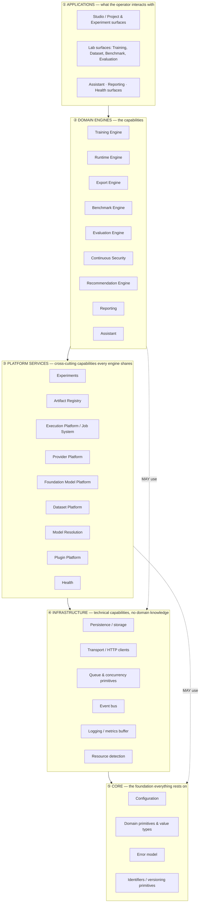

## 4.2 What Each Layer Is

**① Applications.** The surfaces the operator directly drives — Projects/Experiments management, the training/dataset/benchmark/evaluation labs, the assistant, reporting, health. An Application composes domain engines and platform services into a workflow. It contains *no domain logic* — it orchestrates and presents. (The HTTP API layer and the frontend both live here conceptually; a route handler is an application-layer adapter, not a place for business logic. This directly codifies the prior audit's finding that business logic had leaked into the API layer.)

**② Domain Engines.** The capabilities that make RedForge what it is — training, runtime, export, benchmark, evaluation, security, recommendation, reporting, assistant. Each is a bounded context (§3). Engines depend on Platform Services and Infrastructure, never on each other *except through explicitly-permitted, downward-shaped dependencies* defined in §14. Two engines at the same layer MUST NOT import each other's internals; they interact only through Platform Services (the Artifact Registry, the Job System, the Event Bus) or through published read-only interfaces.

**③ Platform Services.** Cross-cutting capabilities every engine relies on but none owns: Experiments (the context work attaches to), the Artifact Registry (the spine), the Execution Platform (how work runs), the Provider Platform (how capabilities register), the Foundation Model and Dataset platforms (shared model/data substrates), Model Resolution, the Plugin Platform, and Health. These are the shared services that keep engines from reinventing infrastructure.

**④ Infrastructure.** Purely technical capabilities with *zero domain knowledge*: persistence, HTTP transport, queue/concurrency primitives, the event bus, logging/metrics, resource detection. Infrastructure could, in principle, be lifted into a different product — it knows nothing about models, training, or artifacts. This is where the *mechanisms* live that Platform Services turn into domain capabilities.

**⑤ Core.** The bedrock: Configuration, domain primitive/value types, the error model, and identity/versioning primitives. Core depends on nothing. Everything depends, eventually, on Core.

## 4.3 The Dependency Rules (Normative)

1. **A module MUST depend only on lower or equal layers, never higher.** An Infrastructure module MUST NOT import a Domain Engine. A Platform Service MUST NOT import an Application. This is checked in review and SHOULD be enforced by tooling.
2. **Within Layer ④ (Domain Engines), lateral dependencies are forbidden by default and permitted only per the explicit matrix in §14.** The permitted lateral edges are few, directional, and named. Everything not in the matrix is forbidden.
3. **The Runtime Engine is a leaf among Domain Engines.** It depends downward on Platform Services and Infrastructure and is depended *upon* by Benchmark, Evaluation, Security, and Export — but it depends on *none* of them, and it MUST NOT depend on Training. This is the boundary that must survive ten years (§11.2).
4. **Core and Configuration have no dependencies.** If Core needs something, that something belongs in Core or below Core — and there is nothing below Core.
5. **Cross-engine communication happens through Platform Services or the Event Bus, not through direct imports.** When Training needs to trigger Security, it does so by emitting an event or submitting a Job — not by importing the Continuous Security engine. This replaces the prior architecture's direct-import-of-singletons integration style (which created the API-layer god-object) with explicit, traceable, layer-respecting communication (§8.6, §2.15).

## 4.4 Why This Layering Survives Ten Years

The layering is chosen so that the parts most likely to change are highest (Applications change constantly; UIs are rewritten) and the parts most expensive to change are lowest and smallest (Core changes almost never). A ten-year platform accumulates change at the top and stability at the bottom. By forbidding upward dependencies, a change at the top can *never* force a change at the bottom — you can rewrite the entire Application layer without touching a Domain Engine, and rewrite a Domain Engine without touching Infrastructure. This is the same property that lets VS Code rewrite its UI without touching its extension host, and lets Git add porcelain commands without touching its object model.

---

---

# SECTION 5 — CANONICAL DOMAIN MODEL

These are the **permanent entities** of RedForge. This is the vocabulary every future feature, table, and API speaks. An entity not on this list does not exist in the domain until added here by ADR. Each entity states: **Purpose · Owner (bounded context) · Relationships · Lifecycle · Storage class · Dependencies · Future extensibility.**

Two *storage classes* are referenced throughout and defined once here:
- **Record** — a durable row owned by a bounded context, the source of truth for that entity.
- **Artifact-wrapped** — the entity is *also* registered as an Artifact (§6) so it participates in lineage; the artifact row is a thin index over the owning record (for data-backed entities) or the source of truth for location (for file-backed entities).

## 5.1 Workspace
- **Purpose:** The single top-level container per machine.
- **Owner:** Workspace context.
- **Relationships:** Has many Projects; has one active Configuration.
- **Lifecycle:** Created once (implicitly, on first run); effectively permanent.
- **Storage:** Record.
- **Dependencies:** Configuration.
- **Future extensibility:** The seam through which multi-workspace (e.g. per-client isolation on one machine) could arrive *without* becoming multi-tenant cloud — workspaces would remain local, one operator, separated for organization, never for access control.

## 5.2 Project
- **Purpose:** A named grouping of related Experiments and Artifacts.
- **Owner:** Projects context.
- **Relationships:** Belongs to a Workspace; has many Experiments; scopes many Artifacts and Datasets.
- **Lifecycle:** create → opened (recency-tracked) → archived → deleted (with a *defined* policy over children, never silent orphaning).
- **Storage:** Record.
- **Dependencies:** Workspace, Configuration.
- **Future extensibility:** Project-level templates and defaults (a project pre-configured for a class of work) attach here.

## 5.3 Experiment
- **Purpose:** The operator's primary unit of work — one line of inquiry, spanning many runs and sessions over time (§7).
- **Owner:** Experiments context.
- **Relationships:** Belongs to a Project; references one Foundation Model and one Dataset lineage as its subject; owns associations to many Training Runs, Artifacts, Benchmark/Evaluation/Security Sessions, Reports, and Recommendations.
- **Lifecycle:** created → active (iterating) → concluded (a decision reached) → archived. Never deleted casually — an experiment is a record of inquiry and its history is the point.
- **Storage:** Record (associations are records; the associated entities live in their own contexts).
- **Dependencies:** Projects, Artifact Registry, Foundation Model Platform, Dataset Platform.
- **Future extensibility:** Experiment comparison, forking an experiment from a prior one's best artifact, and experiment-level hypotheses/notes all attach here without touching any engine.

## 5.4 Foundation Model
- **Purpose:** A training-domain model identity — a specific pretrained checkpoint in the Hugging Face ecosystem (repo + revision + format + quantization).
- **Owner:** Foundation Model Platform.
- **Relationships:** Artifact-wrapped (kind `base_model`); is the root parent of Training Runs, Merged Models, and their descendants; may be *resolved from* a Runtime Model via Model Resolution.
- **Lifecycle:** referenced (identity known, weights not local) → local (weights cached) → in-use → retained. Never mutated — a different format/quantization is a *different* Foundation Model.
- **Storage:** Record + Artifact-wrapped (file-backed once local).
- **Dependencies:** Artifact Registry, Model Resolution.
- **Future extensibility:** New weight formats and quantization schemes are new enum values; the identity model does not change.

## 5.5 Runtime Model
- **Purpose:** An inference-domain servable model identity — a provider-native identifier (Ollama tag, LM Studio path, vLLM served-name) that the Runtime Engine can serve. **Distinct from Foundation Model by identity; related only by derivation** (§11.2, §10.9).
- **Owner:** Runtime Engine (as the servable identity) + Artifact Registry (as an artifact).
- **Relationships:** Artifact-wrapped (kind `runtime_model`); descends from a GGUF Export or a Merged Model via the Export Engine; is the input to Benchmark/Evaluation/Security Sessions.
- **Lifecycle:** produced (by Export) → serviceable → superseded/archived. Also encompasses "externally-provided" runtime models the operator already had (pulled directly via a runtime), which are Runtime Models with no training lineage — a legitimate, first-class case.
- **Storage:** Record + Artifact-wrapped.
- **Dependencies:** Export Engine (for produced ones), Artifact Registry.
- **Future extensibility:** New runtimes are new Export Providers producing new Runtime Model variants; the entity is stable.

## 5.6 Training Run
- **Purpose:** One execution of a fine-tuning job under an Experiment.
- **Owner:** Training Engine.
- **Relationships:** Belongs to an Experiment; consumes a Foundation Model and a Dataset Version; parameterized by a Training Strategy; executed by a Training Provider; produces Checkpoints (and thereby Adapters/Merged Models downstream). Artifact-wrapped (kind `training_run`).
- **Lifecycle:** the canonical Job lifecycle (§8.3) — pending → running → (completed | failed | cancelled), with live progress during running.
- **Storage:** Record + Artifact-wrapped (data-backed).
- **Dependencies:** Foundation Model Platform, Dataset Platform, Artifact Registry, Execution Platform, Provider Platform.
- **Future extensibility:** Multi-stage runs (e.g. SFT then DPO) become a Training Run composed of sub-runs; the entity accommodates this via lineage without schema upheaval.

## 5.7 Training Strategy
- **Purpose:** A declarative specification of *what algorithm* a training run applies (LoRA, QLoRA, SFT, DPO, PPO, RLHF), including its required dataset shape and hyperparameter set.
- **Owner:** Training Engine (strategy registry).
- **Relationships:** Selected by a Training Run; constrains which Training Providers are compatible.
- **Lifecycle:** Not a stored entity per se — a value/spec attached to a Training Run. The *set* of available strategies is a registry.
- **Storage:** Embedded in the Training Run record (as a typed spec); the registry is code/plugin-provided.
- **Dependencies:** None beyond the Training Engine's own model.
- **Future extensibility:** New alignment methods are new Strategy specs registered into the strategy registry — the defining reason Strategy is separated from Provider and from Execution (§10.2).

## 5.8 Training Provider
- **Purpose:** An implementation that *executes* training (Unsloth, PEFT, HF Trainer, Axolotl, TRL, Simulation).
- **Owner:** Training Engine (provider registry) + Provider Platform (registration machinery).
- **Relationships:** Declares which Strategies it supports; selected for a Training Run by compatibility resolution.
- **Lifecycle:** Registered at load/plugin time; instantiated per run; diagnosed for availability.
- **Storage:** Not stored — code/plugin-provided, registered into a registry.
- **Dependencies:** Provider Platform.
- **Future extensibility:** The primary plugin surface for training (§15). A new backend is a new provider, one registration.

## 5.9 Dataset
- **Purpose:** A named collection of records or text usable for training and evaluation.
- **Owner:** Dataset Platform.
- **Relationships:** Belongs to a Project/Experiment; has many Dataset Versions; consumed by Training Runs. Artifact-wrapped (kind `dataset`).
- **Lifecycle:** imported → analyzed → cleaned/split (producing versions) → used → archived.
- **Storage:** Record + Artifact-wrapped.
- **Dependencies:** Artifact Registry.
- **Future extensibility:** New import formats are new dataset parsers; synthetic-data generation and augmentation attach as new version-producing operations.

## 5.10 Dataset Version
- **Purpose:** An immutable snapshot of a dataset's records at a point in its history.
- **Owner:** Dataset Platform.
- **Relationships:** Belongs to a Dataset; referenced by Training Runs (a run trains on a *specific* version).
- **Lifecycle:** created (never mutated) → possibly superseded → retained for reproducibility.
- **Storage:** Record (records may be inline or file-backed depending on size — an Infrastructure concern, invisible to the domain).
- **Dependencies:** Dataset.
- **Future extensibility:** Version-to-version diffs, and branching a version, extend the existing immutable-snapshot model.

## 5.11 Artifact
- **Purpose:** The universal, lineage-tracked unit of everything produced in RedForge (§6). The spine.
- **Owner:** Artifact Registry.
- **Relationships:** Has zero-or-more parent Artifacts (DAG); wraps exactly one domain entity (or is itself file-backed); scoped to a Project/Experiment.
- **Lifecycle:** draft → ready → (invalid | archived) (§6.4).
- **Storage:** Record (the artifact index) + optional file location + optional table reference.
- **Dependencies:** Infrastructure (storage), Configuration.
- **Future extensibility:** New artifact *kinds* are new enum values with new metadata shapes; the registry and lineage machinery never change. This is what makes the Artifact model the extensibility keystone of the platform.

## 5.12 Checkpoint
- **Purpose:** A saved point within a Training Run — training-domain weights at a step.
- **Owner:** Training Engine.
- **Relationships:** Belongs to a Training Run; parent of Adapters/Merged Models; subject of per-checkpoint Security Sessions. Artifact-wrapped (kind `checkpoint`, file-backed).
- **Lifecycle:** produced (append-only) → best-marked → exported-from → retained/archived.
- **Storage:** Record + Artifact-wrapped (file-backed, with real checksum/size).
- **Dependencies:** Artifact Registry.
- **Future extensibility:** Checkpoint pruning/retention policies attach here (§6.11) without changing the entity.

## 5.13 Adapter (LoRA Adapter)
- **Purpose:** The trained low-rank weights produced by a LoRA/QLoRA strategy — small, mergeable, the actual deliverable of adapter-based fine-tuning.
- **Owner:** Training Engine (produced) / Export Engine (consumed for merge).
- **Relationships:** Descends from a Checkpoint; parent of a Merged Model. Artifact-wrapped (kind `lora_adapter`, file-backed).
- **Lifecycle:** produced → merged-from → retained.
- **Storage:** Artifact-wrapped (file-backed).
- **Dependencies:** Artifact Registry.
- **Future extensibility:** Adapter composition (stacking multiple adapters) is a Merged Model with multiple adapter parents — the DAG already models it.

## 5.14 Merged Model
- **Purpose:** A full-weight model produced by merging an Adapter into its base (or a full fine-tune's output) — a standalone HF-format model ready for conversion/serving.
- **Owner:** Export Engine.
- **Relationships:** Descends from a Foundation Model *and* an Adapter (two parents — the canonical DAG-not-tree case); parent of GGUF Exports and vLLM Runtime Models. Artifact-wrapped (kind `merged_model`, file-backed).
- **Lifecycle:** produced (by merge) → converted-from → retained/archived.
- **Storage:** Artifact-wrapped (file-backed).
- **Dependencies:** Artifact Registry, Export Engine.
- **Future extensibility:** Merge strategies (weight-averaging, task arithmetic) become options on the merge step; the entity is stable.

## 5.15 GGUF Export
- **Purpose:** A quantized, GGUF-format conversion of a Merged Model — the format most local runtimes consume.
- **Owner:** Export Engine.
- **Relationships:** Descends from a Merged Model; parent of Ollama/llama.cpp/LM Studio Runtime Models. Artifact-wrapped (kind `gguf_export`, file-backed).
- **Lifecycle:** produced (convert + quantize) → installed-from → retained.
- **Storage:** Artifact-wrapped (file-backed).
- **Dependencies:** Artifact Registry, Export Engine.
- **Future extensibility:** New quantization levels are new metadata; new export formats (beyond GGUF) are sibling artifact kinds under the same Export Engine.

## 5.16 Runtime Deployment
- **Purpose:** The record of a Runtime Model having been *installed into* a specific runtime (e.g. an Ollama tag created via `ollama create`) and made serviceable — the final bridge output.
- **Owner:** Export Engine (produces it) → Runtime Engine (serves against it).
- **Relationships:** Descends from a GGUF Export or Merged Model; *is* the servable Runtime Model from the Runtime Engine's perspective.
- **Lifecycle:** installed → serviceable → uninstalled/superseded.
- **Storage:** Record + Artifact-wrapped (as a Runtime Model).
- **Dependencies:** Export Engine, Artifact Registry.
- **Future extensibility:** This is the clean seam where a *future, separate* deployment concern (explicitly out of scope for RedForge itself, §1.4) would integrate — RedForge hands off a Runtime Deployment; what a third party does with it is not RedForge's concern.

## 5.17 Benchmark Session
- **Purpose:** One objective measurement of a Runtime Model across suites.
- **Owner:** Benchmark Engine.
- **Relationships:** Belongs to an Experiment; consumes a Runtime Model (or Checkpoint) artifact; produces a benchmark-result artifact. Artifact-wrapped (kind `benchmark_result`, data-backed).
- **Lifecycle:** canonical Job lifecycle (§8.3).
- **Storage:** Record + Artifact-wrapped (data-backed).
- **Dependencies:** Runtime Engine, Artifact Registry, Execution Platform.
- **Future extensibility:** New suites are plugins (§15); the session entity is stable.

## 5.18 Evaluation Session
- **Purpose:** One qualitative behavioral evaluation of a Runtime Model against a prompt hierarchy, producing per-prompt results and regression analysis.
- **Owner:** Evaluation Engine.
- **Relationships:** Belongs to an Experiment; consumes a Runtime Model artifact and a PromptSet; produces evaluation-result artifacts. Artifact-wrapped (kind `evaluation_result`, data-backed).
- **Lifecycle:** canonical Job lifecycle (§8.3).
- **Storage:** Record + Artifact-wrapped.
- **Dependencies:** Runtime Engine, Artifact Registry, Execution Platform.
- **Future extensibility:** New similarity providers and regression types are plugins; the session is stable. *This entity finally has a single, unambiguous name* — the prior architecture's collision between two "evaluation session" tables is resolved by this Constitution defining exactly one.

## 5.19 Security Session
- **Purpose:** One security evaluation of a Checkpoint or Runtime Model, producing a score, category breakdown, and findings.
- **Owner:** Continuous Security.
- **Relationships:** Belongs to an Experiment; consumes a Checkpoint or Runtime Model artifact; produces a security-report artifact; forms a timeline across an Experiment. Artifact-wrapped (kind `security_report`, data-backed).
- **Lifecycle:** canonical Job lifecycle (§8.3), triggered either automatically (per-checkpoint, via event) or on demand.
- **Storage:** Record + Artifact-wrapped.
- **Dependencies:** Runtime Engine, Artifact Registry, Execution Platform, security-provider registry.
- **Future extensibility:** New security providers (beyond the reused attack engine) are plugins; the timeline model is stable.

## 5.20 Recommendation
- **Purpose:** A generated, confidence-scored, rationale-bearing suggestion for the next iteration, with predicted-vs-actual tracking.
- **Owner:** Recommendation Engine.
- **Relationships:** Belongs to an Experiment; reads (never writes) many contexts; may be linked to a subsequent Training Run as its realization.
- **Lifecycle:** proposed → (accepted | rejected) → applied → outcome-recorded.
- **Storage:** Record.
- **Dependencies:** Read-only access to lifecycle contexts + Artifact Registry.
- **Future extensibility:** New recommendation sources (beyond security-driven) are new analysis inputs; the entity and its accuracy-tracking are stable.

## 5.21 Report (Engineering Report)
- **Purpose:** A composed, coherent summary of an Experiment's or Run's full lifecycle — training, security, benchmark, evaluation, recommendations — as one artifact.
- **Owner:** Reporting context.
- **Relationships:** Belongs to an Experiment; composed from many result artifacts (its parents in lineage); Artifact-wrapped (kind `engineering_report`).
- **Lifecycle:** composed-on-demand (never stale) OR snapshotted (frozen as an artifact for a point-in-time record) — both modes exist, distinguished explicitly.
- **Storage:** Artifact-wrapped (data-backed for on-demand; file/record for snapshots).
- **Dependencies:** Read-only access to lifecycle contexts + Artifact Registry.
- **Future extensibility:** New report sections consume new artifact kinds via lineage traversal, not hardcoded joins — new lifecycle stages appear in reports automatically once they register artifacts.

## 5.22 Job
- **Purpose:** The universal unit of long-running, backgrounded, recoverable work — training, benchmark, evaluation, security, export, import, dataset processing, diagnostics (§8).
- **Owner:** Execution Platform.
- **Relationships:** Has a kind (dispatched to a registered handler); references the domain entity it acts on; emits progress and lifecycle events.
- **Lifecycle:** the canonical Job state machine (§8.3).
- **Storage:** Record.
- **Dependencies:** Configuration, Infrastructure.
- **Future extensibility:** A new kind of backgroundable work is a new Job kind with a registered handler — never a new bespoke queue. This is the abstraction that ends the prior architecture's triplicated-queue problem.

## 5.23 Provider
- **Purpose:** The universal concept of a pluggable implementation of a capability, across all domains (runtime, training, export, similarity, security).
- **Owner:** Provider Platform (registration) + the capability's engine (semantics).
- **Relationships:** Registered into a domain registry; declares capabilities; resolved by compatibility.
- **Lifecycle:** discovered → registered → instantiated → diagnosed.
- **Storage:** Not stored — code/plugin-provided.
- **Dependencies:** Provider Platform.
- **Future extensibility:** New provider *domains* (future capability categories) are new registries following the same shape (§9.6).

## 5.24 Plugin
- **Purpose:** A third-party package that extends RedForge by registering providers, suites, strategies, or other extensions into the platform's extension points (§15).
- **Owner:** Plugin Platform.
- **Relationships:** Declares a manifest; contributes to one or more capability registries.
- **Lifecycle:** discovered → loaded → its extensions registered → (unloaded).
- **Storage:** Record (installed-plugin index) + filesystem (the plugin package).
- **Dependencies:** Plugin Platform, Provider Platform.
- **Future extensibility:** The entire third-party ecosystem grows here without core changes.

## 5.25 Configuration
- **Purpose:** The single typed source of truth for all settings.
- **Owner:** Configuration context.
- **Relationships:** Read by every context; owned by none but itself.
- **Lifecycle:** resolved at startup from environment + defaults; immutable during a run.
- **Storage:** Not persisted as domain data — derived from environment and defaults.
- **Dependencies:** None.
- **Future extensibility:** New settings are new typed fields with defaults; the resolution mechanism is stable, and it remains the *only* place environment is read.

## 5.26 Health Check
- **Purpose:** A single, severity-graded diagnostic of one aspect of machine/platform readiness.
- **Owner:** Health context.
- **Relationships:** Registered into the health-check registry; aggregated into a readiness verdict.
- **Lifecycle:** run on demand or at startup; stateless between runs.
- **Storage:** Not persisted — computed fresh.
- **Dependencies:** Read-only observation of Runtime, Providers, Resources, Infrastructure.
- **Future extensibility:** New checks are new registered participants; the readiness-aggregation rule is stable.

## 5.27 Resource
- **Purpose:** A detected fact about the host machine (RAM, CPU, GPU, disk) used for capability gating and honest estimation.
- **Owner:** Infrastructure (resource detection).
- **Relationships:** Read by Health, Training (GPU gating), Onboarding (model recommendation), Estimation.
- **Lifecycle:** detected (cached per process); refreshable.
- **Storage:** Not persisted — detected live, cached in memory.
- **Dependencies:** None.
- **Future extensibility:** New resource dimensions (e.g. multi-GPU topology) extend the snapshot; the detection pattern is stable.

## 5.28 Event
- **Purpose:** A durable, factual record of something significant that happened, used both for reconstruction (event-sourced sessions) and for decoupled cross-context communication (§8.6, §4.3).
- **Owner:** Infrastructure (event bus) for transport; the emitting context for meaning.
- **Relationships:** Emitted by a context; consumed by zero-or-more subscribers; may be persisted for replay.
- **Lifecycle:** emitted → delivered → (persisted | discarded per policy).
- **Storage:** Persisted for event-sourced domains; transient for pure notification.
- **Dependencies:** Infrastructure.
- **Future extensibility:** Events are the mechanism by which new cross-context reactions are added *without* new direct dependencies — the antidote to the prior architecture's direct-import integration style.

---

# SECTION 6 — ARTIFACT ARCHITECTURE

Artifacts are the **center of RedForge**. Every stage of the lifecycle produces an artifact; every subsequent stage consumes one. The Artifact Registry is therefore the single most important Platform Service — the spine that connects the disconnected tools RedForge replaces.

## 6.1 Principle

> **If a stage produces something a later stage consumes, it produces an Artifact with lineage. There are no exceptions, and there is no second way to hand a result from one stage to the next.**

This principle is what makes provenance possible by construction rather than by after-the-fact reconstruction, and it is the direct remedy for the prior architecture's largest structural gap (bare path strings and orphan result rows with no unifying concept).

## 6.2 Artifact Registry

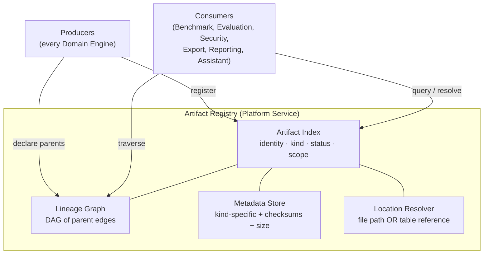

The Registry owns four things and only four things: the **index** (what exists), the **lineage graph** (what produced what), the **metadata** (including checksums and size), and **location resolution** (where the bytes or the row are). It owns *none* of the following: production (engines produce), interpretation (engines interpret), or execution (the Job System executes). It is a librarian.

## 6.3 Artifact Kinds

The canonical, complete kind taxonomy. New kinds are added by ADR. Every kind is either **file-backed** (bytes on disk, registry owns location) or **data-backed** (a row in the owning context's store, registry holds a thin reference — *no data migration for existing subsystems*).

| Kind | Backing | Producing context | Typical parents |
|---|---|---|---|
| `base_model` (Foundation Model) | file | Foundation Model Platform | — (root) or a Runtime Model (if resolved) |
| `dataset` | data or file | Dataset Platform | prior Dataset Version |
| `training_run` | data | Training Engine | Foundation Model, Dataset |
| `checkpoint` | file | Training Engine | Training Run |
| `lora_adapter` | file | Training Engine | Checkpoint |
| `merged_model` | file | Export Engine | Foundation Model + Adapter |
| `gguf_export` | file | Export Engine | Merged Model |
| `runtime_model` | data/file | Export Engine | GGUF Export or Merged Model |
| `benchmark_result` | data | Benchmark Engine | Runtime Model |
| `evaluation_result` | data | Evaluation Engine | Runtime Model |
| `security_report` | data | Continuous Security | Checkpoint or Runtime Model |
| `engineering_report` | data | Reporting | many result artifacts |

## 6.4 Artifact Lifecycle

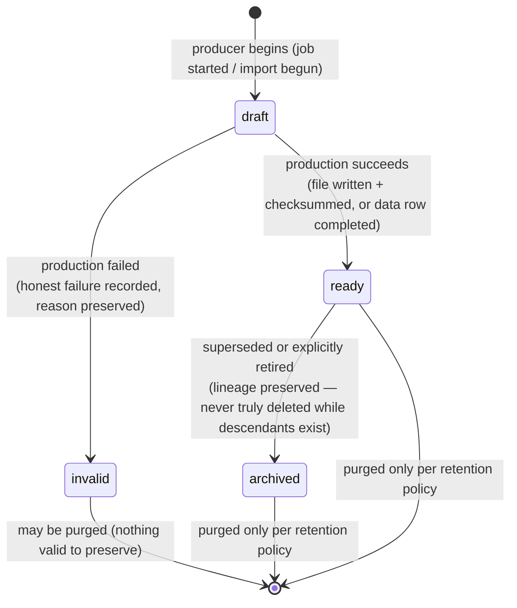

`draft` and `invalid` states make production *honest* — an artifact whose production failed is a first-class `invalid` artifact with a preserved reason, not a missing row (this is the artifact-level expression of §2.14, honest-over-simulated).

## 6.5 Artifact Lineage

Lineage is a **directed acyclic graph**, not a tree — because real derivations have multiple parents (a Merged Model has both a Foundation Model and an Adapter as parents; an Engineering Report has every result it summarizes as parents).

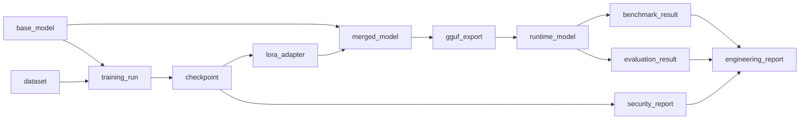

Lineage answers, generically and by construction, the two questions the prior architecture could not:
- **Backward** ("provenance"): given any artifact, what produced it, all the way back to the foundation model and dataset version? — walk ancestors.
- **Forward** ("impact"): given a foundation model or dataset, everything ever derived from it? — walk descendants.

## 6.6 Artifact Versioning

RedForge has **one** versioning mechanism, owned conceptually here and applied uniformly (ending the prior architecture's two independent versioning implementations). A new version of an artifact is a *new artifact* whose parent is the prior version, sharing a stable *lineage identity* (a version chain) but carrying its own artifact id, checksum, and metadata. "The current version" is the head of the chain; history is the chain. This applies equally to Datasets, Prompts, and any future versioned entity — none reinvents versioning.

## 6.7 Artifact Metadata

Metadata is **kind-specific but uniformly attached.** Every artifact carries: identity, kind, status, scope (project/experiment), producer, parents, created-at, and — for file-backed — location, size, and checksum. Beyond that common envelope, each kind carries its own typed metadata (a `checkpoint` carries step/loss; a `benchmark_result` carries scores; a `gguf_export` carries quantization). The envelope is stable; the per-kind payload extends per kind. Consumers rely only on the envelope + the kinds they understand.

## 6.8 Checksums & Integrity

Every **file-backed** artifact carries a checksum computed at `ready` transition. This closes the prior architecture's "unverified path string" gap: a consumer resolving a file-backed artifact can verify the bytes are the bytes that were registered, and the platform can detect and mark `invalid` an artifact whose file has vanished or changed. Content-addressability (deduplication by checksum, the Docker-layer pattern) is a permitted future optimization the checksum field enables but does not mandate.

## 6.9 Storage

Storage is an **Infrastructure concern the Artifact domain is deliberately ignorant of.** The Registry knows an artifact is *file-backed at a location* or *data-backed at a table reference*; it does not know or care whether the file is on local disk, whether large dataset versions are inlined or externalized, or how the persistence layer is implemented. This ignorance is what lets storage evolve (e.g. a future content-addressed store) without touching the artifact domain model. Local-first constrains *where* (always the operator's machine) but not *how*.

## 6.10 Search & Import

- **Search** is a first-class Registry capability: by kind, by scope, by status, by lineage relationship, by metadata predicate. Because everything is an artifact, "find every quantized export of any model trained on dataset X" is one lineage-plus-metadata query — impossible in the prior architecture, native here.
- **Import** brings external things into the artifact spine as first-class artifacts with honest provenance: an externally-obtained foundation model, a hand-authored dataset, a model the operator pulled directly via a runtime. Imported artifacts have `source=import` and a truthful (often rootless) lineage — they are not disguised as things RedForge produced.

## 6.11 Export & Retention

- **Export** (of artifacts *out* of RedForge) is producing a portable form of an artifact for use elsewhere — always operator-initiated, always local-to-local or local-to-operator's-chosen-destination, never an automatic egress. (Distinct from the *Export Engine*, which converts training artifacts into runtime artifacts *within* the platform.)
- **Retention** is policy-governed and lineage-aware: an artifact with living descendants is never silently purged (purging it would orphan its descendants' provenance). Retention policies (keep-best-N checkpoints, purge invalid drafts, archive superseded exports) operate *within* the lineage constraints, never against them. Retention is where the platform manages disk pressure honestly — telling the operator what it will remove and why, never deleting silently (§2.15).

---

---

# SECTION 7 — EXPERIMENT SYSTEM

## 7.1 The Experiment as the Primary Unit of Work

The prior architecture's primary unit was the **Training Run** — an isolated event. This is wrong for how model engineering actually works. An engineer does not think "I ran a training job"; they think "I am trying to make this model better at customer-support tone, and I've tried six things." That inquiry — not any single run — is the real unit of work.

**The Experiment is that unit.** It is the aggregation root beneath Project, and it owns the full context of one line of inquiry:

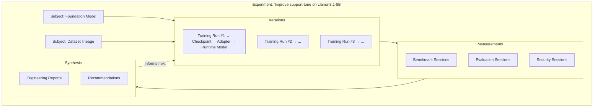

## 7.2 What an Experiment Owns

One Experiment owns the **associations** to:
- Its subject **Foundation Model** and **Dataset lineage**.
- Every **Training Run** performed in pursuit of the inquiry.
- Every **Artifact** those runs produced (checkpoints, adapters, merged models, exports, runtime models) — via lineage.
- Every **Benchmark**, **Evaluation**, and **Security Session** run against those artifacts.
- Every **Report** and **Recommendation** synthesized from them.

Crucially, the Experiment owns the *associations and context*, not the entities themselves — each entity still lives in its owning context (§3, §5). The Experiment is what makes them *coherent as one inquiry*.

## 7.3 Why This Is Superior to Isolated Runs

| Isolated runs (prior) | Experiment-centric (V3) |
|---|---|
| Context lost between runs — comparing run #2 to run #5 means manual archaeology | All iterations share one context; comparison is native |
| "Which run produced my best model?" requires cross-table joins by hand | The Experiment tracks its current-best artifact and the trend to it |
| Recommendations reason over a single run's data | Recommendations reason over the *whole inquiry's* history — the trend, not the point |
| Reports are per-run snapshots | Reports can summarize the inquiry's arc, not just one moment |
| No notion of "I'm still working on this" vs "I concluded this" | The Experiment has a lifecycle (active → concluded) that matches the engineer's mental model |
| Iterating means starting mentally from scratch | Iterating means forking from the Experiment's best-so-far, with full lineage intact |

The deeper reason: **model engineering is a loop, and a loop without memory is thrashing** (§2.5). The Experiment is the platform's memory of an inquiry. Every capability that reasons across time — the Recommendation Engine's trend analysis, the Assistant's "what have I tried," the Reporting engine's arc-of-the-work — depends on the Experiment existing as the thing that remembers.

## 7.4 Experiment Lifecycle

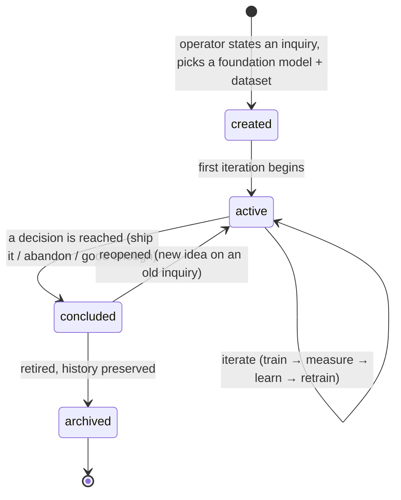

An Experiment is **never casually deleted** — it is the record of an inquiry, and the history of what was tried and what happened is often more valuable than any single artifact it produced.

---

# SECTION 8 — EXECUTION PLATFORM (The Unified Job System)

## 8.1 The Principle

The prior architecture had **four** independent long-running-work mechanisms: three structurally-identical async queues (Benchmark, Evaluation, Continuous Security) plus a bare fire-and-forget task (Training), plus a non-durable in-memory dict (legacy benchmark) — each answering "what does a background job mean" slightly differently, each requiring the same bugfixes applied independently.

**V3 replaces all of them with one Job System.** Every piece of long-running, backgroundable, recoverable work in RedForge is a **Job** of some registered **kind**, scheduled, executed, tracked, recovered, and cancelled by one Execution Platform. This is the direct constitutional application of §2.17 (one execution path per capability) to background work.

## 8.2 Job Kinds

The Execution Platform is **domain-agnostic** — it knows how to run *a job*, not how to *train* or *benchmark*. Each domain engine registers a **job handler** for its kind:

| Job kind | Handler owned by | Acts on |
|---|---|---|
| `training` | Training Engine | Foundation Model + Dataset + Strategy |
| `benchmark` | Benchmark Engine | Runtime Model artifact |
| `evaluation` | Evaluation Engine | Runtime Model artifact + PromptSet |
| `security` | Continuous Security | Checkpoint / Runtime Model artifact |
| `export` | Export Engine | Checkpoint / Merged Model artifact |
| `import` | Foundation Model / Dataset Platform | external source |
| `dataset_processing` | Dataset Platform | Dataset Version (clean/split/analyze at scale) |
| `diagnostics` | Health / Training | provider availability, environment probe |

A new kind of backgroundable work = a new registered handler. **Never a new queue.**

## 8.3 The Canonical Job State Machine

Every job — of every kind — obeys exactly this state machine. No kind may invent its own states.

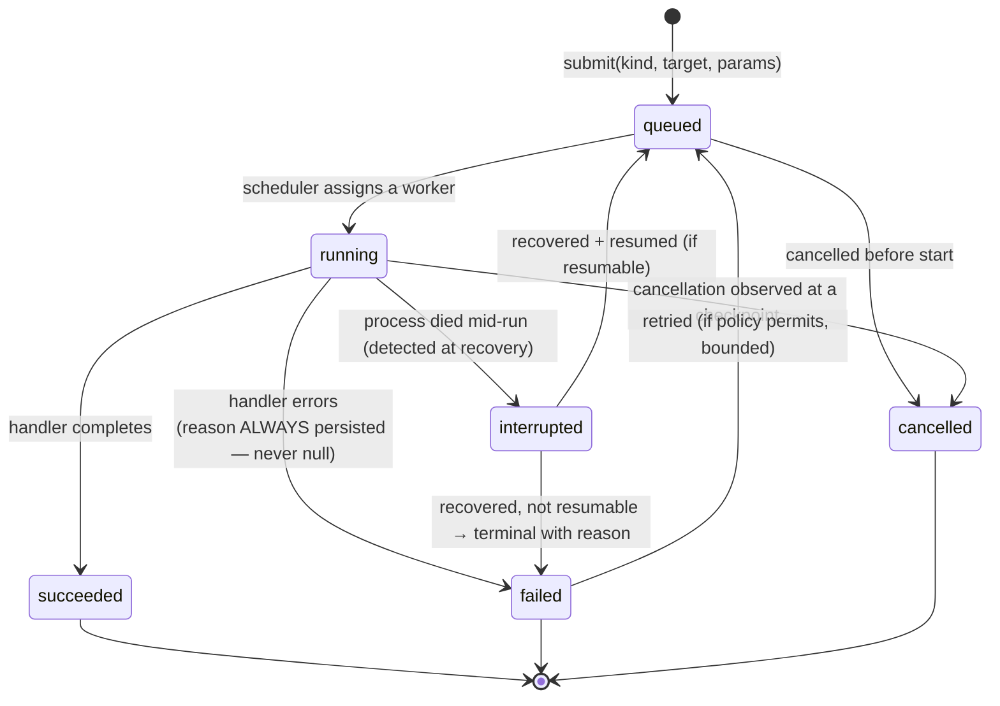

Constitutional guarantees, uniform across every kind (each was a per-subsystem promise in the prior architecture; here they are structural):
- **A failed job ALWAYS persists a reason** (message + trace). The prior "status=failed, error=null" defect is impossible by construction because the state machine's `failed` transition requires a reason.
- **Every job is cancellable the same way** — the prior architecture's inconsistency (DELETE means destroy here, cancel there, nothing elsewhere) is resolved: cancellation is a job operation, uniform across kinds; deletion of a *record* is a separate, uniform operation.
- **Every job is recoverable the same way** — the recovery routine walks *all* jobs (the prior architecture's omission of Continuous Security from recovery is impossible; there is one recovery routine over one Job table).

## 8.4 Scheduler, Workers, Concurrency

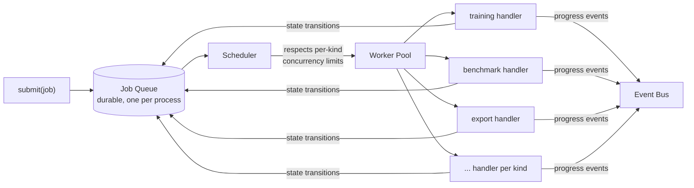

- **Scheduler** decides which queued jobs run next, respecting **per-kind concurrency limits** — this is where the prior architecture's *unbounded concurrent training* defect is fixed: `training` declares a concurrency limit (single-GPU ⇒ 1 by default), enforced centrally, not per-engine.
- **Workers** are a bounded pool; the single-process constraint (§1, local-first) means this is cooperative async concurrency, not a distributed worker fleet. That constraint is a feature, not a limitation to be grown out of.
- **Concurrency is a first-class, per-kind, centrally-enforced policy** — not an accident of whether a given engine happened to implement a semaphore.

## 8.5 Progress, Cancellation, Recovery, Retries

- **Progress** is reported uniformly: every running job emits progress events to the Event Bus; live surfaces subscribe. Fine-grained progress (training step-level) and coarse progress (job percent) are both expressed as progress events — one mechanism, not per-subsystem SSE shims.
- **Cancellation** is cooperative and uniform: a cancel request sets the job's cancel signal; the handler observes it at defined checkpoints and transitions to `cancelled` with partial results preserved where meaningful. There is no mid-operation hard kill (consistent with the prior architecture's already-correct cooperative model, now uniform).
- **Recovery** is one routine over one Job table, run at startup: every job left `running`/`queued` by a dead process is transitioned to `interrupted`, then either resumed (if its kind is resumable and it recorded enough to resume) or terminated `failed` with an honest reason. No job of any kind can be left permanently stuck.
- **Retries** are a bounded, per-kind policy: a `failed` job may re-enter `queued` up to its kind's retry budget, with backoff, distinguishing transient failures (provider briefly unreachable) from terminal ones (invalid input). Retry policy is declared per kind, enforced centrally.

## 8.6 The Event Bus and Cross-Context Reactions

The Job System is also where the prior architecture's **direct-import cross-subsystem integration** is replaced by **event-driven reactions** (§2.15, §4.3). When a Training job produces a checkpoint, it does not *import and call* Continuous Security and the Runtime Registry. It **emits a `checkpoint.produced` event.** Continuous Security *subscribes* to that event and submits a `security` job; the Export/Registry flow subscribes and does its work. 

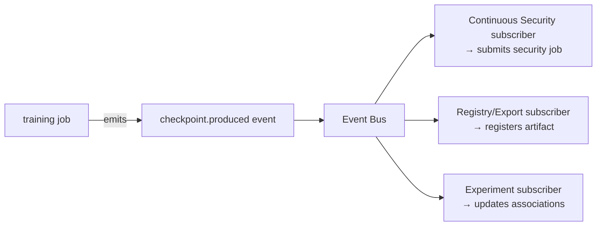

This is strictly superior to direct import because:
- **It is traceable** — the reaction is a named subscription to a named event, findable in one place, not a closure buried in an API route (§2.15).
- **It respects layering** — Training emits an event *downward* to the Event Bus (Infrastructure); it does not depend *laterally* on Continuous Security (§4.3).
- **It is extensible** — a new reaction to checkpoints (e.g. auto-benchmark) is a new subscriber, added without touching the Training engine.

Event-sourced domains (like the security-attack session engine) additionally *persist* their events for replay/reconstruction — the same Event concept (§5.28) serving both decoupled notification and durable reconstruction.

---

# SECTION 9 — PROVIDER PLATFORM

## 9.1 The Principle

Everywhere RedForge has a capability with more than one possible implementation, that capability is expressed as a **provider domain**: a registry of interchangeable implementations sharing one contract. The Provider Platform owns the *shared machinery* of registration, discovery, capability declaration, and compatibility resolution that every provider domain uses — so that adding a new provider domain in year five follows the exact pattern established in year one.

## 9.2 The Provider Domains

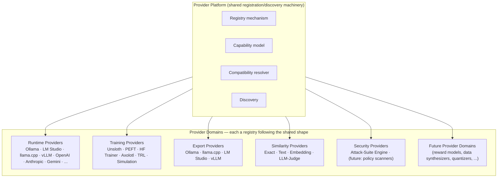

## 9.3 Registration

Every provider domain shares one registration model: a **flat registry keyed by provider name**, populated by (a) built-in providers registered at load, and (b) plugin-contributed providers registered at plugin-load (§15). Registration is **declarative and additive** — a new provider is a registration, never an edit to the consuming engine (§2.3, §2.8). This is the single most-reused pattern in the platform and the primary reason RedForge can grow for a decade without its engines rotting.

## 9.4 Discovery

Providers are **discoverable at runtime**: an engine (or the operator) can enumerate the providers registered in a domain, along with each provider's declared capabilities and current availability. Discovery is how the platform answers "which training backends can I actually use on this machine right now" without hardcoding an answer — availability is *diagnosed*, not assumed (extending the per-layer diagnostics pattern already proven for training backends to every provider domain).

## 9.5 Capabilities

Every provider **declares its capabilities** in a structured, queryable form. Capability declaration is what makes the platform honest about partial support (§2.14): a Runtime Provider declares which sampling options it actually honors (fixing the prior architecture's silent-drop defect); a Training Provider declares which strategies it supports; an Export Provider declares which input artifact kind it consumes. Capabilities are **data, not documentation** — the platform queries them to make decisions, and surfaces them to the operator so partial support is visible, never silent.

## 9.6 Compatibility & Versioning

- **Compatibility resolution** is a shared service: given a requirement (a strategy to train, an artifact kind to export, a runtime to serve), the platform resolves the set of compatible, available providers — and either auto-selects (with a stated basis) or presents the choice. The Training Engine's provider×strategy matrix (§10.4) is one instance of this general mechanism.
- **Versioning** of the provider *contract* is explicit: each provider domain's contract is versioned so that a plugin built against contract v1 keeps working when v2 arrives (or fails loudly and specifically, never silently). This is the foundation of a stable plugin ecosystem (§15) — third parties bind to a *versioned* extension point, and the platform honors that version.

## 9.7 What the Provider Platform Never Does

The Provider Platform is **meta**: it knows how to register, discover, and resolve providers. It does **not** know what any capability *means* — it cannot generate, train, or export. Those semantics belong to the capability's engine. This separation is what lets a genuinely new capability domain (a "reward model provider" for RLHF, a "quantizer provider," a "data synthesizer provider") be added as a new registry following the same shape, with zero change to the Provider Platform itself. The Provider Platform is the pattern; the domains are its instances.

---

---

# SECTION 10 — TRAINING PLATFORM

The Training Platform is where RedForge's founding architectural flaw is permanently corrected. Its design is the subject of the prior `TRAINING_FOUNDATION_ARCHITECTURE.md`; this section states its constitutional form.

## 10.1 Foundation Models

A **Foundation Model** is a *training-domain identity* — a Hugging Face checkpoint (repo + revision + weight format + quantization). It is **not** a runtime model, and the conflation of the two is the flaw V3 exists to fix. A Foundation Model is what a Training Provider loads; it is never what a Runtime Provider serves. It is an artifact (kind `base_model`), may be referenced before it is downloaded (offline-honest), and may be *resolved from* a runtime model the operator already has (§10.9).

## 10.2 Strategies — Separated from Providers and Execution

The Training Platform separates three concerns that the prior architecture fused into one flat config:

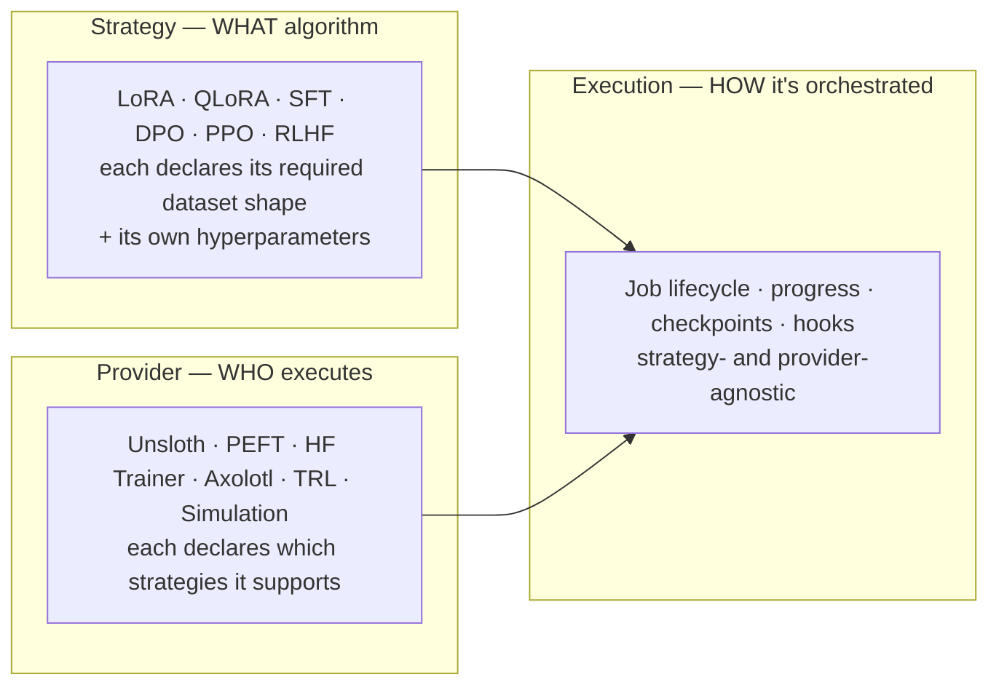

- **Strategy** is *what algorithm runs*, and it knows its own requirements: SFT needs instruction/response pairs; DPO/RLHF need preference pairs; PPO needs a reward model. Hyperparameters that apply only to LoRA (rank, alpha) live on the LoRA strategy, not on every run.
- **Provider** is *who executes*, declaring which strategies it can run.
- **Execution** is *how the run is orchestrated* — Job lifecycle, progress, checkpoint production, event emission — identical regardless of strategy or provider.

This three-way separation is the extensibility guarantee of training: a new algorithm is a new Strategy; a new backend is a new Provider; neither touches Execution, and neither touches the other.

## 10.3 Providers

Training Providers register into the training provider domain (§9) and declare `supported_strategies`. The guaranteed universal fallback is the **Simulation** provider (supports every strategy, requires no ML stack, never unavailable) — preserving the platform's ability to exercise the full lifecycle offline, on any machine, honestly labeled as simulated (§2.14).

## 10.4 Compatibility Resolution

Selecting a provider for a run is an instance of the Provider Platform's general compatibility resolution (§9.6): filter providers by the requested strategy's support, then select by availability, with Simulation as the universal floor. The operator may pin a provider explicitly; otherwise the platform selects and states its basis (§2.10, transparent).

## 10.5 Execution

Training Execution runs as a **Job** (§8) — not a bespoke fire-and-forget task. It obeys the canonical job state machine, is subject to the central per-kind concurrency limit (fixing unbounded-concurrent-training), reports progress as events, and produces artifacts. Its handler is strategy- and provider-agnostic: it drives whatever provider+strategy was resolved, translating provider progress into the uniform progress-event stream.

## 10.6 Checkpoints & Adapters

A run produces **Checkpoints** (training-domain weights at a step) and, for adapter strategies, **Adapters** — both first-class file-backed artifacts with checksums and lineage. Checkpoint production emits a `checkpoint.produced` event (§8.6), which is what triggers security evaluation and export flows *without* Training depending on those engines.

## 10.7 Merge

For adapter strategies, producing a servable model requires **merging** the adapter into base weights → a **Merged Model** artifact (the canonical two-parent lineage node: Foundation Model + Adapter). Merge is an Export-Engine responsibility (it is a step toward a runtime, not a training step), run as an `export`-family job.

## 10.8 Export & Runtime Conversion

The **Export Engine** turns training-domain artifacts into inference-domain runtime artifacts through a pluggable, per-target pipeline:

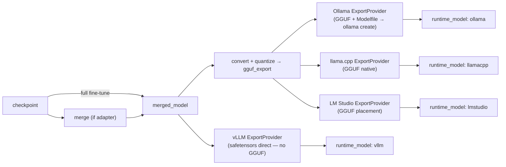

Each target is an **Export Provider** (§9). Export uses the target runtime's **native tooling** to install (e.g. `ollama create`) — it never reaches into the Runtime Engine's internals. Its output is a **Runtime Model** artifact, which is the *only* legitimate bridge from training-domain to inference-domain. This is where the prior architecture's permanent `fallback=True` becomes a *situational* state: fallback means "no export has run yet," an honest, temporary condition, not a missing capability.

## 10.9 Model Resolution

**Model Resolution** (a Platform Service) maps a runtime model the operator already has (an Ollama tag) to its likely Foundation Model identity — confidence-scored, evidence-bearing, never a silent guess presented as fact (§2.14). It runs in both directions: runtime→foundation is *inference* (scored candidates the operator confirms); foundation→runtime is *lineage* (exact, because it only reports what RedForge itself exported). Resolution is how "fine-tune the model I already have" becomes possible without the operator needing to know HF repo ids.

## 10.10 Evaluation & Security Hooks

Training does not *call* evaluation or security. It **emits events** (§8.6). Continuous Security subscribes to `checkpoint.produced` and schedules a `security` job automatically (preserving the valuable auto-per-checkpoint behavior). A future auto-benchmark or auto-evaluation is a new subscriber, added without touching Training. Hooks are subscriptions, not imports — traceable, layer-respecting, extensible.

## 10.11 Artifact Production

Every output of the Training Platform — the run itself, each checkpoint, each adapter, each merged model, each export, each runtime model — is a registered artifact with lineage. The Training Platform's contribution to the artifact spine is the *left half* of every lineage graph in the platform; everything downstream (benchmark, evaluation, security, reports) hangs off the artifacts training produces.

---

# SECTION 11 — RUNTIME PLATFORM

## 11.1 Responsibilities

The Runtime Engine is the **single execution path for every LLM inference call in RedForge** (§2.17). It owns provider abstraction, queueing, caching, cancellation, retry, and metrics for inference — and nothing else. It receives a runtime-native model identifier (a string) and serves it. It is the platform's strongest, cleanest boundary, and the Constitution's job is to keep it that way for ten years.

## 11.2 What Runtime MUST NEVER Own

This is the most important negative constraint in the document.

> **The Runtime Engine MUST NEVER own, import, or know about: Training, Artifacts, Experiments, Export, model production, or how any model it serves came to exist.**

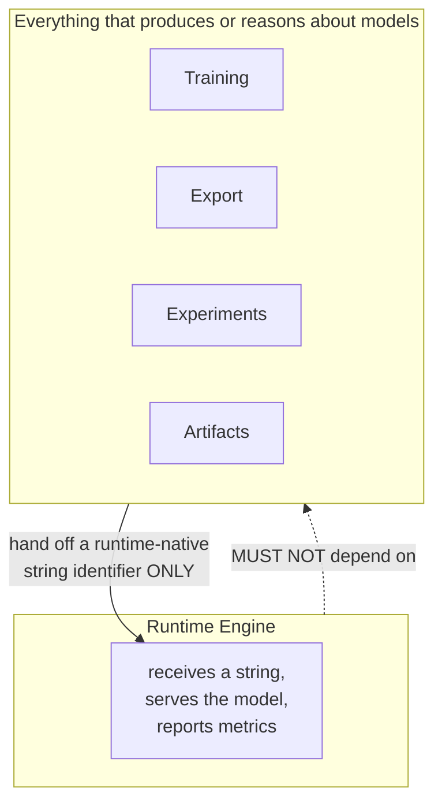

The Runtime Engine cannot distinguish a model that arrived via manual `ollama pull` from one produced by RedForge's own Export pipeline — and it *must not be able to*, because the moment it can, it has knowledge of training, and the boundary rots. Everything training-related depends on Runtime (Benchmark, Evaluation, Security all call it to serve models); Runtime depends on *nothing* training-related. This directionality is non-negotiable and is checked first in any review touching the Runtime Engine (§14).

## 11.3 Interaction With the Rest of the Platform

| Runtime interacts with | How | Direction |
|---|---|---|
| **Artifacts** | Consumers resolve a `runtime_model` artifact to its runtime-native string, then hand *that string* to Runtime. Runtime never touches the Artifact Registry itself. | Artifacts → (string) → Runtime |
| **Experiments** | None directly. Experiments reference runtime-model artifacts; Runtime is unaware of experiments. | none |
| **Training** | None directly. Training produces artifacts; Export installs them into runtimes via native tooling; Runtime later serves the resulting string. Runtime never imports Training. | Training → Export → (install) → Runtime serves string |
| **Benchmark / Evaluation / Security** | They call Runtime to serve a model, exactly as any caller does. Runtime is unaware of their purpose. | Consumers → Runtime |

The **only** thing crossing into the Runtime Engine from the training/artifact world is a plain string, produced by Export, resolved from an artifact by the consumer. This is identical to how a human-pulled model reaches Runtime — which is precisely the point: Runtime treats RedForge-produced and externally-obtained models identically, because it knows nothing of the difference.

---

# SECTION 12 — DATASET PLATFORM

## 12.1 Responsibilities

The Dataset Platform owns the full data lifecycle: import, cleaning, versioning, splitting, validation, metadata, and lineage. It *supplies* records to Training; it never *consumes* them, and it never knows about models.

## 12.2 Import

Import brings external data into the artifact spine as first-class `dataset` artifacts with honest provenance. Multiple formats are supported through **dataset parsers** (a provider-shaped extension point — a new format is a new parser, §15). Import produces a first version; the source is recorded truthfully.

## 12.3 Cleaning

Cleaning operations (dedupe, trim, normalize, drop-empty, and future operations) are **composable transforms** that never mutate in place — each produces a new version with a note describing what changed. Cleaning is a `dataset_processing` job when large enough to warrant backgrounding (§8), synchronous when trivial.

## 12.4 Versioning

Datasets use the platform's **single versioning mechanism** (§6.6): every meaningful change is a new immutable version linked to its predecessor. A training run consumes a *specific version*, so a result is always reproducible against exactly the data that produced it. Restore is forward-only (copies an old version forward as a new head), so history is never rewound or lost.

## 12.5 Splits

Train/validation/test splitting is **deterministic and seeded** (§2.11) — the same dataset and seed always produce the same split, so a training result can be reproduced exactly. Splits are recorded as version metadata, not as separate datasets.

## 12.6 Validation

Validation asserts a dataset's fitness for a purpose *before* it is trained on: shape validation (does it match the strategy's required shape — instruction pairs for SFT, preference pairs for DPO), quality gating (analyzed metrics against thresholds), and safety flagging (leakage/unsafe-content detection). Validation is honest and advisory — it warns and blocks knowingly, never silently passes bad data as good.

## 12.7 Metadata & Quality

Every dataset carries analyzed **quality metadata** — record counts, token estimates, duplicate/empty/malformed rates, leakage/unsafe flags, and a composite quality score with grade. This metadata is what the Recommendation Engine reads to reason about whether poor training outcomes trace to poor data, and what the Assistant reads to answer "is this dataset good enough."

## 12.8 Relationships & Lineage

Datasets participate in the artifact DAG: a cleaned version's parent is the version it was cleaned from; a training run's lineage includes the exact dataset version consumed. This makes "which datasets fed this model, at which versions" a lineage query, and "everything ever trained on this dataset" a descendant walk — the same generic capability every artifact enjoys (§6.5).

---

# SECTION 13 — ENGINEERING PIPELINE

The Engineering Pipeline is the **complete lifecycle** RedForge exists to make coherent. It is not a rigid linear process — it is a *loop* the operator drives, where every stage produces artifacts the next stages consume, and the synthesis stages feed back into the next iteration.

```mermaid
flowchart TB
    FM["① Foundation Model<br/>(training-domain identity)"] --> EXP
    DS["② Dataset<br/>(versioned, validated)"] --> EXP
    EXP["③ Experiment<br/>(the inquiry — owns everything below)"] --> TR
    TR["④ Training<br/>(strategy × provider, as a Job)"] --> CK
    CK["⑤ Checkpoint<br/>(+ Adapter, artifacts)"] --> ART
    ART["⑥ Artifacts<br/>(registered, lineage-tracked)"] --> EXPT
    EXPT["⑦ Export<br/>(merge → convert → install)"] --> RT
    RT["⑧ Runtime Model<br/>(servable, via native tooling)"] --> B & E & S
    B["⑨ Benchmark<br/>(how well?)"] --> REP
    E["⑩ Evaluation<br/>(how does it behave?)"] --> REP
    S["⑪ Security<br/>(how safe? — auto per-checkpoint too)"] --> REP
    REP["⑫ Reports<br/>(composed from lineage)"] --> REC
    REC["⑬ Recommendations<br/>(what next? — confidence-scored)"] --> ITER
    ITER["⑭ Iteration<br/>(fork from best, retrain)"] -.back into.-> EXP

    CK -.checkpoint.produced event.-> S
```

**Stage by stage:**

1. **Foundation Model** — the operator chooses a training-domain base, either by HF identity or by resolving one they already have as a runtime model (§10.9). Registered as a `base_model` artifact.
2. **Dataset** — imported, cleaned, validated, versioned (§12). Registered as a `dataset` artifact. Validated *against the chosen strategy's required shape* before training.
3. **Experiment** — the inquiry that will own everything below (§7). The operator states what they're trying to achieve; the Experiment remembers every iteration toward it.
4. **Training** — a strategy (what) executed by a provider (who), run as a Job (how), under central concurrency control (§8, §10).
5. **Checkpoint** — training-domain weights, produced incrementally, each emitting an event that triggers downstream reactions (§8.6, §10.6). Adapters produced here for adapter strategies.
6. **Artifacts** — everything produced is registered with lineage (§6). This is the stage that makes all subsequent stages' provenance possible.
7. **Export** — the bridge (§10.8): merge → convert → quantize → install into a target runtime via its native tooling, producing a runtime-model artifact. This is the stage the prior architecture lacked entirely.
8. **Runtime Model** — now servable by the Runtime Engine, which knows nothing of how it was made (§11). The pipeline crosses from training-domain to inference-domain here, and *only* here.
9. **Benchmark** — objective measurement across suites (§3.10), consuming the runtime-model artifact, producing a benchmark-result artifact.
10. **Evaluation** — behavioral validation against versioned prompt sets with regression attribution (§3.11), producing evaluation-result artifacts.
11. **Security** — adversarial evaluation (§3.12), run on demand *and* automatically per-checkpoint via the event subscription — so security is a *continuous* signal across the experiment's life, not a one-time gate.
12. **Reports** — composed from the lineage of everything above (§3.19, §6) — new stages appear in reports automatically because reports traverse lineage rather than hardcoding joins.
13. **Recommendations** — the Recommendation Engine reads the whole experiment's history (not one run) and proposes the next iteration, with rationale, confidence, and later, accuracy tracking (§3.13).
14. **Iteration** — the operator forks from the experiment's best artifact and retrains, with full lineage and context intact (§7). The loop closes.

The pipeline's defining property: **it is a loop with memory** (the Experiment), where **every handoff is an artifact** (the spine), and **every cross-stage trigger is an event** (no hidden magic). These three properties together are what make the fragmented toolchain RedForge replaces into one coherent engineering environment.

---

---

# SECTION 14 — DEPENDENCY RULES

Dependencies are **law**, not guidance. A pull request that violates a rule in this section does not merge, regardless of how convenient the violation is. These rules are what keep the platform's boundaries from eroding over a decade of contributors who each, individually, have a good local reason to cross one.

## 14.1 The Cardinal Rules

1. **Training MAY depend on Dataset, Foundation Model, Artifact Registry, Execution Platform, Provider Platform.**
2. **Training MUST NOT depend on Runtime.** (Training produces artifacts; Export bridges them to runtimes.)
3. **Runtime MUST NOT depend on Training.** (Runtime serves a string; it knows nothing of how it was made — §11.2.)
4. **Runtime MUST NOT depend on Artifacts, Experiments, Export, Benchmark, Evaluation, or Security.** Runtime is a leaf.
5. **Benchmark MUST depend only on Runtime + Artifacts (+ Execution + Providers).**
6. **Evaluation MUST depend only on Runtime + Artifacts (+ Execution + Providers).**
7. **Security MUST depend only on Runtime + Artifacts (+ Execution + Providers + its security-provider registry).**
8. **Export MAY depend on Artifacts + Execution + Providers; it uses runtimes' native tooling, NOT the Runtime Engine.**
9. **Recommendation, Reporting, and Assistant MUST depend only on READ-ONLY interfaces of other contexts (+ Artifact Registry reads).** They never write into a context they read from.
10. **No Domain Engine may depend laterally on another Domain Engine except through the permitted edges in the matrix below; all other cross-engine communication is via the Event Bus or Artifact Registry (Platform Services), never direct import.**
11. **Every context MAY depend on Platform Services, Infrastructure, and Core. Nothing MAY depend upward (§4.3).**

## 14.2 Dependency Matrix

Rows depend on columns. ✅ = permitted direct dependency. 📖 = permitted **read-only** dependency. 🔵 = permitted via Platform Service (Artifacts/Jobs/Events), not direct import. ❌ = **forbidden**. — = self / n/a.

| ↓ depends on → | Runtime | Training | Export | Benchmark | Evaluation | Security | Recommendation | Reporting | Assistant | Artifacts | Jobs/Exec | Providers | Dataset | Foundation | Experiments |
|---|:--:|:--:|:--:|:--:|:--:|:--:|:--:|:--:|:--:|:--:|:--:|:--:|:--:|:--:|:--:|
| **Runtime** | — | ❌ | ❌ | ❌ | ❌ | ❌ | ❌ | ❌ | ❌ | ❌ | ✅ | ✅ | ❌ | ❌ | ❌ |
| **Training** | ❌ | — | 🔵 | ❌ | ❌ | 🔵 | ❌ | ❌ | ❌ | ✅ | ✅ | ✅ | ✅ | ✅ | ✅ |
| **Export** | ❌* | ❌ | — | ❌ | ❌ | ❌ | ❌ | ❌ | ❌ | ✅ | ✅ | ✅ | ❌ | ✅ | 🔵 |
| **Benchmark** | ✅ | ❌ | ❌ | — | ❌ | ❌ | ❌ | ❌ | ❌ | ✅ | ✅ | ✅ | ❌ | ❌ | 🔵 |
| **Evaluation** | ✅ | ❌ | ❌ | ❌ | — | ❌ | ❌ | ❌ | ❌ | ✅ | ✅ | ✅ | ❌ | ❌ | 🔵 |
| **Security** | ✅ | ❌ | ❌ | ❌ | ❌ | — | ❌ | ❌ | ❌ | ✅ | ✅ | ✅ | ❌ | ❌ | 🔵 |
| **Recommendation** | ❌ | 📖 | ❌ | 📖 | 📖 | 📖 | — | ❌ | ❌ | 📖 | ❌ | ❌ | 📖 | 📖 | 📖 |
| **Reporting** | ❌ | 📖 | ❌ | 📖 | 📖 | 📖 | 📖 | — | ❌ | 📖 | ❌ | ❌ | 📖 | 📖 | 📖 |
| **Assistant** | 📖 | 📖 | 📖 | 📖 | 📖 | 📖 | 📖 | 📖 | — | 📖 | 📖 | 📖 | 📖 | 📖 | 📖 |
| **Experiments** | ❌ | 🔵 | ❌ | 🔵 | 🔵 | 🔵 | 🔵 | 🔵 | ❌ | ✅ | ❌ | ❌ | ✅ | ✅ | — |

\* **Export → Runtime is ❌ for the *Runtime Engine's internals*, but Export legitimately invokes a target runtime's *native external tooling* (e.g. `ollama create`).** That is not a code dependency on the Runtime Engine; it is a subprocess call to an external program, the same call a human operator would make. The distinction is constitutional: Export never imports `runtime/`, but it may shell out to `ollama`.

**How to read the key rows:**
- **Runtime's row is almost entirely ❌** — it depends only on Providers and the Job/Exec primitives it needs, and Configuration/Core below. This sparseness *is* the boundary. Any new ✅ in the Runtime row is a constitutional violation requiring an ADR that will be scrutinized harder than any other change in the platform.
- **Benchmark/Evaluation/Security rows are identical** — Runtime + Artifacts + Jobs + Providers, and read-only experiment context. They are pure consumers of runtime models; they produce result artifacts; they depend on nothing that produces models.
- **Recommendation/Reporting/Assistant rows are entirely 📖 or ❌** — they read broadly and write only their own output. They are the platform's read-only reasoners.
- **Training's row shows 🔵 to Export and Security** — Training does not *import* those engines; it emits events they subscribe to (§8.6). The 🔵 marks a *relationship that exists* but is *mediated by a Platform Service*, never a direct edge.

## 14.3 Enforcement

- **Layering (§4.3) and this matrix SHOULD be enforced by automated import-boundary checks** so violations fail the build, not just review. A ten-year platform cannot rely on every reviewer remembering every rule; the rules that matter most are the ones a machine checks.
- **The Runtime-isolation rules (2, 3, 4) are the highest-priority checks.** If tooling can enforce only one thing, it enforces that Runtime imports nothing from Training/Artifacts/Export/Benchmark/Evaluation/Security.

---

# SECTION 15 — PLUGIN ARCHITECTURE

## 15.1 The Principle

RedForge cannot anticipate every training method, runtime, benchmark, similarity metric, export format, security scanner, dataset format, or report type that will matter over ten years. **The platform's longevity depends on third parties extending it without forking it** (§2.9). Every capability domain that has a provider registry is, by design, a plugin extension point.

The discipline that keeps this honest: **first-party capabilities are built through the same extension points third parties use.** RedForge's own Unsloth training provider, Ollama export provider, and text-similarity provider register through the exact mechanism a third-party plugin would. Dogfooding the plugin boundary is the only way to keep it real rather than aspirational — a boundary only the "outside" uses inevitably rots.

## 15.2 Extension Points

Every provider domain (§9.2) is a plugin extension point, plus a few capability registries that are not "providers" but are equally extensible:

| Plugin type | Extends | Contract it binds to |
|---|---|---|
| **Provider plugins** | Runtime / Training / Export / Similarity / Security registries | the respective provider contract |
| **Benchmark plugins** | Benchmark suite registry | the `BenchmarkSuite` contract (key, dimension, `run`, honesty flag) |
| **Evaluation plugins** | Similarity-provider + regression-type registries | the similarity/regression contracts |
| **Training plugins** | Training provider + Strategy registries | provider and strategy contracts |
| **Export plugins** | Export provider registry | the export-target contract (input artifact kind → runtime model) |
| **Security plugins** | Security-provider registry | the security-provider contract (target → score/categories/findings) |
| **Dataset plugins** | Dataset parser registry | the parser contract (bytes → records/kind/columns) |
| **Assistant plugins** | Assistant answer-router | a read-only answer-provider contract (scoped question → answer + sources) |
| **Reporting plugins** | Report section registry | a report-section contract (experiment lineage → section) |

## 15.3 The Plugin Contract

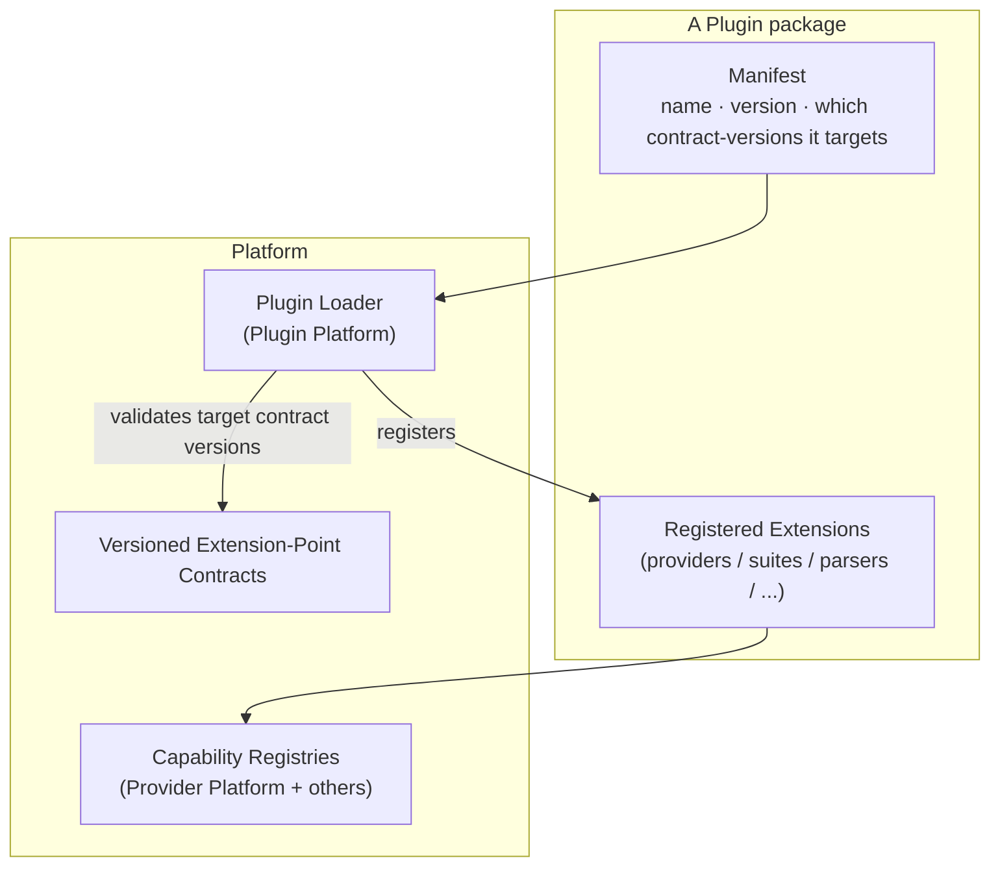

A plugin:
1. **Declares a manifest** — its identity, version, and *which versioned extension-point contracts it targets* (§9.6). This is what makes a plugin ecosystem stable: a plugin binds to *contract v1*, and the platform honors v1 even after v2 ships, or refuses the plugin *loudly and specifically* if it cannot.
2. **Registers extensions** into the appropriate capability registries at load time — exactly as built-in capabilities do.
3. **Declares its capabilities** (§9.5) so the platform can reason about compatibility and surface honest support information.

## 15.4 Plugin Boundaries & Trust

- **Plugins run in the operator's local, single-user trust domain.** There is no multi-tenant sandbox to enforce because there is one operator (consistent with local-first — the operator installing a plugin is trusting it the way they trust any local software). The Constitution's honesty principle still applies: a plugin's provenance and capabilities are surfaced truthfully.
- **Plugins bind to versioned contracts, never to internals.** The stable surface a plugin sees is the extension-point contract; the platform's internals are free to change beneath it. This is the VS Code / Kubernetes lesson: a durable plugin ecosystem requires a stable, versioned API and an unstable, freely-evolving core beneath it. RedForge's extension-point contracts are that stable surface.
- **A plugin never gains a capability the core forbids.** A plugin cannot make Runtime depend on Training, cannot bypass the Job System, cannot write into a context it should only read. Plugins extend *within* the constitutional rules; they do not suspend them.

---

# SECTION 16 — MIGRATION ROADMAP

The path from the current architecture to this Constitution. Every phase is **independently shippable**, **breaks no existing functionality**, and follows the platform's own additive-never-destructive principle. This is the only section expected to be consumed and rewritten as it completes.

## 16.1 Migration Principles

- **Strangler-fig, not big-bang.** New structure grows alongside old, old is retired only once new is proven. Nothing is deleted before its replacement is load-bearing.
- **Every phase ships value.** No phase is pure refactoring with no operator-visible benefit — each delivers a capability or a correctness fix.
- **Backward-compatible seams.** Existing API request/response shapes are preserved via translation shims during transition; clients never break mid-migration.
- **Reversible.** Each phase has a rollback: because new structure is additive, reverting a phase means ceasing to use the new path, not restoring deleted code.

## 16.2 The Phases

### Phase 1 — Artifact Registry foundation
- **DB:** add the artifact index + lineage tables (additive). Backfill thin artifact rows for existing checkpoints, benchmark/evaluation/security results — data-backed wrappers, no data moved.
- **Service:** introduce the Artifact Registry as a Platform Service; existing engines gain *one* registration call at their existing completion points.
- **API:** additive artifact-query endpoints; existing endpoints unchanged.
- **Frontend:** none required; artifact views are additive.
- **Testing:** lineage traversal over backfilled data; registration idempotency.
- **Rollback:** stop registering; artifact tables become inert. Zero impact on existing flows.
- **Ships:** provenance queries that were previously impossible.

### Phase 2 — Foundation Model / Runtime Model separation + Model Resolution
- **DB:** add foundation-model identity table; add nullable foundation-model reference to training runs alongside the existing base-model string (no rename).
- **Service:** Foundation Model Platform + Model Resolution Service; runtime→foundation resolution surfaced as an *optional* step.
- **API:** additive resolution + foundation-model endpoints; existing training-launch shape preserved via shim.
- **Frontend:** optional "resolve from installed runtime" affordance; existing free-text base-model path unchanged.
- **Testing:** resolution confidence scoring; offline degradation; existing training-launch regression suite unchanged.
- **Rollback:** ignore the new foundation-model field; training uses the string as before.
- **Ships:** honest model identity; "fine-tune the model I already have" without knowing HF ids.

### Phase 3 — Unified Job System
- **DB:** add the Job table + canonical state machine.
- **Service:** introduce the Execution Platform; migrate the three async queues (Benchmark, Evaluation, Security) and Training onto it as job handlers. The one recovery routine replaces the four ad-hoc ones (fixing the Continuous-Security recovery gap and the null-error-on-failure defect structurally). Central per-kind concurrency limits (fixing unbounded concurrent training).
- **API:** unified job-status endpoints; existing per-subsystem status endpoints preserved as thin adapters over the Job System during transition.
- **Frontend:** progress surfaces read the unified progress-event stream; existing polling shims retired incrementally.
- **Testing:** state-machine invariants (no failed-with-null-error possible); recovery over every kind; concurrency limits enforced.
- **Rollback:** per-subsystem queues remain until their handler is proven; migrate one kind at a time.
- **Ships:** uniform cancellation/recovery/retry/concurrency; the end of triplicated queues.

### Phase 4 — Strategy abstraction + Export Engine (Ollama first)
- **DB:** add strategy-spec storage on runs; add merged-model / gguf-export / runtime-model artifact kinds.
- **Service:** split Training's flat config into Strategy + Provider + Execution; introduce the Export Engine with one export provider (Ollama). `PROVIDER_CAN_HOST_ADAPTER` becomes *derived from export availability* instead of permanently false.
- **API:** training-launch accepts strategy specs; legacy flat-config requests translated by shim.
- **Frontend:** strategy selection; export action on checkpoints.
- **Testing:** provider×strategy compatibility resolution; end-to-end merge→convert→install→serve; existing LoRA/QLoRA runs unchanged.
- **Rollback:** export is additive; without it, runtime-registry base-model fallback behaves exactly as today.
- **Ships:** the missing training→runtime bridge — the flaw V3 exists to fix — proven end-to-end.

### Phase 5 — Event-driven integration + Experiment context
- **DB:** add Experiment table + associations; add durable event storage where needed.
- **Service:** introduce the Event Bus; convert Training's checkpoint hook (and any other direct cross-subsystem call) into event emissions + subscriptions. Introduce Experiments as the aggregation root; existing runs associate to an implicit experiment during transition.
- **API:** experiment-scoped endpoints; existing run-scoped endpoints preserved.
- **Frontend:** experiment as the primary organizing surface; runs surface within experiments.
- **Testing:** event delivery; subscription reactions; experiment aggregation; no direct cross-engine imports remain (enforced by import-boundary check).
- **Rollback:** events run alongside direct calls until subscribers are proven; experiments are additive context over existing runs.
- **Ships:** the experiment-centric model; the end of hidden-magic cross-subsystem coupling.

### Phase 6 — Provider Platform consolidation + Plugin Platform
- **DB:** installed-plugin index.
- **Service:** unify the per-domain provider registries under the shared Provider Platform machinery; formalize capability declaration (fixing silent partial-support); introduce the Plugin Loader and versioned extension-point contracts.
- **API:** plugin management + provider capability endpoints.
- **Frontend:** plugin management surface; honest capability display.
- **Testing:** first-party capabilities load through the plugin path; contract-version compatibility; capability-gated behavior.
- **Rollback:** built-in providers keep working through direct registration until the shared machinery is proven.
- **Ships:** the third-party extensibility foundation; first-party dogfooding of the plugin boundary.

### Phase 7 — Breadth + consolidation
- Add remaining Training Providers (PEFT, HF Trainer, Axolotl, TRL), Strategies (SFT/DPO/PPO/RLHF), and Export Providers (llama.cpp, LM Studio, vLLM) — each a plugin-shaped addition.
- Retire the duplicated legacy benchmark subsystem once the Phase-3 Benchmark Engine owns all history (single source of truth).
- Extract remaining API-layer business logic (report composition, any residual hooks) into their owning services.
- **Ships:** the full provider/strategy/export breadth; the resolution of every duplicate-concept debt named in the prior audit.

## 16.3 Cross-Cutting Migration Concerns

- **Database migrations** are additive per phase; destructive changes (retiring the legacy benchmark tables) happen only in Phase 7, only after the replacement owns all data, behind an explicit migration.
- **API migrations** always preserve existing request/response shapes via translation shims until a deprecation window closes; no client breaks mid-migration.
- **Frontend migrations** follow backend capability — new surfaces are additive; old surfaces retire only when their replacement is complete.
- **Testing** each phase re-runs the full existing suite unmodified (proving no regression) plus new tests for the new structure; the import-boundary checks (§14.3) come online in Phase 5 and tighten through Phase 7.
- **Rollback strategy** is uniform: because every phase is additive, rollback is "stop using the new path," never "restore deleted code" — the strangler-fig's defining safety property.

---

# SECTION 17 — REDFORGE VISION

The Constitution ends where it began: with identity. The structure in Sections 3–16 exists to serve the product RedForge is becoming. This is that product, described without implementation, across the horizon the architecture is built to survive.

## 17.1 In One Year — The Coherent Workbench

RedForge is the tool a local-model engineer reaches for when they want the *whole lifecycle in one place*. Training produces models that can actually be run, measured, and secured without leaving the tool — the bridge that was missing is built. Every result traces back to what produced it. An engineer can pick up an inquiry they left a week ago and see exactly what they tried and what happened. The fragmentation that defined local model engineering — a training script here, a benchmark there, a spreadsheet tracking it all — is gone, replaced by one coherent environment. RedForge does one thing completely: it makes the local model lifecycle *whole*.

## 17.2 In Three Years — The Reproducible Platform

RedForge is where serious local model engineering happens because it is the only place the work is *reproducible and provable*. Every model an engineer produces carries its full provenance — the foundation model, the exact data, the exact process, the measured results, the security posture — as first-class, queryable history. "How did I make this, and how good and safe is it" is not a question requiring archaeology; it is a property of the artifact. The platform has become *experiment-native*: engineers think in inquiries, not runs, and the tool remembers the arc of their work. Extensibility has taken root — the training methods, runtimes, and evaluations the platform supports have grown well beyond what its authors built, because third parties extend it without forking it.

## 17.3 In Five Years — The Standard for Local AI Engineering

RedForge is to local AI engineering what an IDE is to programming: the assumed environment, the thing you would be strange *not* to use. It is trusted specifically by those who cannot or will not send their work to a cloud — security researchers, regulated industries, engineers working with sensitive models and data — because its guarantee that nothing leaves the machine is structural, not a setting. Its honesty is its reputation: RedForge does not fabricate measurements, does not hide how it reaches conclusions, does not pretend a capability is real before it is. An engineer trusts a RedForge number the way they trust a compiler error — because it means exactly what it says. The platform has a genuine ecosystem: a body of community-built providers, suites, strategies, and integrations, all bound to stable contracts, all extending a core that has stayed coherent because its boundaries held.

## 17.4 In Ten Years — The Constitution Held

RedForge is still, recognizably, the same platform — because the identity in Section 1 and the philosophy in Section 2 did not change, even as everything built on them was rebuilt many times over. The models are different, the training methods are different, the runtimes are different, the UI has been rewritten more than once — and none of that touched the foundation, because the layering forbade it. RedForge outlasted the specific technologies it was born among the way Git outlasted the version-control landscape of its birth and VS Code outlasted the editors of its: by being *right about the shape of the problem* rather than *tied to the tools of a moment*. It remained local-first when the industry pulled toward the cloud, remained honest when the industry rewarded plausible fabrication, remained a workbench for one engineer owning one lifecycle when the industry fragmented into a hundred specialized services — and those choices, which looked like constraints, turned out to be the reasons it was still standing.

The final measure of this Constitution is simple: **a contributor ten years from now, reading a pull request, can decide whether it belongs in RedForge by asking whether it serves the one engineer, on one machine, owning one lifecycle, keeping everything local — and honestly.** If the answer is yes, it belongs, however new its technology. If the answer is no, it belongs in a different product, however impressive its feature. That question is the whole Constitution, compressed. Everything else in this document is the working-out of what it takes to keep answering it the same way for a decade.

---

*End of the RedForge V3.0 Constitution. This document is architecture only — no implementation code, no database SQL, no UI, no styling. It is amended solely by Architecture Decision Record. It governs.*
