# RedForge — Training Foundation Architecture Redesign

**Role**: Chief Architect design document. **Status**: Architecture only — no implementation code. **Scope**: Training's foundation *only*. Everything else — Runtime Manager, Benchmark Center, Evaluation Workbench, Continuous Security, Recommendation Engine, Projects, Assistant — is preserved conceptually and touched only at explicit, minimal integration seams called out below.

This document builds directly on the reverse-engineered facts in `ARCHITECTURE_REVIEW.md` (Parts I–VII) and does not repeat that research — it cites specific existing modules/entities from that review as the baseline this redesign extends.

---

## 0. The Core Architectural Flaw, Precisely

Today, `TrainingRun.base_model` is a raw string (e.g. `"llama3.1:8b"`) that is **assumed to be simultaneously**:
- an Ollama tag the Runtime Manager can serve, **and**
- a Hugging Face model identity `UnslothProvider`/`_unsloth_impl.py` can load via `FastLanguageModel.from_pretrained(model_name=config.base_model, ...)`.

These are not the same namespace. `"llama3.1:8b"` is meaningless to `transformers`/`unsloth`; `"meta-llama/Llama-3.1-8B"` (or `"unsloth/llama-3-8b-bnb-4bit"`) is meaningless to Ollama. The current architecture papers over this with `RegisteredModel.fallback=True` (Architecture Review Part I §12) — because there is no real bridge from "what got trained" to "what Ollama can run," the Runtime Registry always falls back to re-serving the original base-model string, silently assuming it already exists in both namespaces. `PROVIDER_CAN_HOST_ADAPTER` being `False` for every provider is the honest admission of this gap (Architecture Review Part V, Finding #11).

**The fix is not a bigger `TrainingRun` table.** It is separating two identities that were never the same thing, and building the missing bridge between them as a first-class pipeline rather than a fallback.

---

## 1. How Foundation Models Should Be Represented

A **Foundation Model** is a training-domain identity: a specific, addressable set of pretrained weights in Hugging Face's ecosystem — independent of any runtime, independent of any fine-tune.

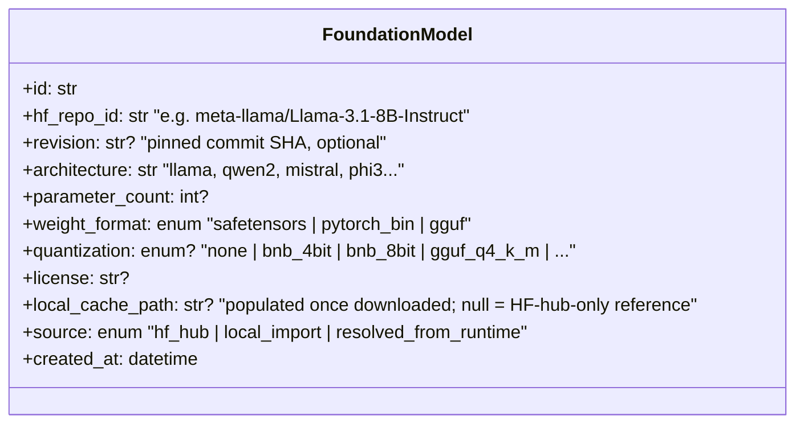

Key design decisions:
- **`hf_repo_id` + `revision` is the identity**, not a display name. Two `FoundationModel` rows with the same repo but different `quantization`/`weight_format` are *different* rows (a 4-bit bnb variant and the full-precision original are not interchangeable training inputs).
- **`local_cache_path` is nullable.** A `FoundationModel` can be a reference to something on the Hugging Face Hub not yet downloaded (lazy — mirrors how Runtime providers today only *describe* a model until it's pulled). This lets the Recommendation Engine and Training Lab's model picker reference a foundation model before committing disk space to it.
- **Not a duplicate of `ModelRecord`** (the legacy `models` table, Architecture Review Part II) — `ModelRecord` tracks *discovered runtime-provider* models; `FoundationModel` tracks *training-domain* identities. They can be linked (see §3) but are never merged into one table, because merging them is exactly the mistake being corrected.
- **This is the new value of `TrainingRun.base_model`.** The column changes from a raw string to a foreign key: `TrainingRun.foundation_model_id → FoundationModel.id`. (Migration path in §10 — this is additive, not a breaking rename.)

---

## 2. How Runtime Models Differ From Training Models

This is the central distinction the whole redesign turns on.

| | **Training Model** (`FoundationModel` / its derivatives) | **Runtime Model** (existing `RegisteredModel`, reshaped) |
|---|---|---|
| **Domain** | Training — what a `TrainingProvider` loads and fine-tunes | Inference — what the Runtime Manager's `Provider` serves |
| **Identity** | HF repo id + revision + format | Provider-specific opaque string (Ollama tag, LM Studio path, vLLM served-model-name) |
| **Format** | safetensors / PyTorch checkpoint, optionally quantized for training (bnb-4bit) | Provider-native (GGUF for Ollama/llama.cpp/LM Studio; safetensors for vLLM) |
| **Consumer** | `TrainingProvider.run()` (Unsloth, PEFT, HF Trainer, Axolotl, TRL) | `Provider.generate()` (Ollama, LM Studio, vLLM, cloud APIs) |
| **Who owns it today** | *Nobody* — implicit in `TrainingConfig.base_model: str` | `runtime_registry` / `RegisteredModel` |
| **Who owns it in this redesign** | `FoundationModel` + `Checkpoint`/`LoRAAdapter`/`MergedModel` (all Artifact-kinds, §4) | `RuntimeModel` artifact (produced only by the Export Pipeline, §6) |

**They are related by derivation, never by identity.** A `RuntimeModel` is not "the same model" as a `FoundationModel` — it is the *output of a pipeline* that started at a `FoundationModel` and passed through training, merging, and format conversion:

```
FoundationModel  --[fine-tune]-->  Checkpoint  --[export]-->  RuntimeModel
```

This single relationship — export, not identity — is what today's architecture is missing, and what makes `RegisteredModel.fallback` a permanent state instead of a transitional one. Once the Export Pipeline (§6) exists, `fallback=True` becomes what it should always have meant: "no export target has run for this checkpoint yet," a normal, temporary, honestly-reported state — not "this capability doesn't exist" (Architecture Review Part I §26's "honesty over simulation-as-fact" principle, preserved and made *true* rather than permanently apologetic).

---

## 3. Model Resolution Service

**Problem it solves**: a user already has `llama3.1:8b` pulled in Ollama and wants to fine-tune "that model" — but Ollama's GGUF has no reliable, machine-readable pointer back to the exact Hugging Face repo it was converted from. This service closes that gap in both directions, honestly (confidence-scored, never a silent guess presented as fact).

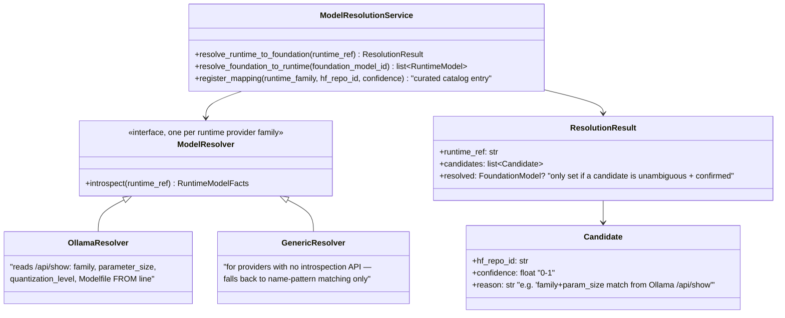

**Mechanics**:
1. `ModelResolver` (one per provider family, same registration pattern as `Provider`/`TrainingProvider`) introspects whatever the runtime actually exposes — for Ollama, `show_model()` already returns `family`, `parameter_size`, `quantization_level`, and often the `Modelfile`'s `FROM` line (Architecture Review Part I §5/§13, `OllamaProvider.show_model`) — for providers with no such API, resolution degrades to name-pattern matching only.
2. Candidates are scored against a **curated mapping catalog** (`family + parameter_size (+ optional GGUF quant) → known hf_repo_id(s)`), maintained the same way `onboarding/recommender.py`'s `_MODEL_CATALOG` is today (Architecture Review Part I §6) — a small, hand-curated, extensible table, not an ML classifier.
3. Result is **always** a `ResolutionResult` with a confidence-scored candidate list; `resolved` is only auto-populated when a single high-confidence match exists — otherwise the caller (Training Lab's model picker) presents the candidates and lets the user confirm, exactly mirroring the honesty convention already used for `simulated`/`fallback` flags elsewhere.
4. The reverse direction — `resolve_foundation_to_runtime()` — is not a guess at all; it's a **lineage query** over Export Pipeline output (§6): "which `RuntimeModel` artifacts were actually exported from this `FoundationModel` (or a `Checkpoint` derived from it)." This direction is always exact, never confidence-scored, because it only reports things RedForge itself produced.

**Where it plugs in**: Training Lab's base-model picker calls `resolve_runtime_to_foundation()` against whatever the user already has installed via the Runtime Manager, so "pick a base model" becomes "pick something you already have, and we'll tell you what it actually is for training" instead of requiring the user to already know an HF repo id. This service has **no write access** to `TrainingRun`/`FoundationModel` — it only proposes; the Training Engine (§5) is what actually creates a `FoundationModel` row once a resolution is accepted (or a user pastes an HF repo id directly, bypassing resolution entirely).

---

## 4. Artifact Registry

The missing abstraction identified in the Architecture Review (Part V, Finding #11; Part VII's top 5-year priority). Generic, append-only, DAG-linked.

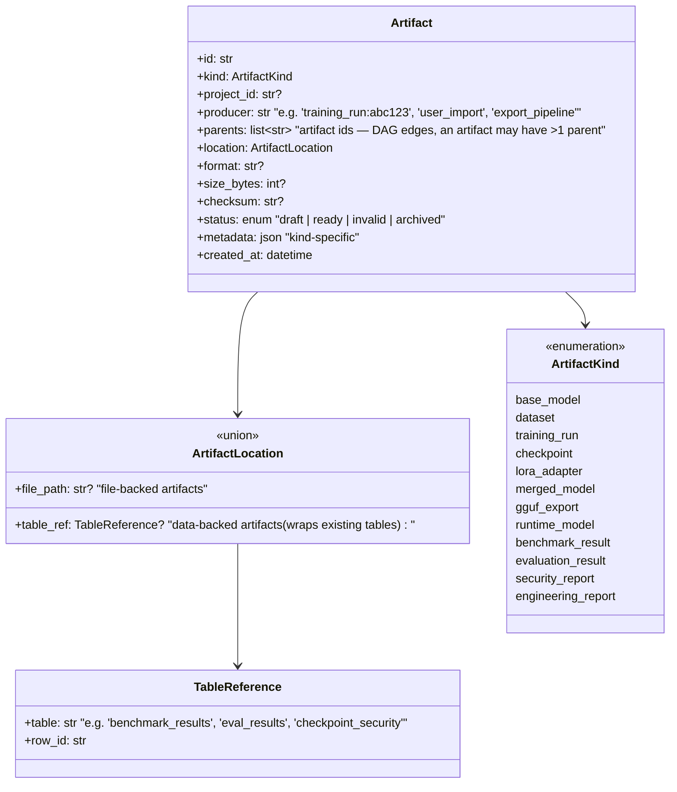

**Two flavors, one uniform index**:

- **File-backed artifacts** (`base_model`, `checkpoint`, `lora_adapter`, `merged_model`, `gguf_export`, `runtime_model`, and datasets *when exported to disk*) — the `Artifact` row is the source of truth for identity, lineage, and location; bytes live on the filesystem, referenced by `location.file_path`, with `size_bytes`/`checksum` for verification (directly closing the "unverified path string" gap flagged in Architecture Review Part I §20/Part V Finding #11).
- **Data-backed artifacts** (`benchmark_result`, `evaluation_result`, `security_report`, `engineering_report`, and `dataset` when it stays SQLite-native like today's `Dataset`/`DatasetVersion`) — **no data migration**. One thin `Artifact` row per existing result, `location.table_ref` pointing back at the already-correct owning table (`BenchmarkResult`, `EvaluationResult`/`WorkbenchSession`, `CheckpointSecurity`, the composed training report). This preserves every one of the "preserved conceptually" subsystems' existing storage exactly as-is — Benchmark Center, Evaluation Workbench, and Continuous Security do not change their internal data model at all. They gain exactly one new responsibility: **register a thin `Artifact` row pointing at themselves** when a result completes, so the DAG can be traversed uniformly (see §8 for the precise integration seam).

**Why a DAG, not a tree**: a `MergedModel` artifact has two parents — the `FoundationModel` it started from and the `LoRAAdapter` merged into it. A `BenchmarkResult` has one parent — the `RuntimeModel` (or `Checkpoint`) it evaluated. This is the structure that finally answers, generically, "show me everything produced from run X" (Architecture Review Part II's explicitly-flagged missing capability) and "show me the full lineage behind this benchmark score" (Architecture Review Part VII's stated 5-year value).

**Lineage traversal example** (the full chain this enables):

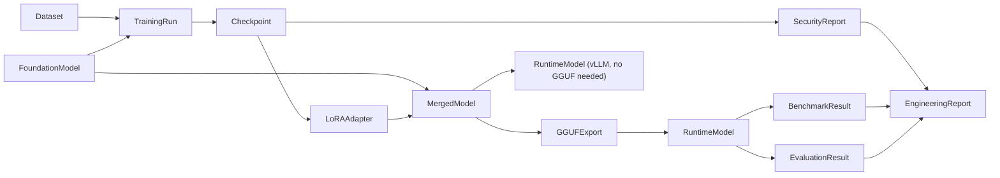

**Ownership boundary**: the Artifact Registry is a **new, small, standalone module** (`app/artifacts/`), analogous in shape to Runtime Registry — a thin service over one table plus a handful of registration/query methods (`register`, `get`, `lineage(artifact_id, direction)`, `list(kind=, project_id=)`). It does not execute anything, does not own any existing subsystem's data, and every existing subsystem opts in by calling `artifact_registry.register(...)` at the moment it already persists its own result — one additional call, not a schema migration.

---

## 5. Training Engine — Providers, Strategies, Execution

Today, `TrainingConfig` is one flat dataclass (`base_model, method: str, epochs, learning_rate, rank, alpha, ...` — Architecture Review Part I §6) where `method ∈ {"lora","qlora"}` is a string field baked directly into `UnslothProvider`/`_unsloth_impl.py`. This conflates **who executes** with **what algorithm runs**, and hardcodes the one algorithm family the current single real provider happens to support.

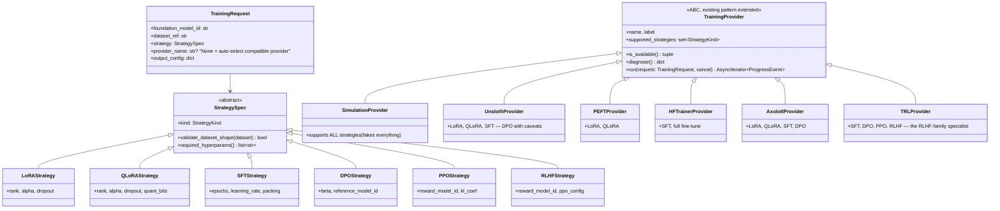

**The three axes, kept genuinely independent**:

1. **Training Provider** — *who executes*. Same ABC shape as today (`is_available`/`diagnose`/`run`, Architecture Review Part I §6), extended with a `supported_strategies: set[StrategyKind]` declaration. Registration mechanism unchanged: `app/training/manager.py`'s `_PROVIDERS` dict, `register_provider()`, `_AUTO_ORDER` — all preserved as-is. New providers (PEFT, Hugging Face Trainer, Axolotl, TRL) are added exactly the way Unsloth was: one new file under `app/training/providers/`, one registry line.
2. **Training Strategy** — *what algorithm*. A new, small hierarchy of declarative specs, each knowing its own required dataset shape (`SFTStrategy` needs instruction/response pairs; `DPOStrategy`/`RLHFStrategy` need preference pairs — chosen/rejected; `PPOStrategy` needs prompts + a reward model) and its own hyperparameter set — replacing today's one-size-fits-all `TrainingConfig` fields that don't apply to every method (e.g. `rank`/`alpha` are LoRA/QLoRA-only but exist unconditionally on `TrainingConfig` today).
3. **Training Execution** — *orchestration*, i.e. today's `runner.py`, structurally unchanged: still fire-and-forget `asyncio.create_task`, still writes to `progress_store` for live SSE/snapshot, still persists `Checkpoint` rows, still fires the `checkpoint_hook` closure for Continuous Security/Registry integration (Architecture Review Part I §6/§9). The only change: it now resolves `(provider, strategy)` compatibility *before* dispatch, and operates over a `TrainingRequest` (foundation model + dataset + strategy) instead of a flat config.

**Compatibility resolution** (`get_provider(strategy, backend=None)`, extending today's `manager.get_provider(name)`):

| Provider | LoRA | QLoRA | SFT | DPO | PPO | RLHF |
|---|:---:|:---:|:---:|:---:|:---:|:---:|
| Simulation | ✅ | ✅ | ✅ | ✅ | ✅ | ✅ |
| Unsloth | ✅ | ✅ | ✅ | ⚠️ caveats | — | — |
| PEFT | ✅ | ✅ | — | — | — | — |
| Hugging Face Trainer | — | — | ✅ | — | — | — |
| Axolotl | ✅ | ✅ | ✅ | ✅ | — | — |
| TRL | — | — | ✅ | ✅ | ✅ | ✅ |

When `provider_name` is unset, selection filters providers by `strategy.kind ∈ supported_strategies` first, then applies today's availability-based auto-order (`_AUTO_ORDER`) within that filtered set — Simulation remains the guaranteed universal fallback for every strategy, preserving `FALLBACK_BACKEND` exactly as today (Architecture Review Part I §6).

**What is explicitly preserved, unchanged**: `progress_store` (in-memory live progress), `ProgressEvent` shape, the checkpoint-persistence path, the checkpoint-hook mechanism wiring Continuous Security and Runtime Registry, `UnslothProvider.diagnose()`'s per-layer diagnostics pattern (extended to other providers, not replaced), and `training_service`'s CRUD/store split (Architecture Review Part IV's noted two-writer pattern is not something this redesign resolves — it's orthogonal to the Training/Runtime Model conflation and is called out only as pre-existing, non-blocking debt).

---

## 6. Export Pipeline

The bridge that was missing entirely. Turns a training-domain `Checkpoint` into inference-domain `RuntimeModel` artifacts, stage by stage, each stage producing its own durable Artifact.

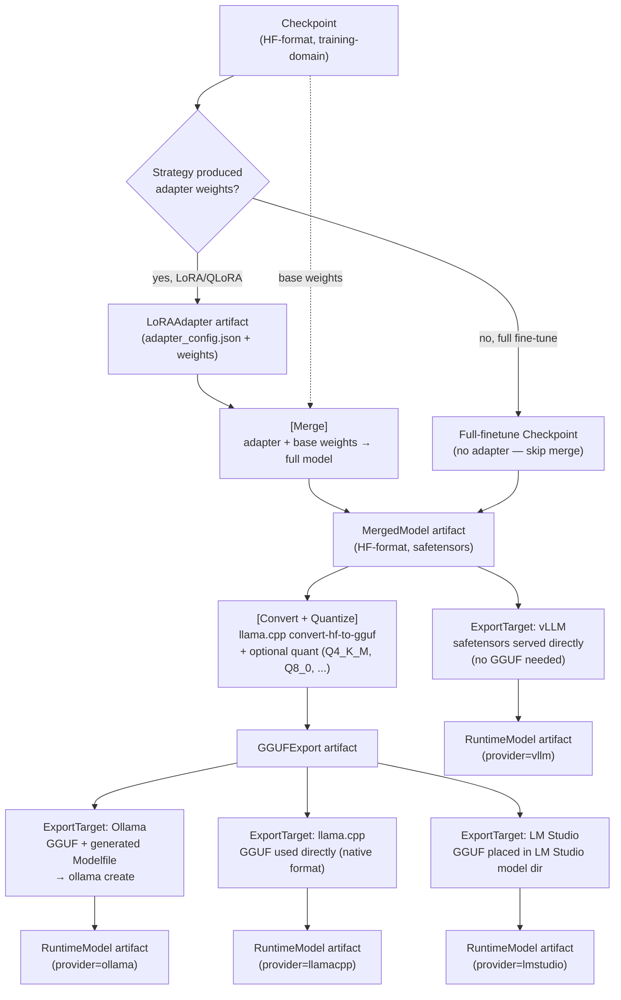

**`ExportTarget`** — a new pluggable interface, deliberately mirroring `Provider`/`TrainingProvider`'s registration pattern:

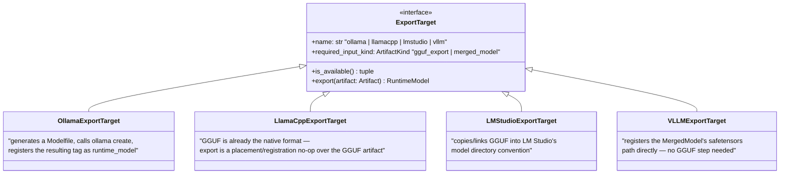

**Execution model**: Export runs through the **same async single-worker queue pattern** already established independently by Benchmark Center, Evaluation Workbench, and Continuous Security (Architecture Review Part I §16, Part V Finding #1) — `pending → running → completed/failed/cancelled`, error always persisted. This is a deliberate reuse of an existing, proven pattern rather than a fourth independent reimplementation; if the Architecture Review's Finding #1 (extract a shared `AsyncQueueService` base) is ever acted on, Export becomes the fourth consumer of that shared base rather than a third copy-paste.

**This is where `PROVIDER_CAN_HOST_ADAPTER` gets a real answer.** Today it is `False` for every provider, permanently (Architecture Review Part I §12). Under this redesign, it becomes **derived from whether an `ExportTarget` is registered and available** for that provider — `True` for `ollama` the moment `OllamaExportTarget` ships, still honestly `False` for any provider without one. The Runtime Registry's existing fallback-to-base-model behavior (Architecture Review Part I §12, `_register_with_provider`) is **not removed** — it remains the correct, honest degradation path for providers/situations where export genuinely hasn't happened yet (export failed, target not implemented, user hasn't run export). Fallback stops being permanent and starts being situational, which is what it always should have meant.

---

## 7. Runtime Manager Integration — Preserving the Boundary

**Runtime Manager gains zero new responsibilities and zero new dependencies.** This is the load-bearing constraint of this entire redesign, and it is enforced structurally, not just by convention:

```mermaid
flowchart LR
    subgraph Training Domain — NEW
        FM[FoundationModel]
        TR[TrainingRun]
        CP[Checkpoint]
        Strat[Strategy]
        Prov[TrainingProvider]
        Export[Export Pipeline]
        RMArt["RuntimeModel Artifact"]
    end

    subgraph Runtime Domain — UNCHANGED
        RM["RuntimeClient / get_runtime()"]
        RProv["Provider ABC\n(Ollama, LM Studio, vLLM, ...)"]
    end

    FM --> TR --> CP --> Export --> RMArt
    RMArt -->|"opaque string handoff\n(e.g. Ollama tag)"| RM
    RM --> RProv

    RM -.NEVER imports.-> FM
    RM -.NEVER imports.-> TR
    RM -.NEVER imports.-> CP
    RM -.NEVER imports.-> Prov
```

The **only** thing that crosses the boundary is a plain string (a runtime-native model identifier — e.g. an Ollama tag), produced by the Export Pipeline and handed to `get_runtime().generate(that_string, ...)` — **exactly the same call shape every other caller in the app already uses** (Architecture Review Part I §5). Runtime Manager cannot tell the difference between a model string that arrived via manual `ollama pull` and one that arrived via this Export Pipeline. It never imports `app/training/`, `app/artifacts/`, or any Strategy/Provider type from the training domain.

This preserves the Architecture Review's single strongest finding (Part IV: "Runtime — the audit's one subsystem with no findings against it... unchanged"). Nothing in this redesign is permitted to erode that boundary, and the design above enforces it by construction: the Export Pipeline is a **producer that writes a `RuntimeModel` artifact and, when relevant, calls the target runtime's own native "install" mechanism** (`ollama create` for Ollama, a file copy for LM Studio) — it does not call into `RuntimeClient`/`Provider` internals at all; it uses the runtime's own tooling exactly as a human operator would.

---

## 8. How Benchmark Center, Evaluation Workbench, and Continuous Security Should Consume Artifacts

**Their execution logic does not change.** All three already call `get_runtime().generate(target_model)` against a resolved string (Architecture Review Part I §7/§8/§9) — that call is correct today and remains correct under this redesign; it is not touched.

**What changes is the selection/provenance layer above execution:**

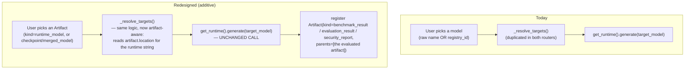

Three concrete, minimal, additive changes — none of which touch existing tables' data model:

1. **Selection surfaces** (the "pick a model" UI/API in Benchmark Center, Evaluation Workbench, and Continuous Security's implicit training-triggered target) start listing `Artifact` rows of kind `runtime_model` (falling back to today's raw registry-entry listing wherever no artifact exists yet — nothing breaks for models that predate this redesign). `_resolve_targets()` in both routers (already independently duplicated per Architecture Review Part IV/V Finding #13) gains one additional resolution branch — "given an `artifact_id`, read its `location` for the runtime string" — alongside its existing raw-name and `registry_id` branches. This is the natural place to also finally unify the two duplicated implementations (Architecture Review's proposed `ModelRef` shared resolver, Part V Finding #13) if desired, though doing so is optional and independent of this redesign.
2. **Result persistence gains one additional call**: immediately after `BenchmarkResult`/`EvaluationResult`/`CheckpointSecurity` writes its row (exactly as today), it calls `artifact_registry.register(kind=..., location=TableReference(table=..., row_id=...), parents=[the artifact_id that was evaluated])`. One new call at an existing completion point — not a new table for these subsystems to maintain, not a change to their scoring/queue logic.
3. **Engineering Reports** (the composed training report, Architecture Review Part I §6/§10) can now optionally walk the Artifact DAG (`artifact_registry.lineage(...)`) to answer provenance questions the six-table hand-assembled join already answers today by name (`benchmarks`, `evaluation`, `security_timeline`) — the existing compose-at-read-time report logic is **not replaced**; the DAG is an additional, generic traversal available alongside it, useful specifically for the "show me everything, not just the six things I already knew to ask for" case the Architecture Review flagged as currently impossible (Part II).

**What is explicitly NOT changed**: `BenchmarkService`/`EvaluationSessionService`/`ContinuousSecurityService`'s async-queue internals, their scoring logic (`_default_run`, `compose_summary`, `security_analyzer.analyze`), their existing DB schemas, their existing API routes' response shapes. These three subsystems remain, exactly as the mandate states, conceptually preserved — they gain artifact-*awareness* at their edges, never artifact-*dependency* in their core.

---

## 9. Domain Model, Lifecycle, and Dependency Diagrams

### 9.1 Complete Domain Model

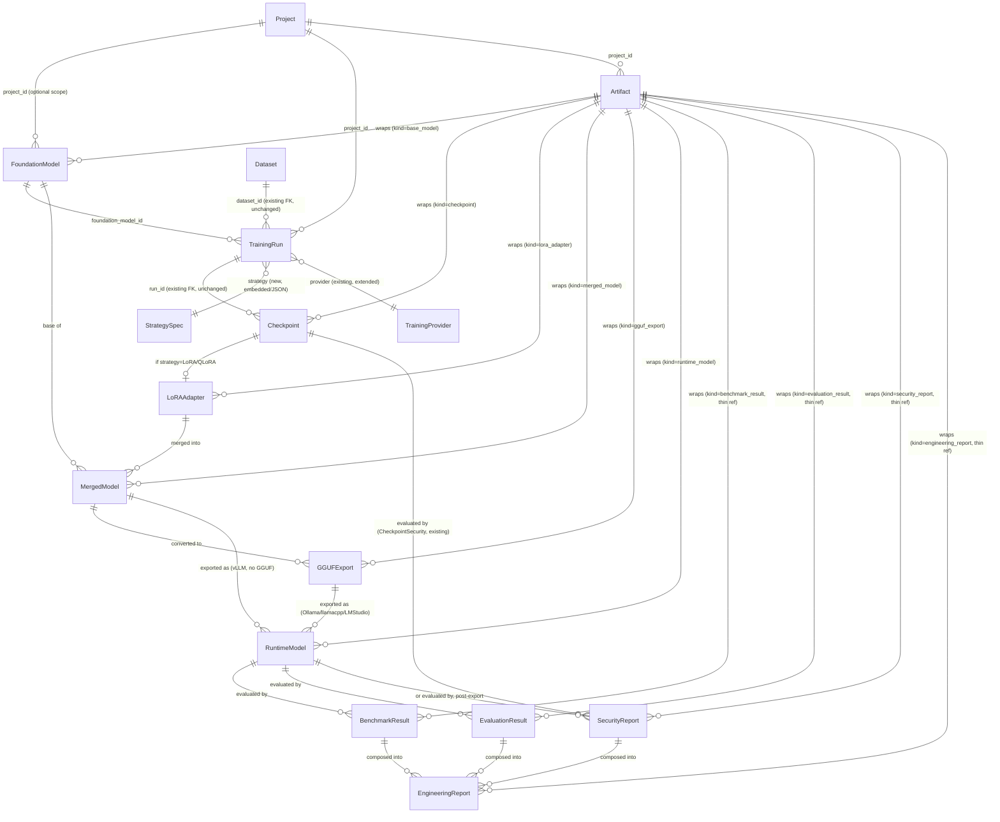

### 9.2 Artifact Lifecycle (applies uniformly to every kind)

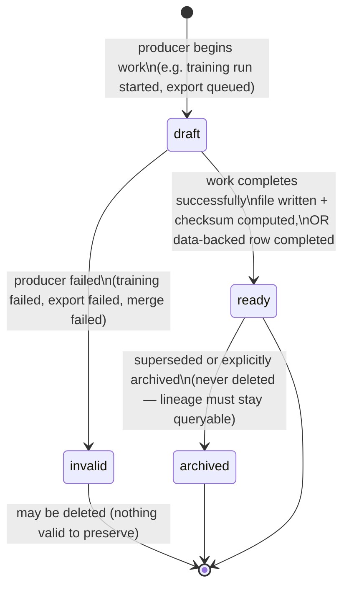

Applied per kind: a `Checkpoint` artifact is `draft` from the moment `TrainingRun` starts, `ready` the instant `_persist_checkpoint` writes it (unchanged from today); a `GGUFExport` is `draft` while the async export queue job is `running`, `ready` on completion, `invalid` if quantization fails; a `BenchmarkResult`-wrapping artifact is `ready` the moment the underlying row's `status="completed"` (mirroring, not duplicating, that row's own state machine from Architecture Review Part III).

### 9.3 End-to-End Sequence — Train → Export → Benchmark

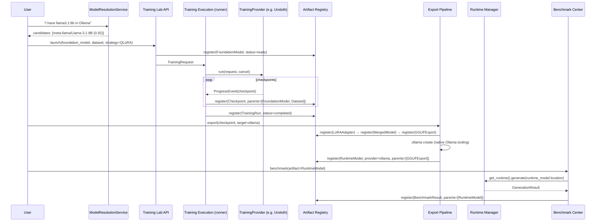

### 9.4 Module Dependency Graph

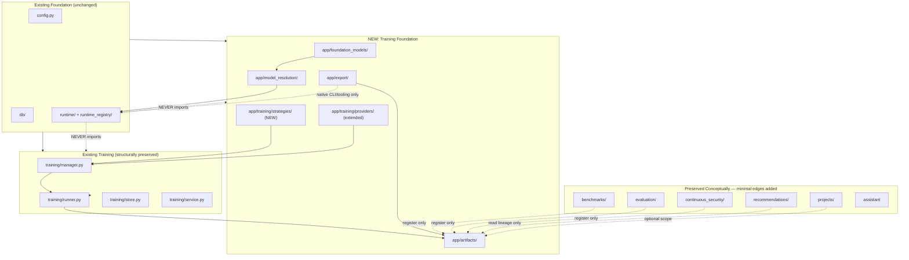

**Reading this graph**: every new module (`foundation_models`, `artifacts`, `strategies`, `resolution`, `export`) sits strictly *above* `runtime/` and *beside* `training/`, never below it — Runtime Manager remains a pure leaf dependency with zero awareness of anything training-related, exactly as mandated in §7. The five preserved subsystems each gain exactly one thin edge into `artifacts/` (register or read-lineage only) and no edge at all into the new training modules — they were never coupled to Training's internals before this redesign and remain uncoupled after it.

---

## 10. Incremental Migration Plan

Every phase is additive, ships independently, and leaves all "preserved" subsystems fully functional throughout — consistent with the codebase's own existing principle (Architecture Review Part I §26: "additive, never destructive").

### Phase 0 — Schema Foundation (no behavior change)
- Add tables: `foundation_models`, `artifacts`, `lora_adapters`, `merged_models`, `gguf_exports`. Add `runtime_models` as the reshaped successor table alongside (not replacing) today's `registered_models` — or, more conservatively, extend `registered_models` in place with the new `foundation_model_id`/artifact-linkage columns, since `RegisteredModel` already occupies exactly the "Runtime Model" conceptual slot (§2) and doesn't need a parallel table, only new columns.
- Backfill: for every existing `TrainingRun.base_model` string, best-effort create a `FoundationModel` row with `source="local_import"`, `hf_repo_id=<the raw string, unverified>`, flagged with low confidence — never silently presented as a resolved identity (honesty convention preserved).
- **Preserved**: 100% of existing behavior. `TrainingRun.base_model` string column stays; a new nullable `foundation_model_id` sits alongside it, unused until Phase 2.
- **Risk**: none — pure additive schema.

### Phase 1 — Model Resolution Service (read-only, opt-in)
- Ship `ModelResolutionService` + `OllamaResolver` (the only runtime with a real introspection API today) + the curated mapping catalog.
- Surface it as a **new, optional** step in Training Lab's model picker: "Resolve from an installed runtime model" alongside the existing free-text base-model field. Users who ignore it see no change at all.
- **Preserved**: the existing free-text base-model input path continues to work exactly as today, unconditionally.
- **Risk**: low — a new, additive, ignorable UI path; no existing API contract changes.

### Phase 2 — Strategy Abstraction (LoRA/QLoRA only, under existing providers)
- Introduce `StrategySpec`/`LoRAStrategy`/`QLoRAStrategy` and refactor `TrainingConfig` internally into `TrainingRequest{foundation_model_id, dataset_ref, strategy}` — but the `/training/launch` **API request schema stays backward compatible**: existing clients sending today's flat `method: "lora"|"qlora"` fields continue to work, translated internally into the new `StrategySpec` shape by the route handler (a compatibility shim, not a breaking change).
- `UnslothProvider`/`SimulationProvider` gain a `supported_strategies` declaration (`{LoRA, QLoRA}` for both, today's actual behavior — no functional change).
- **Preserved**: every existing training run, every existing test (Architecture Review's test suite for `manager.default_backend()`/`get_provider()` continues to pass unmodified — the public selection functions' signatures and behavior are unchanged in this phase).
- **Risk**: medium — internal refactor of `TrainingConfig`'s shape; mitigated by the compatibility shim and by doing this phase with the existing Simulation/Unsloth providers only (no new provider risk compounding it).

### Phase 3 — Export Pipeline, Ollama Only
- Ship the async-queue-based Export Pipeline (reusing the established queue pattern) with exactly one `ExportTarget`: `OllamaExportTarget`.
- Flip `PROVIDER_CAN_HOST_ADAPTER["ollama"]` to a derived-`True`-when-export-available value instead of a hardcoded `False`.
- Wire `runtime_registry.register_checkpoint()` (unchanged signature) to prefer a real exported `RuntimeModel` artifact when one exists, falling back to today's base-model behavior otherwise — the fallback path is **not removed**, only demoted from "always" to "when export hasn't happened."
- **Preserved**: every checkpoint that hasn't been exported behaves exactly as today (base-model fallback). Continuous Security's automatic per-checkpoint scheduling (Architecture Review Part I §9) is entirely unaffected — it consumes whatever `runtime_registry.register_checkpoint()` returns today and continues to do so unchanged.
- **Risk**: medium — first real end-to-end proof of the merge/quantize/export chain; scoped to one provider and one export target to bound the risk.

### Phase 4 — Artifact-Aware Consumption in Benchmark Center / Evaluation Workbench / Continuous Security
- Add the one `artifact_registry.register(...)` call at each subsystem's existing result-completion point (§8).
- Extend `_resolve_targets()` in both routers with the additional artifact-based resolution branch, additive alongside the existing raw-name/registry-id branches.
- **Preserved**: all existing selection paths (raw model name, `registry_id`, whole-project expansion) continue to work identically; artifact-based selection is a new, additional option, not a replacement.
- **Risk**: low — additive branches in already-isolated resolver functions; no change to queue/scoring internals.

### Phase 5 — Provider, Strategy, and Export-Target Breadth
- Add `PEFTProvider`, `HFTrainerProvider`, `AxolotlProvider`, `TRLProvider` (each a new file, one registry line — the exact mechanism `UnslothProvider` already demonstrates).
- Add `SFTStrategy` (formalized — today's default behavior made explicit), `DPOStrategy`, `PPOStrategy`, `RLHFStrategy`.
- Add `LlamaCppExportTarget`, `LMStudioExportTarget`, `VLLMExportTarget`.
- **Preserved**: every prior phase's behavior; this phase is pure breadth expansion within the shapes Phases 2–3 already established.
- **Risk**: low per individual addition (isolated, registry-based), naturally sequenced by demand (ship the provider/strategy/target combination users actually ask for first).

### What Never Moves, In Any Phase
Runtime Manager's `Provider` ABC and `RuntimeClient` (§7); Benchmark Center's, Evaluation Workbench's, and Continuous Security's async-queue internals, scoring logic, and database schemas (§8); the Recommendation Engine's context-gathering/pure-recommendation split (untouched — it gains only optional lineage-read access); Projects (untouched — artifacts optionally scope to `project_id` exactly like every other entity already does); the Assistant (untouched — a future phase, not part of this plan, could teach it to answer lineage questions, but nothing here requires or assumes that).

---

*This document is architecture-only. No implementation code was written. Every design decision above is scoped to answer the ten questions posed, grounded in the specific existing modules and entities documented in `ARCHITECTURE_REVIEW.md`, and constrained throughout by the explicit mandate to preserve Runtime Manager, Benchmark Center, Evaluation Workbench, Continuous Security, Recommendation Engine, Projects, and the Assistant exactly as they are.*
