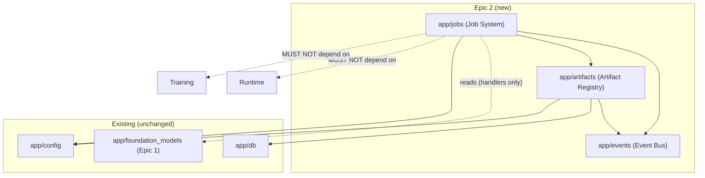

# RedForge V3 — Epic 2: Platform Core (Implementation Notes)
## Artifact Registry + Execution Platform (Job System)

**Status:** Shipped. Additive, non-breaking. Follows the V3 Constitution.
**Builds on:** Epic 1 (Foundation Platform) — reads it read-only, never modifies it.
**Scope:** The two pieces of permanent platform infrastructure every future engine
will use — the **Artifact Registry** and the **Execution Platform (Job System)** —
plus the shared **Event Bus** infrastructure both depend on.

This is an implementation companion to `REDFORGE_V3_CONSTITUTION.md` (§4, §5, §6, §8)
and `V3_EPIC1_FOUNDATION_PLATFORM.md`.

---

## 1. What This Epic Delivers

Two new bounded contexts plus one shared infrastructure module, each following the
Epic-1 pattern (pure domain → repository ABC → service → additive ORM/API/UI):

1. **Artifact Registry** (`app/artifacts/`) — the platform spine (Constitution §6):
   the canonical source of truth for every produced unit, with a lineage DAG,
   versioning, checksums, and pluggable storage.
2. **Execution Platform / Job System** (`app/jobs/`) — the unified execution
   mechanism for all long-running work (Constitution §8): one scheduler, one worker
   pool, one canonical state machine, per-kind concurrency, progress, cancellation,
   recovery, and retries.
3. **Event Bus** (`app/events/`) — in-process pub/sub Infrastructure (Constitution
   §4.2, §8.6) both contexts emit onto, so future cross-context reactions need no
   direct imports.

The full pipeline is proven end-to-end: **submit a Job → it queues → a worker runs
its handler → progress is reported → a result is produced → an Artifact is published
with lineage** — demonstrated in production code (the `model_sync` handler) and in
tests (a producer handler).

---

## 2. Architecture & Layering

```
Applications (API routers, future UI)         ← app/api/artifacts.py, app/api/jobs.py
        ↓
Platform Services (Layer ③)                    ← Artifact Registry, Job System
        ↓
Infrastructure (Layer ④)                       ← Event Bus (app/events), storage
        ↓
Core (Layer ⑤)                                 ← Configuration, domain primitives
```

Both new contexts are **Platform Services** — depended upon by future domain engines,
depending on none of them. Dependencies flow strictly downward. The Job System reads
Epic-1's Foundation service (a Platform Service reading another — permitted), and the
Artifact Registry depends only on Infrastructure + Core.

### Dependency graph (new edges only)



**No Runtime dependency. No Training dependency. No circular dependencies.** The Job
System's handlers read the Foundation service (Epic 1) — a legitimate downward read
between Platform Services — and nothing else engine-specific.

---

## 3. Artifact Registry (`app/artifacts/`)

| Module | Layer | Responsibility |
|---|---|---|
| `domain.py` | Domain (pure) | `Artifact` aggregate; value objects `ArtifactLocation`, `Checksum`, `ArtifactReference`, `ArtifactEdge`, `ArtifactLineage`; enums `ArtifactStatus`, `RelationshipType`. No SQLAlchemy. |
| `artifact_types.py` | Domain | Extensible type registry — new types need no architecture change; each declares file/data backing. |
| `storage.py` | Infrastructure | `StorageProvider` ABC + `LocalStorageProvider` + registry. Cloud providers deliberately *not* implemented (local-first). |
| `checksum.py` | Infrastructure | Pure sha256 helpers. |
| `repository.py` | Persistence | `ArtifactRepository`, `ArtifactRelationshipRepository`, `ArtifactVersionRepository` (ABCs) + SQL impls. Maps rows ↔ domain. |
| `service.py` | Application | `ArtifactRegistryService`, `ArtifactQueryService`, `ArtifactLineageService`, `ArtifactVersionService`, `ArtifactStorageService`. |
| `events.py` | — | Event names + emit helper. |

### Key decisions (Constitution governs where it and the Epic's suggested list differ)
- **Versioning = artifacts sharing a `lineage_id`** (Constitution §6.6): a new version
  is a *new artifact* with the same `lineage_id`, an incremented `version`, and a
  `SUPERSEDES` edge to its predecessor — **not** a separate version table. The Epic's
  suggested `ArtifactVersion`/`ArtifactVersionRepository` are realized as a versioning
  *view* over the artifact index.
- **Lineage is a DAG** (§6.5): parent→child edges in `artifact_edges`, not a tree — a
  Merged Model has two parents. Production edges (`derived_from`/`produced_from`/
  `consumed`) form provenance; `supersedes` forms the version chain.
- **Two backings** (§6.3): file-backed (bytes on disk, real checksum/size) and
  data-backed (a row in an owning context's table, referenced — **no data migration**
  for existing subsystems).
- **Tags/producer/metadata** are fields on the artifact, not separate tables (minimal,
  additive).

### Artifact lifecycle
`draft → ready → (invalid | archived)`. `draft`/`invalid` make production honest — a
failed production is a first-class invalid artifact with a reason, not a missing row.

### Services & their responsibilities
- **ArtifactRegistryService** — `register`, `publish`, `archive`, `invalidate`, `tag`,
  `resolve` (location), `validate` (checksum/existence — marks invalid honestly),
  `delete` (with edge cleanup). Emits `artifact.published`/`archived`/`invalidated`.
- **ArtifactQueryService** — `search` by type/status/project/tag/text.
- **ArtifactLineageService** — `parents`, `children`, `lineage` (BFS ancestors +
  descendants over production edges). Answers provenance and impact generically.
- **ArtifactVersionService** — `create_version` (new artifact + SUPERSEDES edge),
  `history`. Emits `artifact.version_created`.
- **ArtifactStorageService** — file-backed size/checksum/integrity via `StorageProvider`.

---

## 4. Execution Platform / Job System (`app/jobs/`)

| Module | Layer | Responsibility |
|---|---|---|
| `domain.py` | Domain (pure) | `Job` aggregate; `JobProgress`, `JobResult`, `JobError`; enum `JobStatus` + canonical state machine. |
| `job_types.py` | Domain | Extensible kind registry; each kind declares its **per-kind concurrency limit**. |
| `handlers.py` | Application | `JobContext` (progress/log/cancel/publish-artifact), `JobHandler` contract, `JobHandlerRegistry` + built-in handlers. |
| `repository.py` | Persistence | `JobRepository` (ABC) + SQL impl. |
| `service.py` | Application | `JobService` — scheduler + worker (per-kind concurrency), progress, cancellation, retry, history, queue status. |
| `events.py` | — | Event names + emit helper. |

### Canonical job state machine (Constitution §8.3)
```
queued → running → (completed | failed | cancelled)
queued → cancelled                     (cancelled while still queued)
running → cancelled                    (cooperative, at handler's next check)
[recovery] running/queued → interrupted  (process died mid-run)
failed/cancelled/interrupted → queued  (retry, bounded by max_attempts)
```

**Constitutional guarantees, uniform across every kind:**
- A **failed job ALWAYS persists a reason** (message + traceback) — the domain's
  `failed` transition requires a `JobError`; a null-error failure is impossible.
- **Cancellation is cooperative and uniform** — a cancel request is observed at the
  handler's next `ctx.is_cancelled()` check; queued jobs are cancelled immediately.
- **Recovery is one routine over one table** — `JobRecord` is in `main.py`'s
  (generic, per-row) orphan-recovery loop, so a job left running by a crash becomes
  `interrupted` with a reason, never permanently stuck.
- **Concurrency is a central, per-kind policy** — `training` defaults to concurrency 1
  (fixes the prior architecture's unbounded-concurrent-training defect); other kinds
  run in parallel up to their declared limit and a global cap.

### Scheduler / worker
A synchronous, await-free `_dispatch()` (race-free in the single event loop) starts as
many pending jobs as the global + per-kind limits allow; each running job's completion
re-dispatches to fill freed capacity. Tests drive it deterministically via
`auto_worker=False` + `drain()`.

### Handlers (Epic 2 built-ins — a few real jobs, per the Epic's "even if only a few use it")
- `model_discovery` → calls Epic-1 `foundation_model_service.discover()`.
- `model_sync` → syncs a foundation model (Epic 1) **and** idempotently publishes its
  data-backed Artifact — the real, honest Job → Artifact pipeline over real data.
- `diagnostics` → a trivial progress/cancellation-exercising handler.

The big engines (Training, Benchmark, Evaluation, Security, Export) are **not** migrated
to Jobs in this epic (see Deferred Work) — they register handlers in later epics.

### JobContext — what a handler gets
`report_progress`, `log`, `is_cancelled`, `publish_artifact` (register + publish +
record artifact id), `find_data_artifact` (idempotency). Handlers stay decoupled from
the execution machinery and are unit-testable with a fake context.

---

## 5. Event Bus (`app/events/`)

A tiny in-process async pub/sub (`EventBus` + `Event` + `event_bus` singleton). Sync
and async subscribers; wildcard (`*`) subscription; a failing subscriber never breaks
the publisher (graceful degradation, §2.13). Events emitted this epic:
`artifact.published`, `artifact.version_created`, `artifact.archived`,
`artifact.invalidated`, `job.started`, `job.progress`, `job.completed`, `job.failed`,
`job.cancelled`. Cross-context *reactions* (subscriptions that trigger work) are wired
in later epics; the mechanism is ready and tested.

---

## 6. Database (additive only)

**Three new tables:** `artifacts`, `artifact_edges`, `jobs` (new `Base` subclasses,
provisioned by `create_all` at startup). **No existing table altered** — no column
added, renamed, or removed anywhere. Persistence rows (`ArtifactRecord`,
`ArtifactEdgeRecord`, `JobRecord`) live in `db/models.py` for `create_all`
registration but are touched only by their repositories.

---

## 7. API (additive)

**`/api/artifacts`** (12 routes): `types`, search (`GET ""`), register (`POST ""`),
get, `lineage`, `parents`, `children`, `versions`, `version` (create), `publish`,
`tag`, `archive`, `validate`, delete. Literal routes precede `/{artifact_id}`.

**`/api/jobs`** (8 routes): `types`, `queue`, list (`GET ""`), submit (`POST ""`),
get, `progress`, `logs`, `cancel`, `retry`. Literal routes precede `/{job_id}`.

Every existing endpoint is unchanged. Two lines added to `main.py` (imports +
`include_router`) and one entry added to the (already generic) recovery loop.

---

## 8. UI (additive; existing design system only)

- New nav items **Artifacts** (Build group) and **Jobs** (System group).
- New routes `/artifacts`, `/artifacts/:id`, `/jobs` (all lazy-loaded, own chunks).
- `ArtifactsPage` — search + type/status filters + status-indicated cards.
- `ArtifactDetailPage` — metadata, **lineage graph** (parents → this → children, with
  ancestor/descendant counts), version chain, validate/archive/delete.
- `JobsPage` — queue summary, active (running/queued) panel with **progress cards**,
  history, submit control, cancel/retry, **logs drawer**, polls only while jobs are
  active.
- No existing page, layout, style, or routing changed. Pages compose only existing
  primitives (`Card`, `Button`, `Badge`, `Progress`, `PageHeader`, `EmptyState`,
  `Skeleton`).

---

## 9. Tests

- `tests/test_artifacts.py` (7): types extensibility, local storage + checksum,
  register/publish/lineage DAG (two-parent + ancestor/descendant), versioning shares
  lineage, file-backed checksum + honest validate-on-missing, publish emits event, API.
- `tests/test_jobs.py` (9): status/type domain, diagnostics job with progress,
  failed-always-has-reason, handler-exception-captured-with-traceback, **full
  Job→publish-artifact pipeline**, cancel queued, retry, foundation-service handler, API.

**Regression:** full backend suite **488 passed** (472 Epic-1 baseline + 16 new),
0 failures. Frontend `tsc` clean, `vite build` clean (3 new lazy chunks), version guard OK.

---

## 10. Constitution Conformance Checklist

- ✅ **Bounded contexts** with clear public APIs and hidden internals (§3.4, §3.14).
- ✅ **Repository pattern + dependency inversion** — services depend on interfaces, never SQLAlchemy (§4).
- ✅ **Pure domain models** — no framework leakage into `domain.py` (§4).
- ✅ **Layering** — Platform Services depend downward only; no upward dependencies (§4.3).
- ✅ **No Runtime / Training dependencies** — Job System reads only Foundation (a Platform Service); Artifact Registry depends only on Infrastructure/Core (§14).
- ✅ **No circular dependencies, no hidden coupling** — cross-context signals are events, not imports (§2.15, §8.6).
- ✅ **Artifact-oriented** — the spine exists; everything a stage produces is an Artifact with lineage (§2.4, §6).
- ✅ **One execution path** — the Job System is the single mechanism for long-running work going forward (§2.17, §8).
- ✅ **Honest over simulated** — failed jobs and invalid artifacts carry real reasons; no fabricated lineage (§2.14).
- ✅ **Single source of truth** — one artifact index, one lineage graph, one job table, one event bus (§2.16).
- ✅ **Additive, non-breaking** — 3 new tables, additive endpoints/pages only; every existing test passes (§16).

---

## 11. Deferred Work (later epics — explicitly NOT in Epic 2)

Per the Epic's non-goals, this epic did **not** touch: Training Providers, the Training
refactor, the Export Engine, Experiments, the Plugin System, the Recommendation
Engine, and the Benchmark / Evaluation / Security migrations. Those engines keep their
existing queues unchanged; they migrate onto the Job System and begin publishing
artifacts (checkpoints, results, reports) with lineage in later epics. The
infrastructure they will build on is now in place:

- **Future engines submit Jobs** instead of executing directly — they register a
  handler for their kind (a one-file addition, provider pattern).
- **Future engines publish Artifacts** through `ctx.publish_artifact(...)` — their
  outputs join the lineage DAG automatically.
- **Future cross-context reactions** subscribe to events (e.g. `checkpoint.produced` →
  submit a `security` job) — no direct imports, fully traceable.
- **Retention policies, content-addressed dedup, and cloud storage providers** are
  enabled by (but deferred beyond) this epic's checksum + storage-abstraction scaffolding.
